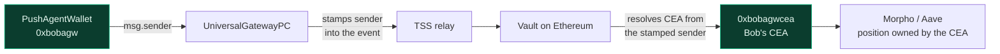
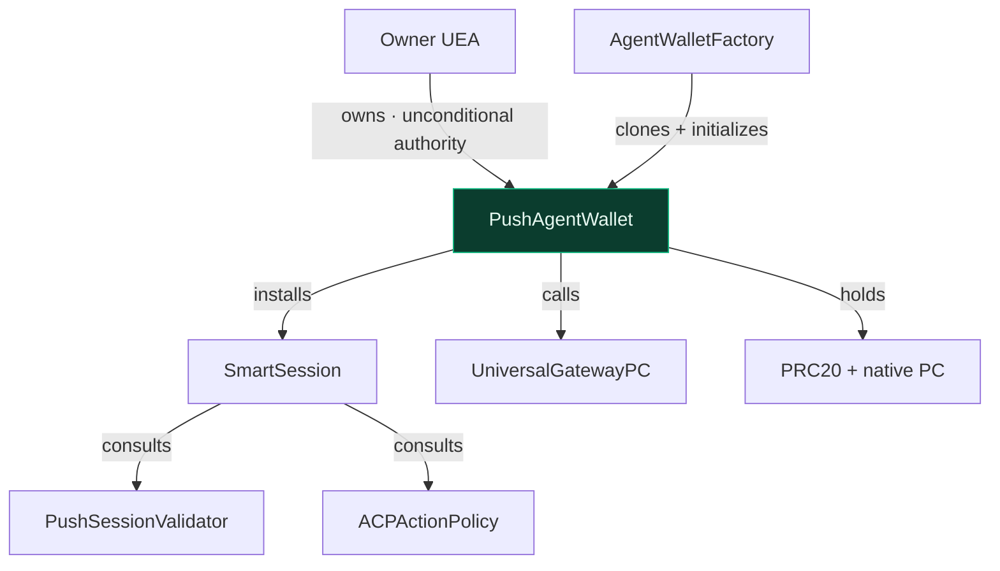
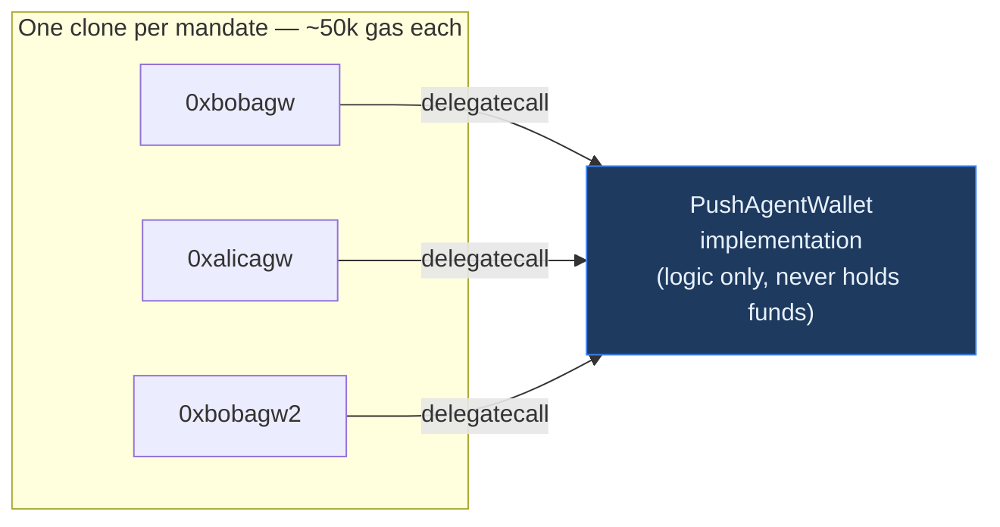
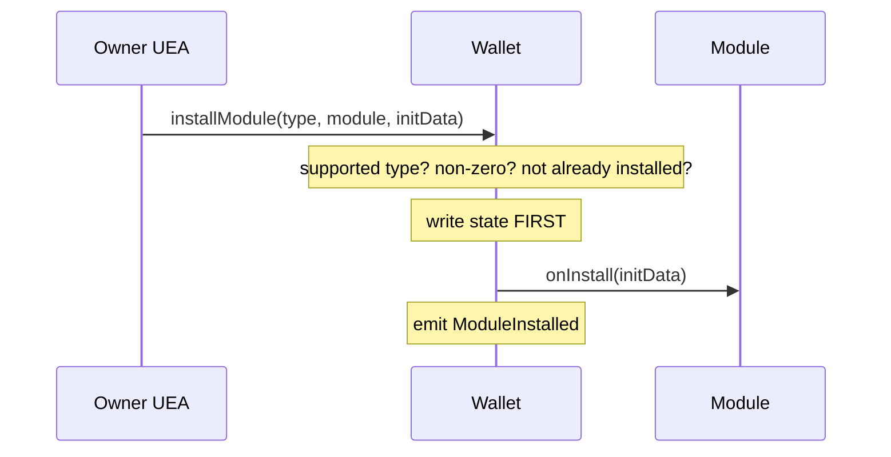
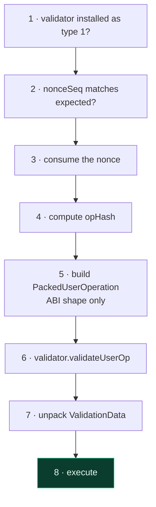
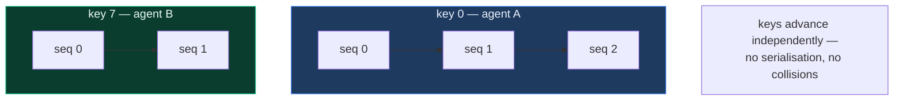
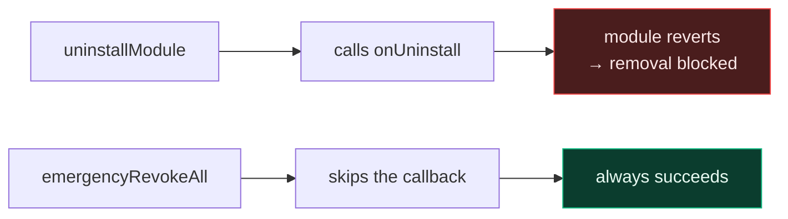

# PushAgentWallet

`src/PushAgentWallet.sol` · ERC-7579 modular smart account

---

## 1. What this contract does

`PushAgentWallet` is the account that **holds the user's money** for one mandate and
**performs every action** taken on their behalf.

It does four things:

1. Custodies funds — PRC20 tokens and native PC for cross-chain gas.
2. Executes calls, either directly for the owner or under a validated session.
3. Hosts modules — the session engine and, optionally, a hook.
4. Provides the owner with unconditional escape hatches.

Everything else in the system exists to serve this contract: the factory mints it, the
validator authenticates callers to it, the policies constrain what it will do.

## 2. Why it matters

Two reasons, one obvious and one structural.

**It holds the funds.** A flaw here is a direct loss of user assets, which is why the
contract has no upgrade path, no admin, and no owner-transfer.

**It is the identity the outside world sees.** When the wallet calls
`UniversalGatewayPC.sendUniversalTxOutbound`, the gateway stamps `msg.sender` into its
outbound event, and that address decides which CEA executes on the destination chain.



Because the wallet — never the agent — is always the caller, the destination position is
always owned by the user's own CEA. Provider custody is not forbidden by a rule that could
be misconfigured; it is unreachable by construction.

## 3. Role in the system



## 4. Deployment shape

Each wallet is an **EIP-1167 minimal clone** delegating to one shared implementation.



The logic is immutable and shared; only storage is per-wallet. There is no proxy admin and
no upgrade mechanism, so no key exists that could swap the logic under a user's funds.

The implementation itself is sealed at deploy time by initializing it to a burn address,
so nobody can claim the logic contract directly.

## 5. Storage

The layout is fixed and must never be reordered.

| Slot | Field | Purpose |
|---|---|---|
| 0 | `owner` (+ `_initialized`, packed) | The owning UEA; set once |
| 1 | `_hook` | Optional hook module; zero means none |
| 2 | `_modules` | `moduleTypeId => module => installed` |
| 3 | `_nonces` | `nonceKey => sequence` |

`_modules` is deliberately **nested type-first**. A flattened `module => bool` map would
let a module installed as a validator be treated as an executor — a privilege escalation
called out in the ERC-7579 security considerations. Keying by type first makes that
impossible: installing under type 1 grants authority under type 1 only.

## 6. Initialization

```solidity
function initialize(address owner_) external;
```

Callable once. It sets the owner and flips `_initialized`.

It is intentionally not restricted by caller, which looks alarming until you see the
deployment shape: the factory creates the clone and initializes it **in the same
transaction**, and a counterfactual address holds no code until `cloneDeterministic`
returns. There is no window in which a third party could initialize someone's wallet.

The `_initialized` flag then makes it permanent — including on the implementation
contract, which is sealed to a burn address at deploy time.

## 7. Module system

The wallet supports exactly two module types.

| Type | Name | Supported | Why |
|---|---|---|---|
| 1 | Validator | ✅ | Hosts SmartSession |
| 2 | Executor | ❌ | Highest-privilege type; nothing needs unprompted execution |
| 3 | Fallback | ❌ | Token receivers are native; avoids the ERC-2771 footgun |
| 4 | Hook | ✅ | Interface present for future use |

`installModule` and `uninstallModule` are owner-gated. Install writes state **before**
calling `onInstall`, so a module that tries to reenter during its own installation finds
the state already settled and is additionally stopped by the reentrancy guard.



Uninstall clears state before calling `onUninstall`. A module that reverts in that
callback still blocks its own removal — which is exactly why the next section exists.

## 8. Execution

Two entry points, two very different authority models.

### `execute` — the owner path

```solidity
function execute(ModeCode mode, bytes calldata executionCalldata) external payable;
```

Restricted to the owner (or the wallet itself). No policy applies: the UEA is the root
authority. This is the path the owner uses to move funds, unwind positions, or act when no
session exists.

### `executeWithSession` — the delegated path

```solidity
function executeWithSession(
    address  validator,
    ModeCode mode,
    bytes calldata executionCalldata,
    bytes calldata signature,
    uint192  nonceKey,
    uint64   nonceSeq
) external;
```

**Callable by anyone.** Authority comes from the signature verified inside, not from
`msg.sender`. The provider normally submits and pays gas; a relayer can do it later with
no contract change. This is intentional, not a missing modifier.

The seven steps:



The nonce is consumed **before** validation. That is safe because a later failure reverts
the whole transaction, and it guarantees the sequence is strictly monotonic per key.

### Supported execution modes

| Call type | Supported | Note |
|---|---|---|
| Single | ✅ | One call |
| Batch | ✅ | Several calls, in order, all-or-nothing |
| Delegatecall | ❌ | The target would own the account's storage |
| Static | ❌ | No use case for a state-changing entry point |

Only the default execution type is accepted; the "try" variant is rejected because silent
partial failure is the wrong semantic when moving money. A failing inner call bubbles its
original revert data rather than being flattened into a generic error.

## 9. The operation hash

This is the heart of replay protection. Eight fields are bound:

```solidity
keccak256(abi.encode(
    OP_HASH_DOMAIN,               // scheme separation
    block.chainid,                // cross-chain replay
    address(this),                // cross-account replay
    validator,                    // validator substitution
    ModeCode.unwrap(mode),        // single -> batch substitution
    keccak256(executionCalldata), // payload integrity
    nonceKey,
    nonceSeq
))
```

Each field closes a specific attack:

| Field | Removing it would allow |
|---|---|
| `OP_HASH_DOMAIN` | A signature for another scheme to be replayed here |
| `block.chainid` | A testnet signature to work on mainnet |
| `address(this)` | Bob's signature to work on Alice's wallet |
| `validator` | Routing through a weaker installed validator |
| `mode` | Re-submitting a signed single call as a batch |
| `keccak256(calldata)` | Substituting any other payload |
| `nonceKey` / `nonceSeq` | Replaying the same operation forever |

None of these is optional.

## 10. ValidationData unpacking

With no EntryPoint present, the wallet decodes the validator's packed response itself.

```
bits [0:160]    authorizer   0 = success, anything else = failure
bits [160:208]  validUntil   0 means NO EXPIRY
bits [208:256]  validAfter   0 means no start restriction
```

Two rules that are easy to get wrong:

- Any non-zero `authorizer` reverts — including an aggregator address, since aggregators
  are not supported.
- **`validUntil == 0` means the session never expires.** Treating zero as "expired at the
  epoch" would break every non-expiring session; treating a real past timestamp as valid
  would honour expired ones. Both are explicitly tested.

## 11. Two-dimensional nonces

The nonce is a `(uint192 key, uint64 seq)` pair rather than a single counter.



With a single counter, two agents submitting concurrently would collide and one would
spuriously revert. Separate keys let them proceed in parallel while each remains strictly
ordered and single-use within its own lane.

## 12. Owner controls

The owner's authority is unconditional and cannot be constrained by any module.

### `emergencyRevokeAll`

```solidity
function emergencyRevokeAll(address[] calldata validators) external;
```

Clears validators **without** calling `onUninstall`, and clears the hook slot. This is the
answer to a hostile or broken module that reverts in its own removal callback: the normal
`uninstallModule` path could be blocked forever, this one cannot be.



### `sweepPC`

Returns unspent native PC to a destination of the owner's choosing. Owner only.

### `callValidator`

```solidity
function callValidator(address smartSession, bytes calldata data) external returns (bytes memory);
```

SmartSession requires `msg.sender == account` when sessions are granted, so this is the
owner-gated passthrough that makes the wallet the caller.

The check that `smartSession` is an **installed type-1 validator** is what stops this
being a general-purpose arbitrary-call primitive. Without it, an owner-gated
"call anything" function would exist — narrower than `execute`, but redundant and an
unnecessary surface. That check must not be relaxed.

## 13. Token handling and interfaces

The wallet natively implements the ERC-721 and ERC-1155 receiver hooks and accepts native
PC through `receive()`, so it can hold NFTs and gas without a fallback handler. This is
why module type 3 can be dropped entirely.

ERC-1271 is deliberately **not** supported — `isValidSignature` always returns the failure
magic value. Nothing in the current design asks the wallet to attest to off-chain
messages, and a live ERC-1271 surface on a fund-holding account is a meaningful risk for no
present benefit.

## 14. Function reference

| Function | Access | Purpose |
|---|---|---|
| `initialize` | once, by factory | Set the owning UEA |
| `execute` | owner or self | Unconditional execution |
| `executeWithSession` | anyone (signature-gated) | Delegated execution |
| `installModule` | owner or self | Install a validator or hook |
| `uninstallModule` | owner or self | Remove a module, with callback |
| `emergencyRevokeAll` | owner | Remove validators, skipping callbacks |
| `sweepPC` | owner | Recover native PC |
| `callValidator` | owner | Passthrough for session management |
| `nonce` | view | Current sequence for a nonce key |
| `isModuleInstalled` | view | Query the module registry |
| `accountId` / `supportsModule` / `supportsExecutionMode` | view | ERC-7579 introspection |

## 15. Related documents

- [architecture.md](./architecture.md) — how the whole system fits together
- [factory.md](./factory.md) — how wallets are created and addressed
- [modules.md](./modules.md) — the validator and policies that gate the session path
- [libraries-and-types.md](./libraries-and-types.md) — mode and execution encoding
