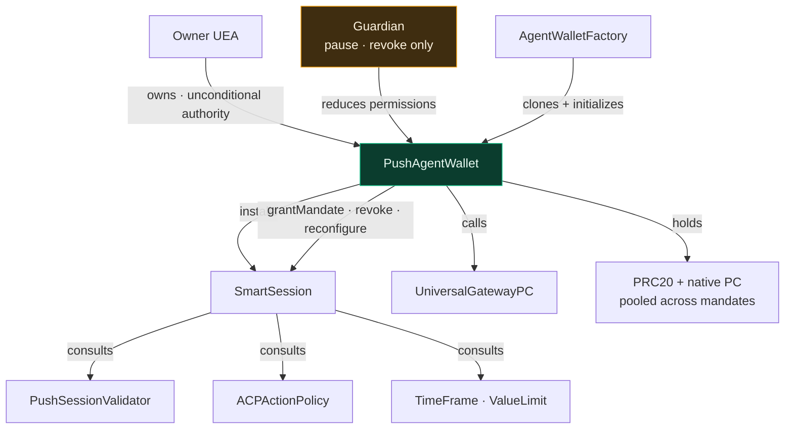
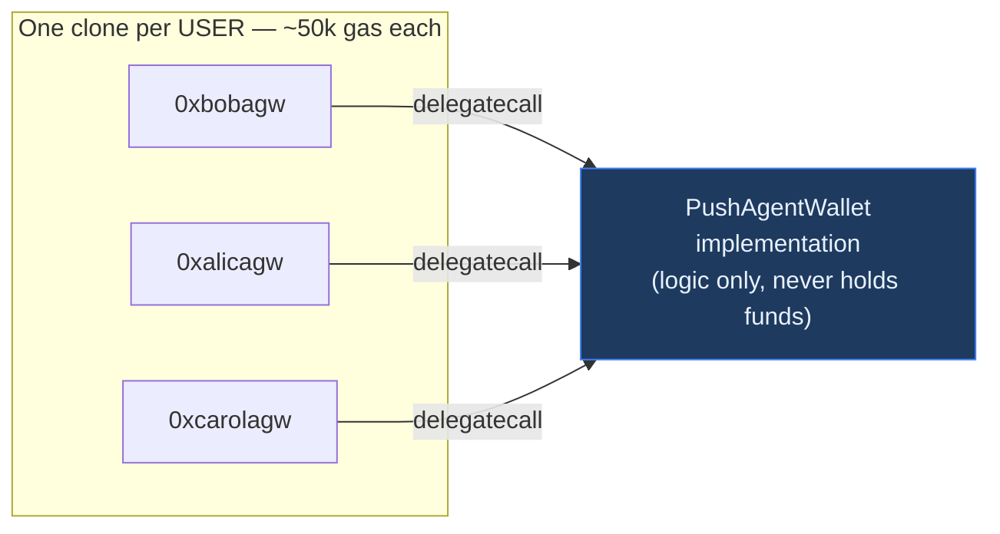
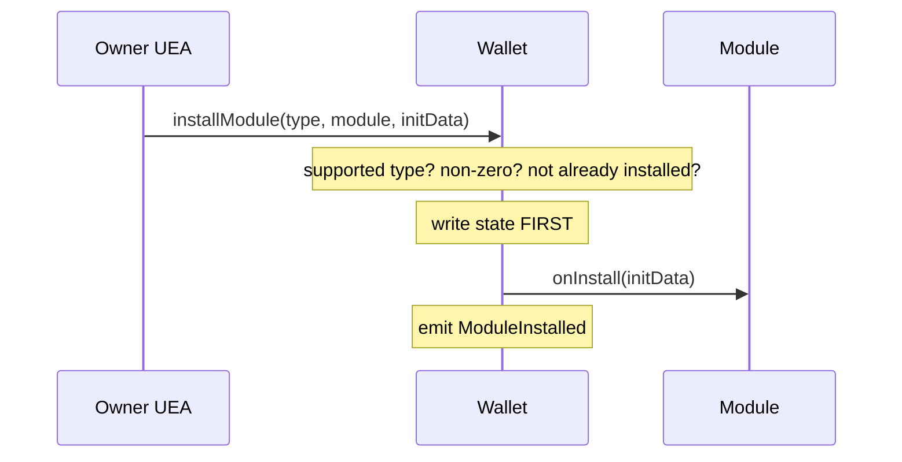
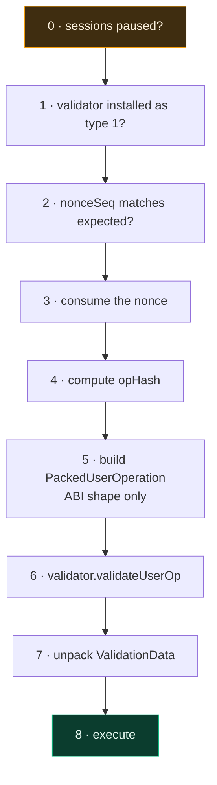
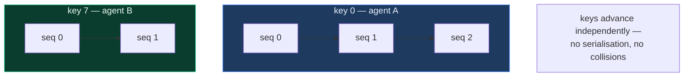
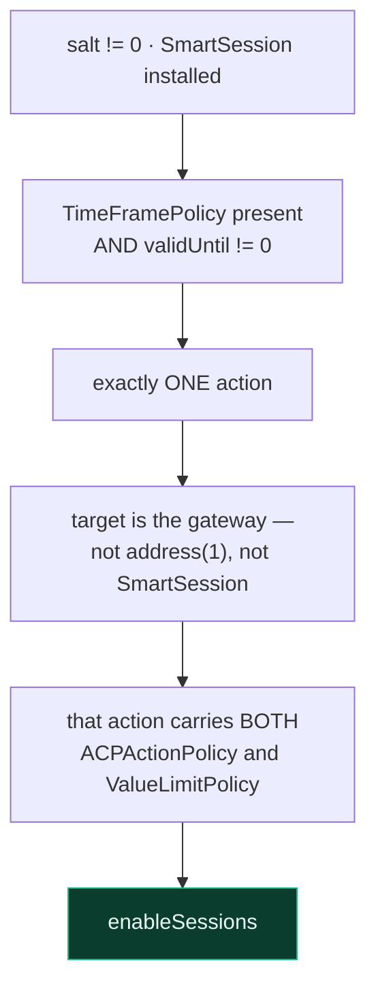
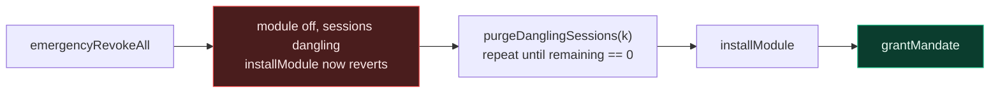
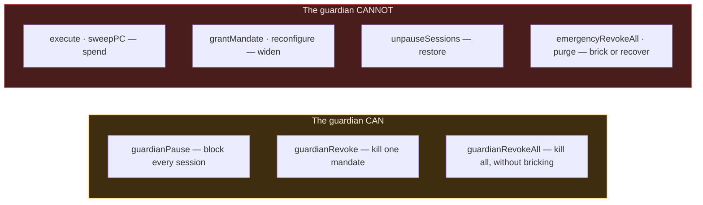
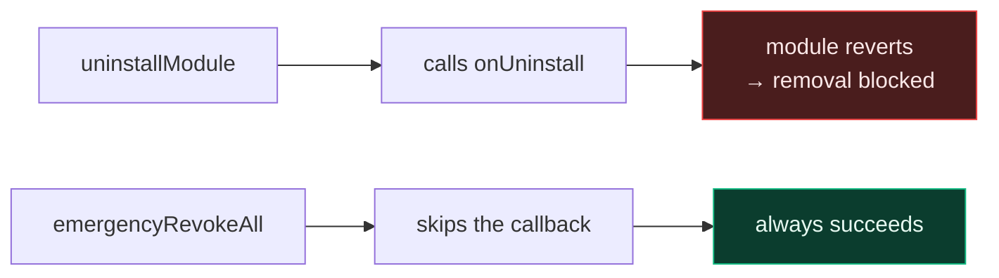

# PushAgentWallet

`src/PushAgentWallet.sol` · ERC-7579 modular smart account

---

## 1. What this contract does

`PushAgentWallet` is the account that **holds the user's money** and **performs every
action** taken on their behalf. There is exactly one per user, for life.

It does six things:

1. Custodies funds — PRC20 tokens and native PC for cross-chain gas, pooled across every
   mandate the user has granted.
2. Executes calls, either directly for the owner or under a validated session.
3. Hosts modules — the session engine and, optionally, a hook.
4. Owns the **mandate lifecycle**: granting, revoking, reconfiguring and purging sessions,
   with the grant-time guards that make a mandate bounded by construction.
5. Exposes a **guardian** surface: a second address that may pause or revoke in one Push
   transaction, and do nothing else.
6. Provides the owner with unconditional escape hatches.

Everything else in the system exists to serve this contract: the factory mints it, the
validator authenticates callers to it, the policies constrain what it will do.

## 2. Why it matters

Two reasons, one obvious and one structural.

**It holds the funds.** A flaw here is a direct loss of user assets, which is why the
contract has no upgrade path, no admin, and no owner-transfer.

**It is the identity the outside world sees.** When the wallet calls
`UniversalGatewayPC.sendUniversalTxOutbound`, the gateway stamps `msg.sender` into its
outbound event, and that address decides which CEA executes on the destination chain.


Because the wallet — never the agent — is always the caller, the destination position is
always owned by the user's own CEA. Provider custody is not forbidden by a rule that could
be misconfigured; it is unreachable by construction.

## 3. Role in the system



## 4. Deployment shape

Each wallet is an **EIP-1167 minimal clone** delegating to one shared implementation.



The logic is immutable and shared; only storage is per-wallet. There is no proxy admin and
no upgrade mechanism, so no key exists that could swap the logic under a user's funds.

The implementation itself is sealed at deploy time by initializing it to a burn address,
so nobody can claim the logic contract directly.

## 5. Storage

The layout is fixed and must never be reordered.

| Slot | Field | Purpose |
|---|---|---|
| 0 | `owner` (+ `_initialized`, packed) | The owning UEA; set once |
| 1 | `_hook` | Optional hook module; zero means none |
| 2 | `_modules` | `moduleTypeId => module => installed` |
| 3 | `_nonces` | `nonceKey => sequence` |
| 4 | `guardian` (+ `sessionsPaused`, packed) | The emergency address and the global session-path kill switch |

Slots 0–3 are byte-identical to v1; the guardian was **appended** at slot 4 rather than
inserted, so no existing field moved.

Five values are `immutable` rather than stored — the session engine, the gateway, and the
three mandatory policies. They live in the implementation's code and are shared by every
clone, which is what makes the grant-time guards tamper-proof: a storage-based policy
address could be rewritten later to quietly disarm them.

`_modules` is deliberately **nested type-first**. A flattened `module => bool` map would
let a module installed as a validator be treated as an executor — a privilege escalation
called out in the ERC-7579 security considerations. Keying by type first makes that
impossible: installing under type 1 grants authority under type 1 only.

## 6. Initialization

```solidity
function initialize(address owner_, address guardian_) external;
```

Callable once. It sets the owner, records the guardian, and flips `_initialized`.

`guardian_` may be `address(0)`, meaning no guardian. That is a valid configuration: every
guardian entrypoint compares against `msg.sender`, which can never be the zero address, so
they are all inert until the owner sets one via `setGuardian`.

It is intentionally not restricted by caller, which looks alarming until you see the
deployment shape: the factory creates the clone and initializes it **in the same
transaction**, and a counterfactual address holds no code until `cloneDeterministic`
returns. There is no window in which a third party could initialize someone's wallet.

The `_initialized` flag then makes it permanent — including on the implementation
contract, which is sealed to a burn address at deploy time.

## 7. Module system

The wallet supports exactly two module types.

| Type | Name | Supported | Why |
|---|---|---|---|
| 1 | Validator | ✅ | Hosts SmartSession |
| 2 | Executor | ❌ | Highest-privilege type; nothing needs unprompted execution |
| 3 | Fallback | ❌ | Token receivers are native; avoids the ERC-2771 footgun |
| 4 | Hook | ✅ | Interface present for future use |

`installModule` and `uninstallModule` are owner-gated. Install writes state **before**
calling `onInstall`, so a module that tries to reenter during its own installation finds
the state already settled and is additionally stopped by the reentrancy guard.

**Only one hook may be active.** Installing a second hook while one is present is
rejected rather than silently replacing it. A silent replacement would leave the previous
hook's registry entry set — making it permanently un-reinstallable and making
`isModuleInstalled` report a hook that is not active. This is the single-active-module
hazard named in the ERC-7579 security considerations.



Uninstall clears state before calling `onUninstall`. A module that reverts in that
callback still blocks its own removal — which is exactly why the next section exists.

## 8. Execution

Two entry points, two very different authority models.

### `execute` — the owner path

```solidity
function execute(ModeCode mode, bytes calldata executionCalldata) external payable;
```

Restricted to the owner. No policy applies: the UEA is the root authority. This is the path the owner uses to move funds, unwind positions, or act when no
session exists.

### `executeWithSession` — the delegated path

```solidity
function executeWithSession(
    address  validator,
    ModeCode mode,
    bytes calldata executionCalldata,
    bytes calldata signature,
    uint192  nonceKey,
    uint64   nonceSeq
) external;
```

**Callable by anyone.** Authority comes from the signature verified inside, not from
`msg.sender`. The provider normally submits and pays gas; a relayer can do it later with
no contract change. This is intentional, not a missing modifier.

The steps:



**Step 0 is deliberately first.** The guardian's pause check runs before the nonce is
consumed and before any policy counter moves, so a pause costs the user nothing to reverse
— no burnt nonce, no spent budget. That is what makes pause safe to trigger on suspicion
rather than certainty.

The nonce is consumed **before** validation. That is safe because a later failure reverts
the whole transaction, and it guarantees the sequence is strictly monotonic per key.

### Supported execution modes

| Call type | Supported | Note |
|---|---|---|
| Single | ✅ | One call |
| Batch | ✅ | Several calls, in order, all-or-nothing. An empty or malformed batch is rejected, so "executed nothing" can never look like success |
| Delegatecall | ❌ | The target would own the account's storage |
| Static | ❌ | No use case for a state-changing entry point |

Only the default execution type is accepted; the "try" variant is rejected because silent
partial failure is the wrong semantic when moving money. A failing inner call bubbles its
original revert data rather than being flattened into a generic error.

## 9. The operation hash

This is the heart of replay protection. Eight fields are bound:

```solidity
keccak256(abi.encode(
    OP_HASH_DOMAIN,               // scheme separation
    block.chainid,                // cross-chain replay
    address(this),                // cross-account replay
    validator,                    // validator substitution
    ModeCode.unwrap(mode),        // single -> batch substitution
    keccak256(executionCalldata), // payload integrity
    nonceKey,
    nonceSeq
))
```

Each field closes a specific attack:

| Field | Removing it would allow |
|---|---|
| `OP_HASH_DOMAIN` | A signature for another scheme to be replayed here |
| `block.chainid` | A testnet signature to work on mainnet |
| `address(this)` | Bob's signature to work on Alice's wallet |
| `validator` | Routing through a weaker installed validator |
| `mode` | Re-submitting a signed single call as a batch |
| `keccak256(calldata)` | Substituting any other payload |
| `nonceKey` / `nonceSeq` | Replaying the same operation forever |

None of these is optional.

## 10. ValidationData unpacking

With no EntryPoint present, the wallet decodes the validator's packed response itself.

```
bits [0:160]    authorizer   0 = success, anything else = failure
bits [160:208]  validUntil   0 means NO EXPIRY
bits [208:256]  validAfter   0 means no start restriction
```

Two rules that are easy to get wrong:

- Any non-zero `authorizer` reverts — including an aggregator address, since aggregators
  are not supported.
- **`validUntil == 0` means the session never expires.** Treating zero as "expired at the
  epoch" would break every non-expiring session; treating a real past timestamp as valid
  would honour expired ones. Both are explicitly tested.

## 11. Two-dimensional nonces

The nonce is a `(uint192 key, uint64 seq)` pair rather than a single counter.



With a single counter, two agents submitting concurrently would collide and one would
spuriously revert. Separate keys let them proceed in parallel while each remains strictly
ordered and single-use within its own lane.

## 12. The mandate lifecycle

A mandate is a SmartSession session on this wallet. Four owner-only functions manage them,
and all four exist because upstream `enableSessions` is silent on the failure modes a
shared account cares about.

| Function | What it does |
|---|---|
| `grantMandate(session)` | Grants one mandate, after running every guard below |
| `revokeMandate(pid)` | Kills exactly one mandate |
| `reconfigureMandate(session)` | Replaces a live mandate's terms. **Resets its counters, by design** |
| `purgeDanglingSessions(n)` | Recovery from the `onInstall` brick, in owner-chosen chunks |

### Why `grantMandate` exists

Calling `enableSessions` directly would accept a duplicate `PermissionId` **silently** —
re-running it resets the ACP spend counter to zero and replaces every cap. An agent that had
exhausted its mandate could be handed a fresh, larger one with no new user signature.
`grantMandate` rejects the duplicate and routes the legitimate case through
`reconfigureMandate`, which is loud and emits its own event.

It also enforces, on-chain, everything the SDK could otherwise get silently wrong:



Each guard closes a specific hole:

| Guard | Without it |
|---|---|
| `validUntil != 0` | Zero means **no expiry** upstream — a permanent key on the user's only wallet |
| exactly one action | Two entries for the same target collapse to one config; the looser one wins by array position |
| target is the gateway | `address(1)` configures the fallback ActionId, whose policies apply to *every* unregistered call |
| target is not SmartSession | The session key could reach `enableSessions` (self-grant) or `removeSession` (kill other mandates) |
| both policies attached | Upstream needs only *one* policy to pass, so an action carrying just `TimeFramePolicy` would bypass every ACP rule |

### Recovery from the brick

`emergencyRevokeAll` skips module callbacks so a hostile module cannot resist removal. The
cost is that SmartSession's session set survives, and `onInstall` then refuses to reinstall.
`purgeDanglingSessions` is the way back:



`revokeMandate` and `purgeDanglingSessions` deliberately do **not** route through
`callValidator`, because that requires the module to be installed — false in exactly the
state where recovery is needed. `removeSession` upstream has no install check and is scoped
to `msg.sender`, so calling it directly is both correct and safe.

## 13. The guardian

A second address with exactly two powers: **pause** and **revoke**. It cannot spend, cannot
grant, and cannot unpause.

The reason it exists is latency. The owner is a UEA driven from the origin chain, so every
owner action costs a TSS round trip measured in minutes — and a compromised session key can
do real damage in minutes. The guardian acts in one Push transaction.



**The asymmetry is the design.** Because the guardian can only ever *reduce* permissions, a
compromised guardian is a liveness problem, never a solvency one — which is what makes the
role safe to hand to a watchtower, a hot key, or a monitoring service.

Two details follow from it. Only the **owner** may unpause, so a hostile guardian cannot
hold the wallet open. And `guardianRevokeAll` loops `removeSession` rather than reusing
`emergencyRevokeAll`, so it clears the session set properly and does **not** brick the
wallet — a guardian able to brick but not to purge would be a nastier griefing vector than
anything it defends against.

Pause is also reversible **without** re-granting, which is why it exists alongside revoke:
revoking and re-granting would reset the mandate's spend counters to zero, so a false alarm
handled by revocation would silently re-arm its caps.

## 14. Owner controls

The owner's authority is unconditional and cannot be constrained by any module.

### `emergencyRevokeAll`

```solidity
function emergencyRevokeAll(address[] calldata validators) external;
```

Clears validators **without** calling `onUninstall`, and fully clears the active hook —
both the slot and its registry entry, so it can be reinstalled afterwards. This is the
answer to a hostile or broken module that reverts in its own removal callback: the normal
`uninstallModule` path could be blocked forever, this one cannot be.



### `sweepPC`

Returns unspent native PC to a destination of the owner's choosing. Owner only.

### `callValidator`

```solidity
function callValidator(address smartSession, bytes calldata data) external returns (bytes memory);
```

SmartSession requires `msg.sender == account` when sessions are granted, so this is the
owner-gated passthrough that makes the wallet the caller.

The check that `smartSession` is an **installed type-1 validator** is what stops this
being a general-purpose arbitrary-call primitive. Without it, an owner-gated
"call anything" function would exist — narrower than `execute`, but redundant and an
unnecessary surface. That check must not be relaxed.

> **It bypasses every `grantMandate` guard.** An `enableSessions` routed through here skips
> the duplicate check, the expiry requirement, and G1–G3 entirely. That is acceptable only
> because the owner already holds unlimited authority over this wallet, so it grants nothing
> new — and it is unreachable from a session, since a session may not target SmartSession.
> `grantMandate` and `reconfigureMandate` are the only supported production grant paths.
> Note that `ACPActionPolicy`'s own config-time checks still fire on this path, so a
> mis-pinned approval entry cannot be built through it either.

## 15. Token handling and interfaces

The wallet natively implements the ERC-721 and ERC-1155 receiver hooks and accepts native
PC through `receive()`, so it can hold NFTs and gas without a fallback handler. This is
why module type 3 can be dropped entirely.

ERC-1271 is deliberately **not** supported — `isValidSignature` always returns the failure
magic value. Nothing in the current design asks the wallet to attest to off-chain
messages, and a live ERC-1271 surface on a fund-holding account is a meaningful risk for no
present benefit.

## 16. Function reference

| Function | Access | Purpose |
|---|---|---|
| `initialize` | once, by factory | Set the owning UEA and the guardian |
| `execute` | owner | Unconditional execution |
| `executeWithSession` | anyone (signature-gated) | Delegated execution |
| `installModule` | owner | Install a validator or hook |
| `uninstallModule` | owner | Remove a module, with callback |
| **`grantMandate`** | owner | Grant one mandate, fully guarded |
| **`revokeMandate`** | owner | Kill one mandate |
| **`reconfigureMandate`** | owner | Replace a mandate's terms; resets its counters |
| **`purgeDanglingSessions`** | owner | Clear dangling sessions after `emergencyRevokeAll` |
| **`setGuardian`** | owner | Designate or rotate the guardian |
| **`unpauseSessions`** | owner | Lift a pause. Never the guardian |
| **`guardianPause`** | guardian | Block the entire session path |
| **`guardianRevoke`** | guardian | Kill one mandate |
| **`guardianRevokeAll`** | guardian | Kill all mandates without bricking |
| `emergencyRevokeAll` | owner | Remove validators, skipping callbacks |
| `sweepPC` | owner | Recover native PC |
| `callValidator` | owner | Passthrough for session management. **Bypasses every grant guard** — never a production grant path |
| `nonce` | view | Current sequence for a nonce key |
| `guardian` / `sessionsPaused` | view | Guardian address and pause state |
| `SMART_SESSION` / `UNIVERSAL_GATEWAY_PC` / `ACP_ACTION_POLICY` / `TIMEFRAME_POLICY` / `VALUE_LIMIT_POLICY` | view | The pinned immutables the guards compare against |
| `isModuleInstalled` | view | Query the module registry |
| `accountId` / `supportsModule` / `supportsExecutionMode` | view | ERC-7579 introspection |

## 17. Related documents

- [architecture.md](./architecture.md) — how the whole system fits together
- [factory.md](./factory.md) — how wallets are created and addressed
- [modules.md](./modules.md) — the validator and policies that gate the session path
- [libraries-and-types.md](./libraries-and-types.md) — mode and execution encoding
