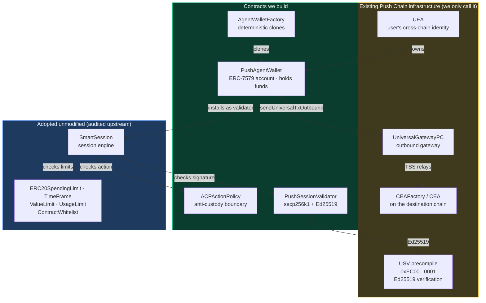
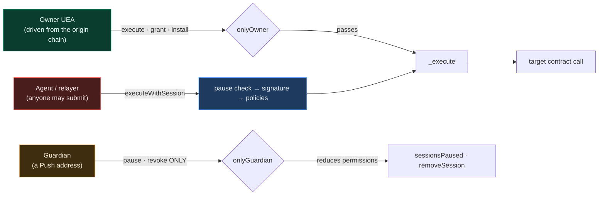
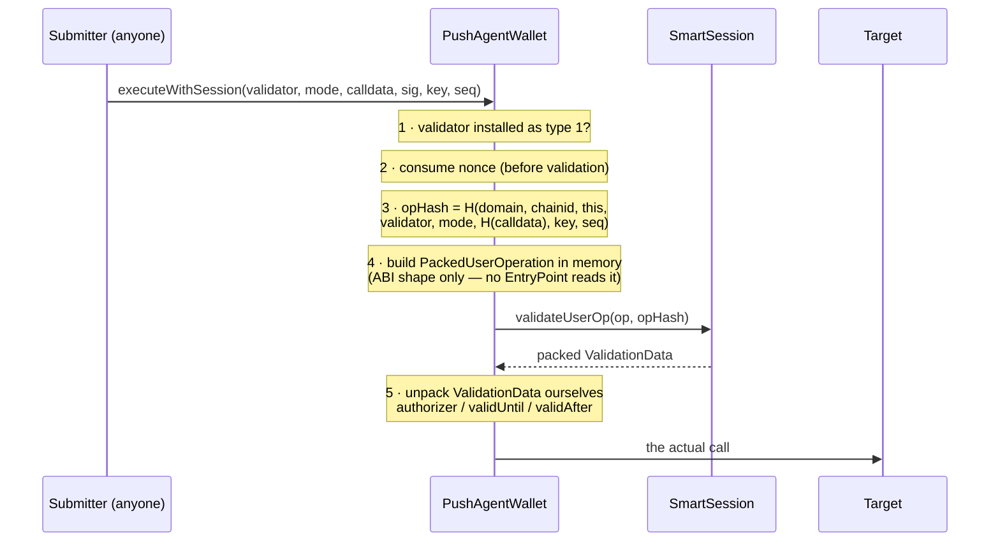
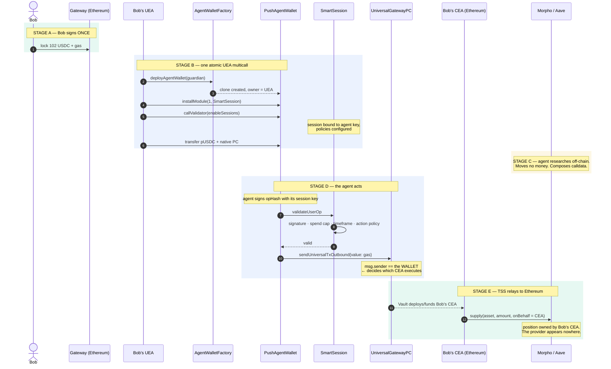
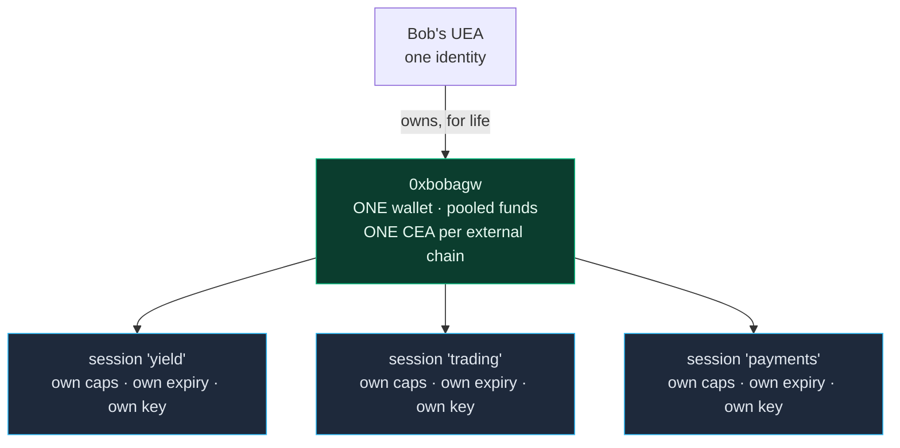
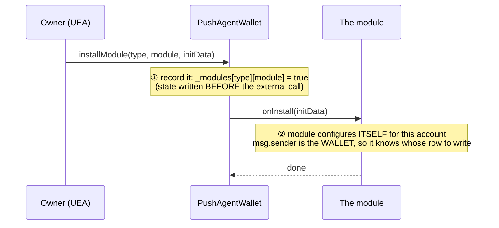
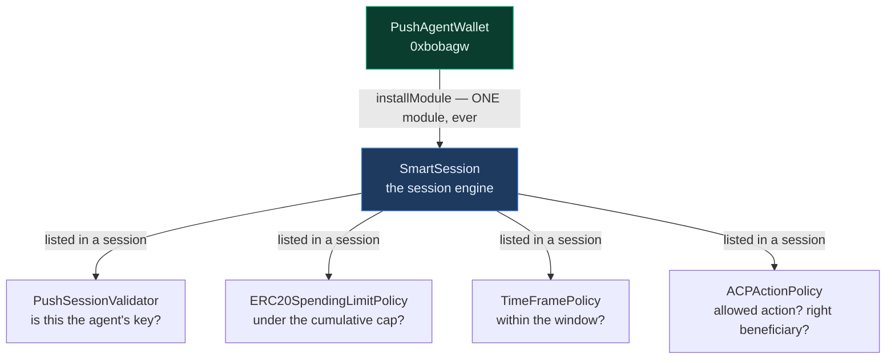
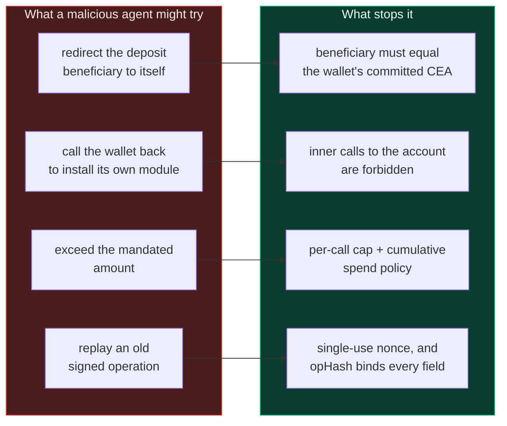

# Architecture

**Push Agentic Wallet** — smart accounts on Push Chain that let an autonomous AI agent
act on a user's behalf, across chains, within limits the user sets once and can withdraw
at any moment.

This document explains the system end to end. Start here, then read the contract-specific
documents linked at the bottom.

---

## 1. The problem

A user wants an AI agent to manage capital for them. Say Bob holds USDC on Ethereum and
wants an agent to find the best lending yield and deposit into it.

The naive approach is to send the agent your funds and trust it. That fails for obvious
reasons: the agent custodies your money, and you rely on its honesty and its operational
security.

The next approach is to grant a token allowance. Better, but an allowance is a blunt
instrument — it caps *how much*, never *what for*. An agent with an allowance can move
your funds anywhere it likes, to any beneficiary, including itself.

What we actually want is narrower:

> The agent may move **up to this much**, of **this asset**, by calling **these specific
> functions**, on **these specific protocols**, and the resulting position must end up
> owned by **me** — for **this long**, and I can revoke it instantly.

That is what this system enforces, in contract code rather than by trust.

## 2. The core idea

Each **user** gets one smart account, for life: a **`PushAgentWallet`**.

The wallet is owned by the user's existing **UEA** (Universal Executor Account — their
cross-chain identity on Push Chain). The agent never owns it and never holds its keys.
Instead, the agent is granted a **session key**: a scoped, expiring credential that can
only trigger actions passing every installed policy.

A **mandate** is a session on that wallet, not a contract of its own. Ten mandates mean ten
sessions inside SmartSession, one wallet, and one CEA per external chain. See
[§8.1](#81-one-wallet-per-user) for what that buys and what it costs.

The critical structural property is this:

> When the wallet sends a cross-chain transaction, **the wallet** is `msg.sender` at the
> gateway — never the agent.

Push Chain's gateway stamps `msg.sender` into its outbound event, and that address
determines which **CEA** (Chain Executor Account) executes on the destination chain.
Because the wallet is always the caller, funds land in *the wallet's own* CEA. The agent
composes the transaction but never appears in the ownership path.

Custody is therefore not prevented by a rule that could be misconfigured. It is prevented
by the shape of the system.

## 3. The actors

| Handle | What it is | Lives on |
|---|---|---|
| `0xbob` | The end user's EOA | Ethereum |
| `0xbobuea` | Bob's UEA — his cross-chain identity, and the wallet's root authority | Push Chain |
| `0xbobagw` | **`PushAgentWallet`** — Bob's ONE account, owned by `0xbobuea` for life | Push Chain |
| `0xbobagwcea` | The CEA derived from `0xbobagw` — one per external chain | Ethereum |
| `0xbobguard` | Bob's **guardian**: a Push address that may pause or revoke, nothing else | Push Chain |
| `0xprovider` | The provider agent's own UEA | Push Chain |
| `0xprovkey` | The agent's hot **session key**, secp256k1 or Ed25519, one per mandate | off-chain |

Note that `0xbobagwcea` derives from `0xbobagw`, not from the provider. That derivation
is the whole ballgame.

## 4. System map

Four contracts are ours. Everything else is either adopted unmodified or already exists
on Push Chain.



### Who does what

| Contract | One-line role | Doc |
|---|---|---|
| `PushAgentWallet` | Holds the funds; is the `msg.sender` the gateway sees | [agent-wallet.md](./agent-wallet.md) |
| `AgentWalletFactory` | Mints one wallet per owner, deterministically and idempotently | [factory.md](./factory.md) |
| `ACPActionPolicy` | Decides whether a proposed cross-chain action is permitted | [modules.md](./modules.md) |
| `PushSessionValidator` | Answers "did the session key sign this?" for both curves | [modules.md](./modules.md) |
| `SmartSession` + 5 policies | Adopted session engine and limit policies | [modules.md](./modules.md) |
| Libraries, interfaces, types | Shared encoding, errors, mirrored structs | [libraries-and-types.md](./libraries-and-types.md) |

## 5. Three authority paths

Everything the wallet does arrives through one of exactly three doors. Understanding the
differences explains most of the design.



| Path | Who | Powers | Speed |
|---|---|---|---|
| **Owner** | the UEA | everything — execute, install, grant, reconfigure, purge, sweep, unpause. All exits and the standing PRC20 approval live here. | minutes (TSS round trip) |
| **Guardian** | any Push address the owner designates | `guardianPause`, `guardianRevoke`, `guardianRevokeAll`. Can only *reduce* permissions: cannot spend, cannot grant, cannot unpause. | seconds (one Push tx) |
| **Session** | the agent key; submitted by anyone | `executeWithSession` → policy-gated → terminates at the gateway | seconds, bounded by the Mandate Bound |

**The owner path** is unconditional. The UEA is the root authority: it can execute anything,
install or remove any module, and revoke any session at any time. No policy constrains the
owner, because policies exist to constrain *delegated* authority.

**The guardian path** exists because the owner is slow. Owner actions cost an origin-chain
round trip, and a compromised session key can act inside that window. The guardian closes it
to one Push transaction. The asymmetry is the whole design: because the guardian can only
ever *reduce* permissions, a compromised guardian is a liveness problem, never a solvency
one — which is what makes the role safe to delegate to a watchtower or a hot key.

Pause is deliberately reversible **without** re-granting. Revoking and re-granting would
reset the mandate's spend counters to zero, so a false alarm handled by revocation would
silently re-arm its caps. Only the owner may unpause.

**The session path** is where all the enforcement lives. The agent has no inherent authority
— every call must carry a signature that survives every installed check.

A deliberate and initially surprising detail: `executeWithSession` is callable by
**anyone**. Authorization is the signature checked inside, not `msg.sender`. This is not
a missing access control — it means the provider, a relayer, or the user can all submit
the same signed operation, and gas payment is decoupled from authority.

### Recovery runbook

`emergencyRevokeAll` deliberately skips module callbacks, so a hostile module cannot resist
removal. The cost is that SmartSession's session set survives, which blocks reinstallation.
The way back is fixed and always available to the owner:

```
emergencyRevokeAll([SmartSession])
  → purgeDanglingSessions(k)      repeat until the emitted `remaining` is 0
  → installModule(1, SmartSession)
  → grantMandate(...)             re-grant what should still exist
```

`guardianRevokeAll` is the non-bricking variant: it loops `removeSession`, which clears the
session set properly, so reinstallation keeps working.

## 6. Native account abstraction

Push Chain has **no ERC-4337 EntryPoint**. That single fact shapes `PushAgentWallet`.

On a 4337 chain, an EntryPoint receives a `UserOperation`, asks the account to validate
it, interprets the returned `ValidationData`, and then calls the account. Here, there is
no such orchestrator, so `executeWithSession` does that job itself.



Two details in that flow are where subtle bugs would live:

**The operation hash binds eight fields.** Domain tag, chain id, account address,
validator address, execution mode, payload hash, nonce key, nonce sequence. Each one
closes a distinct replay class — drop `block.chainid` and a testnet signature replays on
mainnet; drop `address(this)` and Bob's signature works on Alice's wallet.

**`validUntil == 0` means no expiry**, not "expired at the epoch". Reading that field
naively would reject every non-expiring session.

The nonce is 2D — a `(uint192 key, uint64 seq)` pair rather than one counter. Several
agents can therefore operate the same wallet concurrently on separate keys without
serialising behind each other or colliding.

## 7. End-to-end flow

This is the complete journey, from Bob signing once on Ethereum to a position opening in
his name on Ethereum again. Stages A/B/C are setup; D/E are each subsequent agent action.



Once set up, each further action is just Stage C → D → E. The wallet persists, the
session persists until it expires or is revoked, and Bob signs nothing further.

## 8. Creation of an agentic wallet

A wallet comes into existence exactly once per user, and it is created **by the user's own
UEA** — never by the agent, never by an operator. Deployment is idempotent: calling it again
returns the existing wallet rather than reverting, so a repeated Stage B multicall cannot
fail an otherwise valid grant.

### The deployment flow


Three properties are worth holding onto.

**The caller is the owner.** `deployAgentWallet` reads the owner from `msg.sender` and
takes no owner parameter. There is deliberately no `deployFor(owner, …)` variant — such a
path would let an attacker deploy a wallet on a user's behalf, against an implementation
the user never chose.

**Deployment happens inside the user's inbound multicall.** In the end-to-end flow
(Stage B), `deployAgentWallet` is one call in the atomic multicall the UEA executes after
Bob's single Ethereum signature. Wallet creation, module installation, session grant, and
funding all land in one transaction.

**Deploying twice is a no-op, not an error.** If a wallet already exists for the caller, the
call returns it unchanged and emits nothing. That matters because deployment happens inside
an atomic multicall: a revert on a benign duplicate would take an otherwise valid grant down
with it. The SDK still checks `isDeployed` and builds a shorter multicall for later mandates,
but correctness does not depend on it doing so.

### The address is deterministic

```
salt    = keccak256(abi.encode(owner))
address = CREATE2(factory, salt, EIP-1167 clone of the implementation)
```

Because the address depends only on the owner and the mandate id, it can be computed
before anything is deployed. That is what makes the one-signature flow possible: the
payload Bob signs on Ethereum can reference a wallet address that will not exist for
several more steps, and can commit to the CEA derived from it.

It also means the address is **not** front-runnable. An attacker who calls
`deployAgentWallet` first would be deploying with themselves as `msg.sender`, producing a
different salt and therefore a different address — not Bob's.

### 8.1 One wallet per user

A **mandate** is a standing grant of bounded authority: *"this agent may run this strategy
for me, up to this much, until this date."* It is not a single job. Many jobs run under
one mandate, and that is the point — the second job needs no new signature from the user.

One UEA owns exactly **one** wallet, forever. Mandates multiply as sessions inside it:



**Jobs are not mandates.** Running the yield strategy three times uses one session three
times. What bounds exposure across those repeated runs is not a fresh signature — it is
the *cumulative* spend cap and the mandate expiry, both fixed when the session was granted.

**Why one wallet.** Every mandate after the first skips wallet deployment, module
installation, and a destination-chain CEA proxy deployment. One CEA per chain means protocol
rewards, points and e-mode status aggregate in one place, destination-chain approvals persist
across mandates, and the user has one legible external address instead of a fleet.

#### The Mandate Bound

Because mandates share a wallet, isolation is **configured, not structural**. A fully
compromised session key can, before revocation, do exactly this much and no more:

| Dimension | Provable bound | Enforced by |
|---|---|---|
| Mandated asset | `≤ maxAmountTotal − spent` | `ACPActionPolicy` R5b |
| Per transaction | `0 < amount ≤ maxAmountPerCall` | `ACPActionPolicy` R13 + R5 |
| Native PC (pooled gas) | `≤ valueLimit − limitUsed` | `ValueLimitPolicy` |
| Per-transaction PC | `≤ maxPCPerCall` | `ACPActionPolicy` R12 |
| Destination-chain native, per inner entry | `≤ rule.maxValue` | `ACPActionPolicy` R11 |
| Time | until `validUntil` (non-zero, enforced at grant) | `TimeFramePolicy` + `grantMandate` |
| Reachable destination contracts | `⊆ {t : (t,s) ∈ allowedCalls}` | `ACPActionPolicy` R8 |
| Deposit destination | `== expectedCEA` | `ACPActionPolicy` R9 |
| Approval spender on the destination chain | `== rule.expectedArg` | `ACPActionPolicy` R9-ext |
| Positions at rest, exits, CEA self-calls | **unreachable** | `ACPActionPolicy` R7 |
| Other mandates' configs, sessions, modules | **unreachable** | R2 + grant guards G1–G3 |

Every row is a number readable directly from policy state, and **no bound is the product of
two parameters** — so no bound can be quietly inflated by moving one factor.

**Not covered, stated plainly.** Idle wallet balances are fungible across mandates: mandate
2's session spends from a pooled pUSDC balance that may include mandate 1's undeployed
deposit. Total user exposure is the sum of every `maxAmountTotal`, each personally signed.
Deployed position *outcomes* in the CEA are untouchable by any session, because sessions are
entry-only.

**What `mandateId` means is an off-chain decision.** The contracts treat it as an opaque
`bytes32` session salt and never interpret it. It must be non-zero, and re-granting the same
`(validator, key, salt)` is rejected — `reconfigureMandate` is the explicit path for
changing a live mandate's terms.

## 9. The wallet and its modules

### What `PushAgentWallet` is

An ERC-7579 modular smart account, deployed as an EIP-1167 minimal clone. It is the
contract that **holds the mandate's funds** and, critically, the contract that appears as
`msg.sender` when the outbound gateway is called.

Its own storage is deliberately small:

| Slot | Holds | Meaning |
|---|---|---|
| 0 | `owner` + `_initialized` | the UEA that owns this wallet; set once, never changes |
| 1 | `_hook` | the single active hook, if any |
| 2 | `_modules[type][module]` | which modules are installed, keyed **type-first** |
| 3 | `_nonces[key]` | 2D nonce sequences for session operations |

That is the whole of it. No caps, no allowlists, no expiry, no session keys — none of the
mandate's rules live in the wallet.

**The UEA is the sole root authority.** Only the owner can install or remove modules, grant
or reconfigure sessions, sweep funds, or execute directly. There is no admin key, no
pause, no upgrade path, and no `transferOwnership` — the wallet's address is derived from
its owner, so a mutable owner would make that derivation lie. The agent is never the
owner and can never become it.

**The wallet's code is fixed forever.** Clones share the implementation's bytecode and it
cannot be upgraded. All extensibility comes from modules — which is exactly why ERC-7579
exists.

### What installing a module means

Installation is two distinct writes, in two different contracts:



The wallet stores a **yes/no**. The module stores the **details**.

`initData` is opaque bytes the wallet forwards without inspecting — its meaning is defined
entirely by the module receiving it. That opacity is deliberate: it is what lets one
account interface serve modules that had not been written when the account was deployed.

The key mechanic is that `msg.sender` inside `onInstall` is the **wallet**. A single
deployed module therefore serves every account on the chain, keeping one configuration row
per account. Nothing is deployed per user.

### The account vs. SmartSession — two different registries

This is the distinction that most often trips people up. There are **two** levels of
registration, and only the first is "installation".



A live wallet has **exactly one entry** in its module registry: SmartSession, as type 1.
Everything expressive lives one layer down.

| | The account | SmartSession |
|---|---|---|
| Written by | `installModule` | `enableSessions` |
| Stores | one boolean per module | sessions, each listing several policies |
| How many | **1** in practice | many sessions per account |
| Changes when a rule changes? | never | yes |
| Knows the spend cap exists? | **no** | yes |

**Installing is plumbing; granting a session is permission.** The owner installs
SmartSession once, then writes one session per mandate — each with its own key, caps, expiry
and allowlist, and each keyed by its own `PermissionId`. That per-`PermissionId` keying is
what keeps mandates independent on a shared wallet. Adding a rule never touches the account.

This layering buys three things. The wallet stays permanent and minimal. One account can
carry several independent grants. And revocation is a single storage write:
`emergencyRevokeAll` clears the SmartSession entry, and every session dies at once — not
because the sessions were deleted, but because the wallet stops asking.

### Modules in use today

| Module | ERC-7579 type | Installed on the account? | Origin |
|---|---|---|---|
| `SmartSession` | 1 — validator | ✅ **yes, the only one** | adopted |
| `PushSessionValidator` | 7 — stateless validator | ❌ referenced inside a session | **ours** |
| *(hook slot)* | 4 — hook | ❌ supported, none installed in v1 | — |

`PushSessionValidator` is type **7**, and the account only accepts types 1 and 4 — so it
is never installed on the wallet. SmartSession calls it during validation. It is stateless
by design: every parameter arrives as calldata, so one deployment serves every account,
and it supports both secp256k1 and Ed25519 (the latter via Push Chain's USV precompile,
which is what lets a Solana-keyed agent operate an EVM account).

Executor modules (type 2) and fallback handlers (type 3) are permanently unsupported —
see the design-decisions table below.

### Policies available today

Policies are not ERC-7579 modules. They are listed inside a session and called by
SmartSession during validation.

| Policy | Enforces | Status |
|---|---|---|
| `ACPActionPolicy` | the action is the gateway call; the asset, amounts, destination protocols, **beneficiary** and **approval spender** are all as mandated | **ours** · MANDATORY |
| `TimeFramePolicy` | the session's validity window, and that it genuinely expires | adopted · MANDATORY |
| `ValueLimitPolicy` | the mandate's lifetime native-PC (gas) budget | adopted · MANDATORY |
| `UsageLimitPolicy` | number of uses | adopted, optional |
| `ContractWhitelistPolicy` | callable contracts | adopted, optional |
| `ERC20SpendingLimitPolicy` | cumulative token spend | adopted, **not used** — the asset cap lives in `ACPActionPolicy` |

The three mandatory policies are enforced **on-chain at grant time**: `grantMandate` rejects
any session missing `TimeFramePolicy` with a real expiry, or missing either
`ACPActionPolicy` or `ValueLimitPolicy` on its single gateway action. Anything the SDK could
get wrong in a way that silently weakens a mandate is checked by the contract.

`ACPActionPolicy` is the anti-custody boundary and the one policy that could not be adopted:
it understands Push Chain's outbound request format and enforces that the beneficiary of any
cross-chain deposit is the wallet's own CEA. The others are generic and audited upstream.

Every policy must pass. SmartSession does not take a vote — a single rejection reverts the
whole operation. Policies **intersect**, so adding a permissive policy alongside
`ACPActionPolicy` cannot weaken it; the hazards are substitution and omission, which is what
the grant-time guards catch.

> #### ⛔ Never attach `SimpleGasPolicy` on Push Chain
>
> It reads gas fields from the `PackedUserOperation`. Because Push Chain has no EntryPoint,
> `executeWithSession` builds that struct in memory with **every gas field zero** — so the
> policy computes a zero cost, passes everything forever, and still satisfies SmartSession's
> "at least one policy" floor while *appearing* in the session as a gas control.
>
> A policy that enforces nothing but looks like it does is worse than no policy. Use
> `ValueLimitPolicy` for gas budgeting. This is a natural mistake when porting a standard
> ERC-4337 session template.

## 10. Why the agent cannot steal

Four independent properties, each enforced by a different mechanism.



Above all of it sits the owner. The UEA can call `emergencyRevokeAll` and cut every
session instantly — and that path deliberately skips module callbacks, so a buggy or
hostile module cannot refuse to be removed.

## 11. Design decisions worth knowing

### Guiding principles

Everything below follows from these. When a change seems to conflict with one, the principle
wins.

| # | Principle | Statement |
|---|---|---|
| P-1 | **PUSH-ORIGIN** | Every agent action originates and is triggered from Push Chain. |
| P-2 | **SINGLE-RESOLUTION-POINT** | Mandate identity exists only on Push, and is fully resolved inside `ACPActionPolicy` before the outbound event is emitted. |
| P-3 | **CAPS-NOT-CLAIMS** | A mandate is a bounded allowance against a pooled account, not a pot of money. The system never asserts external state it cannot observe. |
| P-4 | **FAIL-CLOSED** | Every pin is chosen so that if an upstream rule were bypassed, the downstream frozen contract reverts rather than executes. |
| P-5 | **ENTRY-ONLY SESSIONS** | The session path opens positions. It never closes them, bridges value back, or self-calls the CEA. Exits are owner-path. |
| P-6 | **NULL-DIFF COMPLIANCE** | The agentic outbound is not a new transaction type. Nothing outside this repo changes. |
| P-7 | **ON-CHAIN GRANT VALIDATION** | Anything the SDK could get wrong in a way that silently weakens a mandate is validated on-chain at grant time. |
| P-8 | **TWO-SPEED AUTHORITY** | Root authority (owner) is slow and unconstrained. Emergency authority (guardian) is fast and can only *reduce* permissions. |

### Settled choices

Each removes a class of risk rather than adding a feature.

| Decision | Reasoning |
|---|---|
| Wallet logic is **immutable** (EIP-1167 clone) | No admin key exists over user funds; nothing to upgrade maliciously |
| `owner` is set once, **no `transferOwnership`** | The address derives from the owner, so a mutable owner would make it lie |
| **No executor modules** | Executors are the highest-privilege module type, and nothing needs unprompted execution |
| **No `delegatecall`** execution mode | The target would own the account's storage |
| **No partial-failure mode** | Silent partial success is the wrong semantic for moving money |
| **No fallback handlers** | Token receivers are implemented natively; avoids the ERC-2771 spoofing footgun |
| **Sessions granted by the owner only** | The agent can never widen its own permissions |
| Module registry keyed **type-first** | A validator can never be mistaken for an executor |

## 12. Where to read next

| Document | What it covers |
|---|---|
| [agent-wallet.md](./agent-wallet.md) | `PushAgentWallet` — the account, execution, sessions, nonces, owner controls |
| [factory.md](./factory.md) | `AgentWalletFactory` — deterministic deployment and address derivation |
| [modules.md](./modules.md) | `ACPActionPolicy`, `PushSessionValidator`, `SmartSession` and the adopted policies |
| [libraries-and-types.md](./libraries-and-types.md) | Encoding libraries, shared types, errors, interfaces |
