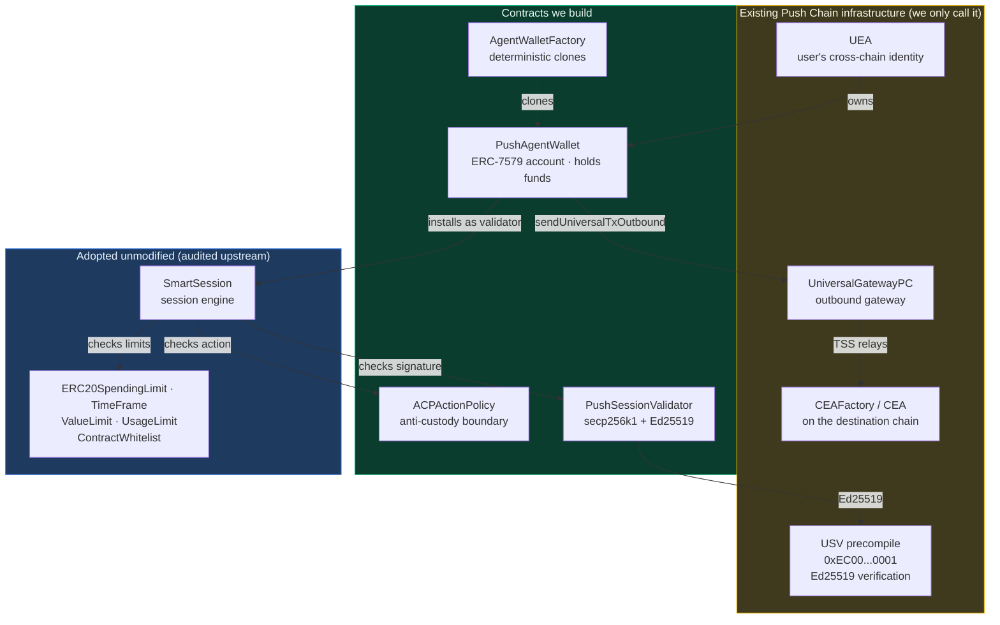
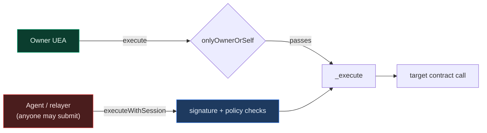
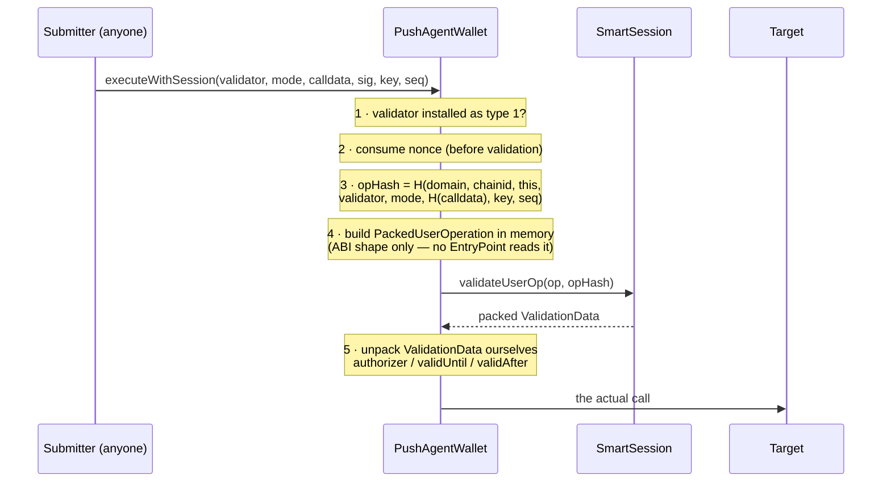
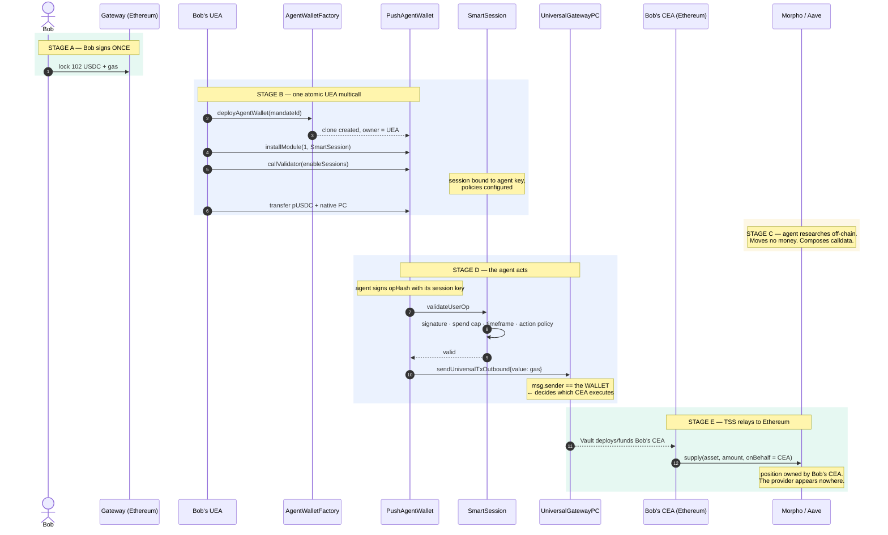
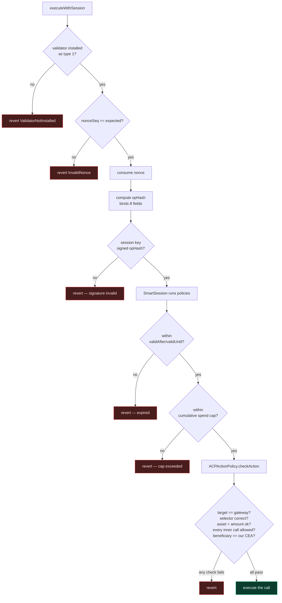
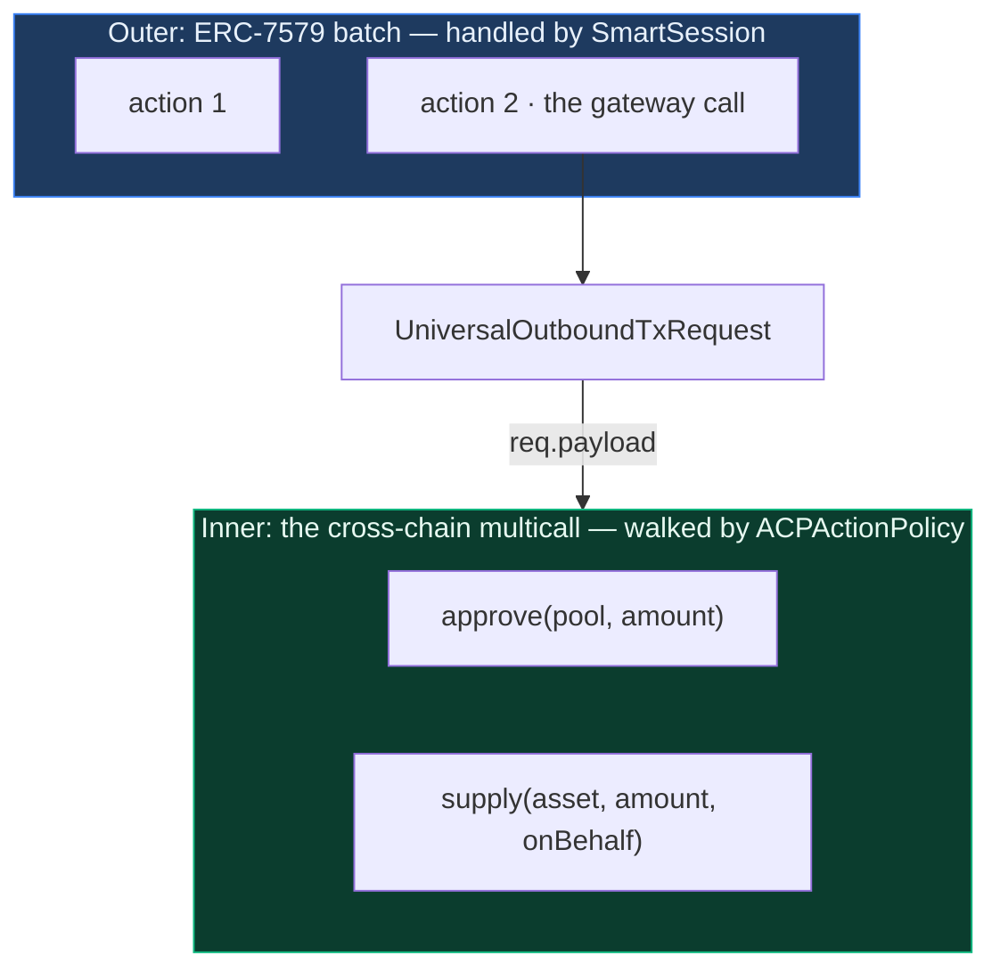
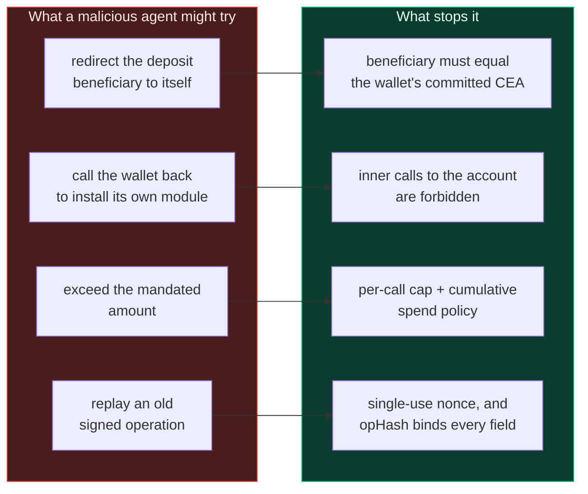
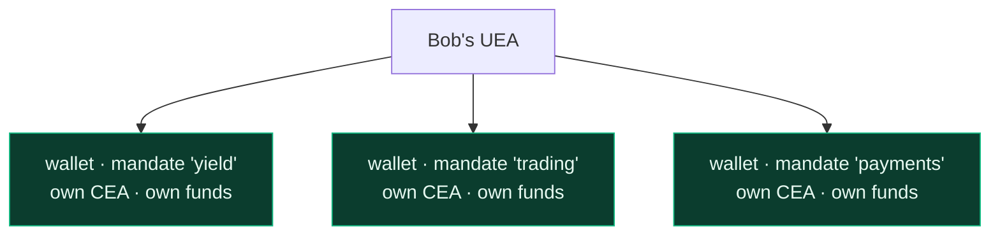

# Architecture

**Push Agentic Wallet** — smart accounts on Push Chain that let an autonomous AI agent
act on a user's behalf, across chains, within limits the user sets once and can withdraw
at any moment.

This document explains the system end to end. Start here, then read the contract-specific
documents linked at the bottom.

---

## 1. The problem

A user wants an AI agent to manage capital for them. Say Bob holds USDC on Ethereum and
wants an agent to find the best lending yield and deposit into it.

The naive approach is to send the agent your funds and trust it. That fails for obvious
reasons: the agent custodies your money, and you rely on its honesty and its operational
security.

The next approach is to grant a token allowance. Better, but an allowance is a blunt
instrument — it caps *how much*, never *what for*. An agent with an allowance can move
your funds anywhere it likes, to any beneficiary, including itself.

What we actually want is narrower:

> The agent may move **up to this much**, of **this asset**, by calling **these specific
> functions**, on **these specific protocols**, and the resulting position must end up
> owned by **me** — for **this long**, and I can revoke it instantly.

That is what this system enforces, in contract code rather than by trust.

## 2. The core idea

Each mandate gets its own smart account: a **`PushAgentWallet`**.

The wallet is owned by the user's existing **UEA** (Universal Executor Account — their
cross-chain identity on Push Chain). The agent never owns it and never holds its keys.
Instead, the agent is granted a **session key**: a scoped, expiring credential that can
only trigger actions passing every installed policy.

The critical structural property is this:

> When the wallet sends a cross-chain transaction, **the wallet** is `msg.sender` at the
> gateway — never the agent.

Push Chain's gateway stamps `msg.sender` into its outbound event, and that address
determines which **CEA** (Chain Executor Account) executes on the destination chain.
Because the wallet is always the caller, funds land in *the wallet's own* CEA. The agent
composes the transaction but never appears in the ownership path.

Custody is therefore not prevented by a rule that could be misconfigured. It is prevented
by the shape of the system.

## 3. The actors

| Handle | What it is | Lives on |
|---|---|---|
| `0xbob` | The end user's EOA | Ethereum |
| `0xbobuea` | Bob's UEA — his cross-chain identity | Push Chain |
| `0xbobagw` | **`PushAgentWallet`** — the mandate account, owned by `0xbobuea` | Push Chain |
| `0xbobagwcea` | The CEA derived from `0xbobagw` — executes on Ethereum | Ethereum |
| `0xprovider` | The provider agent's own UEA | Push Chain |
| `0xprovkey` | The agent's hot **session key**, secp256k1 or Ed25519 | off-chain |

Note that `0xbobagwcea` derives from `0xbobagw`, not from the provider. That derivation
is the whole ballgame.

## 4. System map

Four contracts are ours. Everything else is either adopted unmodified or already exists
on Push Chain.

### Who does what

| Contract | One-line role | Doc |
|---|---|---|
| `PushAgentWallet` | Holds the funds; is the `msg.sender` the gateway sees | [agent-wallet.md](./agent-wallet.md) |
| `AgentWalletFactory` | Mints one wallet per `(owner, mandate)`, deterministically | [factory.md](./factory.md) |
| `ACPActionPolicy` | Decides whether a proposed cross-chain action is permitted | [modules.md](./modules.md) |
| `PushSessionValidator` | Answers "did the session key sign this?" for both curves | [modules.md](./modules.md) |
| `SmartSession` + 5 policies | Adopted session engine and limit policies | [modules.md](./modules.md) |
| Libraries, interfaces, types | Shared encoding, errors, mirrored structs | [libraries-and-types.md](./libraries-and-types.md) |

## 5. Two authority paths

Everything the wallet does arrives through one of exactly two doors. Understanding the
difference explains most of the design.

**The owner path** is unconditional. The UEA is the root authority: it can execute
anything, install or remove any module, and revoke any session at any time. No policy
constrains the owner, because policies exist to constrain *delegated* authority.

**The session path** is where all the enforcement lives. The agent has no inherent
authority — every call must carry a signature that survives every installed check.

A deliberate and initially surprising detail: `executeWithSession` is callable by
**anyone**. Authorization is the signature checked inside, not `msg.sender`. This is not
a missing access control — it means the provider, a relayer, or the user can all submit
the same signed operation, and gas payment is decoupled from authority.

## 6. Native account abstraction

Push Chain has **no ERC-4337 EntryPoint**. That single fact shapes `PushAgentWallet`.

On a 4337 chain, an EntryPoint receives a `UserOperation`, asks the account to validate
it, interprets the returned `ValidationData`, and then calls the account. Here, there is
no such orchestrator, so `executeWithSession` does that job itself.

Two details in that flow are where subtle bugs would live:

**The operation hash binds eight fields.** Domain tag, chain id, account address,
validator address, execution mode, payload hash, nonce key, nonce sequence. Each one
closes a distinct replay class — drop `block.chainid` and a testnet signature replays on
mainnet; drop `address(this)` and Bob's signature works on Alice's wallet.

**`validUntil == 0` means no expiry**, not "expired at the epoch". Reading that field
naively would reject every non-expiring session.

The nonce is 2D — a `(uint192 key, uint64 seq)` pair rather than one counter. Several
agents can therefore operate the same wallet concurrently on separate keys without
serialising behind each other or colliding.

## 7. End-to-end flow

This is the complete journey, from Bob signing once on Ethereum to a position opening in
his name on Ethereum again. Stages A/B/C are setup; D/E are each subsequent agent action.

Once set up, each further action is just Stage C → D → E. The wallet persists, the
session persists until it expires or is revoked, and Bob signs nothing further.

## 8. How a single action is validated

Stage D compressed into one picture — this is the enforcement core.

Checks are ordered cheapest-first, so a malformed or unauthorized request fails before
the expensive payload walk.

## 9. Two levels of nesting

A recurring source of confusion: `ACPActionPolicy` deals with **two different** layers of
batching, and they are not the same thing.

SmartSession destructures the **outer** batch and calls `checkAction` once per action, so
the policy never iterates it. The policy's own loop walks the **inner** multicall inside
`req.payload` — the instructions that will run on the destination chain. That inner loop
is where the beneficiary check applies.

## 10. Why the agent cannot steal

Four independent properties, each enforced by a different mechanism.

Above all of it sits the owner. The UEA can call `emergencyRevokeAll` and cut every
session instantly — and that path deliberately skips module callbacks, so a buggy or
hostile module cannot refuse to be removed.

## 11. One wallet per mandate

The wallet address is derived from `keccak256(abi.encode(owner, mandateId))`, so each
mandate gets a distinct account.

This is blast-radius containment. A compromised session key on the trading mandate cannot
touch the yield mandate's funds — different account, different CEA, different policy set.
Addresses are also computable before deployment, so the funding transaction and the
deployment can be built in a single signed payload.

## 12. Design decisions worth knowing

These are settled choices. Each removes a class of risk rather than adding a feature.

| Decision | Reasoning |
|---|---|
| Wallet logic is **immutable** (EIP-1167 clone) | No admin key exists over user funds; nothing to upgrade maliciously |
| `owner` is set once, **no `transferOwnership`** | The address derives from the owner, so a mutable owner would make it lie |
| **No executor modules** | Executors are the highest-privilege module type, and nothing needs unprompted execution |
| **No `delegatecall`** execution mode | The target would own the account's storage |
| **No partial-failure mode** | Silent partial success is the wrong semantic for moving money |
| **No fallback handlers** | Token receivers are implemented natively; avoids the ERC-2771 spoofing footgun |
| **Sessions granted by the owner only** | The agent can never widen its own permissions |
| Module registry keyed **type-first** | A validator can never be mistaken for an executor |

## 13. Where to read next

| Document | What it covers |
|---|---|
| [agent-wallet.md](./agent-wallet.md) | `PushAgentWallet` — the account, execution, sessions, nonces, owner controls |
| [factory.md](./factory.md) | `AgentWalletFactory` — deterministic deployment and address derivation |
| [modules.md](./modules.md) | `ACPActionPolicy`, `PushSessionValidator`, `SmartSession` and the adopted policies |
| [libraries-and-types.md](./libraries-and-types.md) | Encoding libraries, shared types, errors, interfaces |
