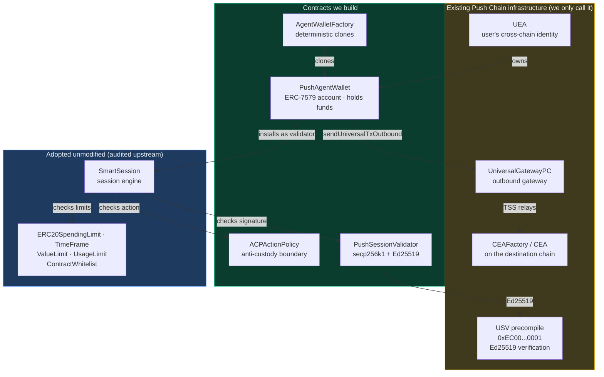
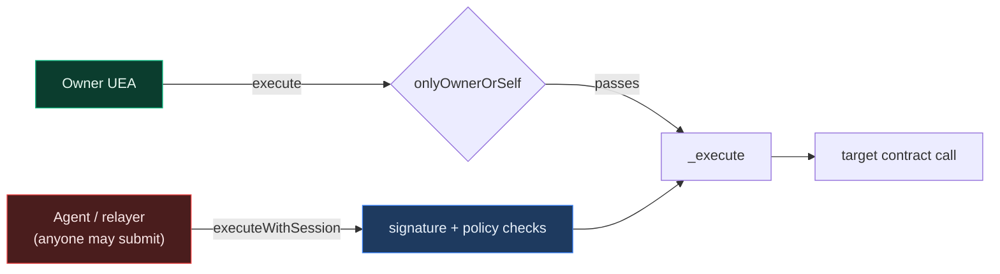
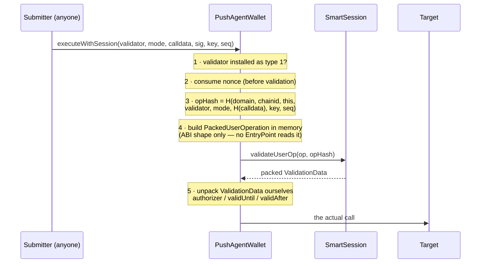
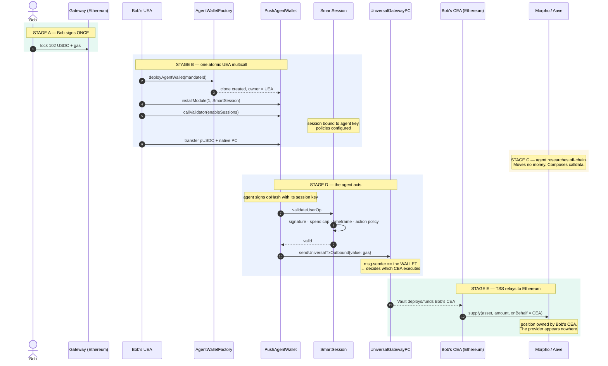
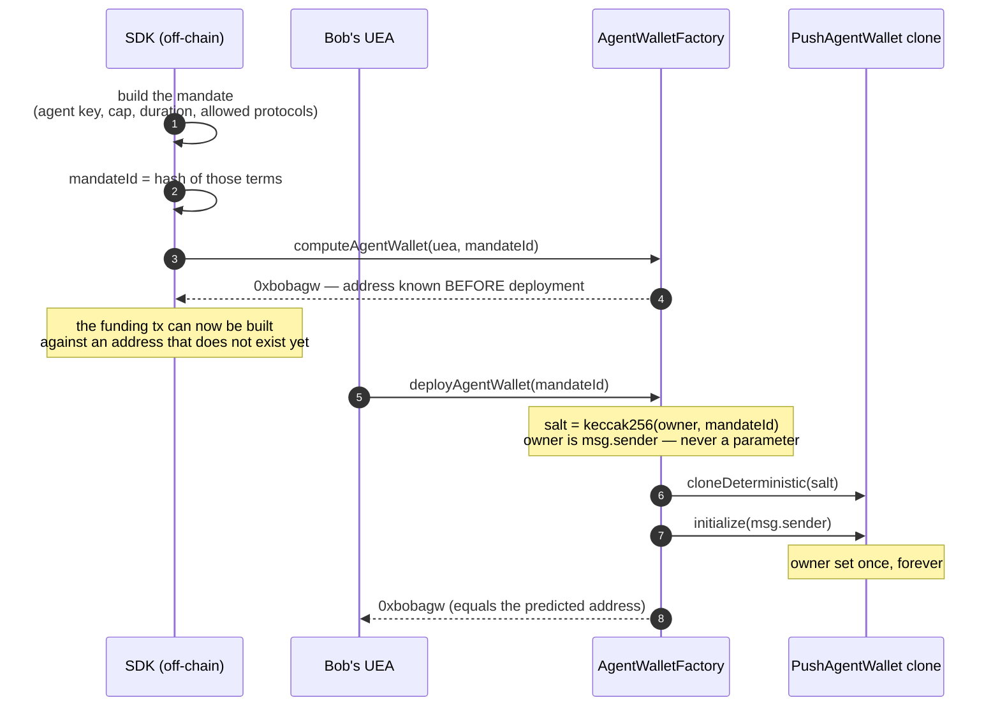
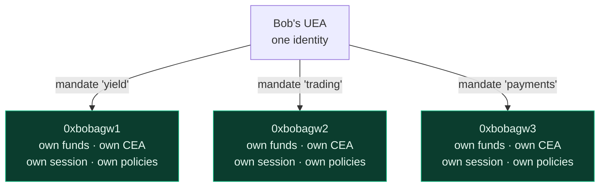
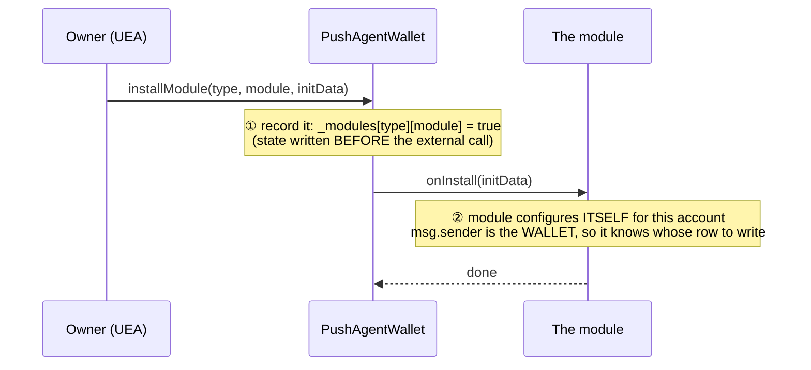
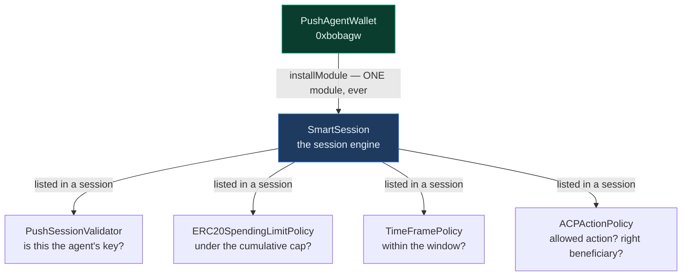
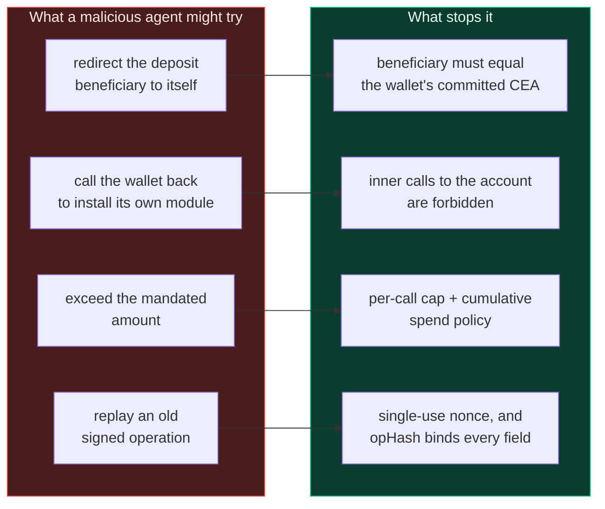

# Architecture

**Push Agentic Wallet** — smart accounts on Push Chain that let an autonomous AI agent
act on a user's behalf, across chains, within limits the user sets once and can withdraw
at any moment.

This document explains the system end to end. Start here, then read the contract-specific
documents linked at the bottom.

---

## 1. The problem

A user wants an AI agent to manage capital for them. Say Bob holds USDC on Ethereum and
wants an agent to find the best lending yield and deposit into it.

The naive approach is to send the agent your funds and trust it. That fails for obvious
reasons: the agent custodies your money, and you rely on its honesty and its operational
security.

The next approach is to grant a token allowance. Better, but an allowance is a blunt
instrument — it caps *how much*, never *what for*. An agent with an allowance can move
your funds anywhere it likes, to any beneficiary, including itself.

What we actually want is narrower:

> The agent may move **up to this much**, of **this asset**, by calling **these specific
> functions**, on **these specific protocols**, and the resulting position must end up
> owned by **me** — for **this long**, and I can revoke it instantly.

That is what this system enforces, in contract code rather than by trust.

## 2. The core idea

Each mandate gets its own smart account: a **`PushAgentWallet`**.

The wallet is owned by the user's existing **UEA** (Universal Executor Account — their
cross-chain identity on Push Chain). The agent never owns it and never holds its keys.
Instead, the agent is granted a **session key**: a scoped, expiring credential that can
only trigger actions passing every installed policy.

The critical structural property is this:

> When the wallet sends a cross-chain transaction, **the wallet** is `msg.sender` at the
> gateway — never the agent.

Push Chain's gateway stamps `msg.sender` into its outbound event, and that address
determines which **CEA** (Chain Executor Account) executes on the destination chain.
Because the wallet is always the caller, funds land in *the wallet's own* CEA. The agent
composes the transaction but never appears in the ownership path.

Custody is therefore not prevented by a rule that could be misconfigured. It is prevented
by the shape of the system.

## 3. The actors

| Handle | What it is | Lives on |
|---|---|---|
| `0xbob` | The end user's EOA | Ethereum |
| `0xbobuea` | Bob's UEA — his cross-chain identity | Push Chain |
| `0xbobagw` | **`PushAgentWallet`** — the mandate account, owned by `0xbobuea` | Push Chain |
| `0xbobagwcea` | The CEA derived from `0xbobagw` — executes on Ethereum | Ethereum |
| `0xprovider` | The provider agent's own UEA | Push Chain |
| `0xprovkey` | The agent's hot **session key**, secp256k1 or Ed25519 | off-chain |

Note that `0xbobagwcea` derives from `0xbobagw`, not from the provider. That derivation
is the whole ballgame.

## 4. System map

Four contracts are ours. Everything else is either adopted unmodified or already exists
on Push Chain.



### Who does what

| Contract | One-line role | Doc |
|---|---|---|
| `PushAgentWallet` | Holds the funds; is the `msg.sender` the gateway sees | [agent-wallet.md](./agent-wallet.md) |
| `AgentWalletFactory` | Mints one wallet per `(owner, mandate)`, deterministically | [factory.md](./factory.md) |
| `ACPActionPolicy` | Decides whether a proposed cross-chain action is permitted | [modules.md](./modules.md) |
| `PushSessionValidator` | Answers "did the session key sign this?" for both curves | [modules.md](./modules.md) |
| `SmartSession` + 5 policies | Adopted session engine and limit policies | [modules.md](./modules.md) |
| Libraries, interfaces, types | Shared encoding, errors, mirrored structs | [libraries-and-types.md](./libraries-and-types.md) |

## 5. Two authority paths

Everything the wallet does arrives through one of exactly two doors. Understanding the
difference explains most of the design.



**The owner path** is unconditional. The UEA is the root authority: it can execute
anything, install or remove any module, and revoke any session at any time. No policy
constrains the owner, because policies exist to constrain *delegated* authority.

**The session path** is where all the enforcement lives. The agent has no inherent
authority — every call must carry a signature that survives every installed check.

A deliberate and initially surprising detail: `executeWithSession` is callable by
**anyone**. Authorization is the signature checked inside, not `msg.sender`. This is not
a missing access control — it means the provider, a relayer, or the user can all submit
the same signed operation, and gas payment is decoupled from authority.

## 6. Native account abstraction

Push Chain has **no ERC-4337 EntryPoint**. That single fact shapes `PushAgentWallet`.

On a 4337 chain, an EntryPoint receives a `UserOperation`, asks the account to validate
it, interprets the returned `ValidationData`, and then calls the account. Here, there is
no such orchestrator, so `executeWithSession` does that job itself.



Two details in that flow are where subtle bugs would live:

**The operation hash binds eight fields.** Domain tag, chain id, account address,
validator address, execution mode, payload hash, nonce key, nonce sequence. Each one
closes a distinct replay class — drop `block.chainid` and a testnet signature replays on
mainnet; drop `address(this)` and Bob's signature works on Alice's wallet.

**`validUntil == 0` means no expiry**, not "expired at the epoch". Reading that field
naively would reject every non-expiring session.

The nonce is 2D — a `(uint192 key, uint64 seq)` pair rather than one counter. Several
agents can therefore operate the same wallet concurrently on separate keys without
serialising behind each other or colliding.

## 7. End-to-end flow

This is the complete journey, from Bob signing once on Ethereum to a position opening in
his name on Ethereum again. Stages A/B/C are setup; D/E are each subsequent agent action.



Once set up, each further action is just Stage C → D → E. The wallet persists, the
session persists until it expires or is revoked, and Bob signs nothing further.

## 8. Creation of an agentic wallet

A wallet comes into existence exactly once per mandate, and it is created **by the user's
own UEA** — never by the agent, never by an operator.

### The deployment flow



Three properties are worth holding onto.

**The caller is the owner.** `deployAgentWallet` reads the owner from `msg.sender` and
takes no owner parameter. There is deliberately no `deployFor(owner, …)` variant — such a
path would let an attacker deploy a wallet on a user's behalf, against an implementation
the user never chose.

**Deployment happens inside the user's inbound multicall.** In the end-to-end flow
(Stage B), `deployAgentWallet` is one call in the atomic multicall the UEA executes after
Bob's single Ethereum signature. Wallet creation, module installation, session grant, and
funding all land in one transaction.

**Deploying twice is an error, not a no-op.** If a wallet already exists for that
`(owner, mandateId)` pair, the call reverts. Repeat use of an existing mandate skips
deployment entirely — the SDK checks `isDeployed` first and builds a shorter multicall.

### The address is deterministic

```
salt    = keccak256(abi.encode(owner, mandateId))
address = CREATE2(factory, salt, EIP-1167 clone of the implementation)
```

Because the address depends only on the owner and the mandate id, it can be computed
before anything is deployed. That is what makes the one-signature flow possible: the
payload Bob signs on Ethereum can reference a wallet address that will not exist for
several more steps, and can commit to the CEA derived from it.

It also means the address is **not** front-runnable. An attacker who calls
`deployAgentWallet` first would be deploying with themselves as `msg.sender`, producing a
different salt and therefore a different address — not Bob's.

### 8.1 One wallet per mandate

A **mandate** is a standing grant of bounded authority: *"this agent may run this strategy
for me, up to this much, until this date."* It is not a single job. Many jobs run under
one mandate, and that is the point — the second job needs no new signature from the user.

One UEA can own **many** wallets, one per mandate:



**Jobs are not mandates.** Running the yield strategy three times uses one wallet three
times. What bounds exposure across those repeated runs is not a fresh signature — it is
the *cumulative* spend cap and the mandate expiry, both fixed when the session was
granted.

**This is blast-radius containment by construction.** If the trading mandate's session key
leaks, the attacker reaches exactly one wallet. The yield and payments wallets are
separate accounts with separate funds, separate CEAs, and separate policy configurations.
There is no code path that would let one mandate's session reach another's wallet, because
they are different contracts.

**What `mandateId` means is an off-chain decision.** The contracts treat it as an opaque
`bytes32` salt and never interpret it. Deriving it by hashing the mandate terms means any
change to the terms yields a new wallet and therefore a fresh user signature; using a
stable label instead lets one wallet's policies be reconfigured over time. That trade-off
belongs to the SDK, not to the contracts.

## 9. The wallet and its modules

### What `PushAgentWallet` is

An ERC-7579 modular smart account, deployed as an EIP-1167 minimal clone. It is the
contract that **holds the mandate's funds** and, critically, the contract that appears as
`msg.sender` when the outbound gateway is called.

Its own storage is deliberately small:

| Slot | Holds | Meaning |
|---|---|---|
| 0 | `owner` + `_initialized` | the UEA that owns this wallet; set once, never changes |
| 1 | `_hook` | the single active hook, if any |
| 2 | `_modules[type][module]` | which modules are installed, keyed **type-first** |
| 3 | `_nonces[key]` | 2D nonce sequences for session operations |

That is the whole of it. No caps, no allowlists, no expiry, no session keys — none of the
mandate's rules live in the wallet.

**The UEA is the sole root authority.** Only the owner can install or remove modules, grant
or reconfigure sessions, sweep funds, or execute directly. There is no admin key, no
pause, no upgrade path, and no `transferOwnership` — the wallet's address is derived from
its owner, so a mutable owner would make that derivation lie. The agent is never the
owner and can never become it.

**The wallet's code is fixed forever.** Clones share the implementation's bytecode and it
cannot be upgraded. All extensibility comes from modules — which is exactly why ERC-7579
exists.

### What installing a module means

Installation is two distinct writes, in two different contracts:



The wallet stores a **yes/no**. The module stores the **details**.

`initData` is opaque bytes the wallet forwards without inspecting — its meaning is defined
entirely by the module receiving it. That opacity is deliberate: it is what lets one
account interface serve modules that had not been written when the account was deployed.

The key mechanic is that `msg.sender` inside `onInstall` is the **wallet**. A single
deployed module therefore serves every account on the chain, keeping one configuration row
per account. Nothing is deployed per user.

### The account vs. SmartSession — two different registries

This is the distinction that most often trips people up. There are **two** levels of
registration, and only the first is "installation".



A live wallet has **exactly one entry** in its module registry: SmartSession, as type 1.
Everything expressive lives one layer down.

| | The account | SmartSession |
|---|---|---|
| Written by | `installModule` | `enableSessions` |
| Stores | one boolean per module | sessions, each listing several policies |
| How many | **1** in practice | many sessions per account |
| Changes when a rule changes? | never | yes |
| Knows the spend cap exists? | **no** | yes |

**Installing is plumbing; granting a session is permission.** The owner installs
SmartSession once, then writes one session per mandate — each with its own key, cap,
expiry, and allowlist. Adding a rule never touches the account.

This layering buys three things. The wallet stays permanent and minimal. One account can
carry several independent grants. And revocation is a single storage write:
`emergencyRevokeAll` clears the SmartSession entry, and every session dies at once — not
because the sessions were deleted, but because the wallet stops asking.

### Modules in use today

| Module | ERC-7579 type | Installed on the account? | Origin |
|---|---|---|---|
| `SmartSession` | 1 — validator | ✅ **yes, the only one** | adopted |
| `PushSessionValidator` | 7 — stateless validator | ❌ referenced inside a session | **ours** |
| *(hook slot)* | 4 — hook | ❌ supported, none installed in v1 | — |

`PushSessionValidator` is type **7**, and the account only accepts types 1 and 4 — so it
is never installed on the wallet. SmartSession calls it during validation. It is stateless
by design: every parameter arrives as calldata, so one deployment serves every account,
and it supports both secp256k1 and Ed25519 (the latter via Push Chain's USV precompile,
which is what lets a Solana-keyed agent operate an EVM account).

Executor modules (type 2) and fallback handlers (type 3) are permanently unsupported —
see the design-decisions table below.

### Policies available today

Policies are not ERC-7579 modules. They are listed inside a session and called by
SmartSession during validation.

| Policy | Enforces | Origin |
|---|---|---|
| `ACPActionPolicy` | the action is the gateway call; the asset, amount, destination protocols and **beneficiary** are all as mandated | **ours** |
| `ERC20SpendingLimitPolicy` | cumulative token spend across the whole mandate | adopted |
| `TimeFramePolicy` | the session's validity window | adopted |
| `ValueLimitPolicy` | native-value ceiling | adopted, available |
| `UsageLimitPolicy` | number of uses | adopted, available |
| `ContractWhitelistPolicy` | callable contracts | adopted, available |

`ACPActionPolicy` is the anti-custody boundary and the one policy that could not be
adopted: it understands Push Chain's outbound request format and enforces that the
beneficiary of any cross-chain deposit is the wallet's own CEA. The others are generic and
audited upstream.

Every policy must pass. SmartSession does not take a vote — a single rejection reverts the
whole operation.

## 10. Why the agent cannot steal

Four independent properties, each enforced by a different mechanism.



Above all of it sits the owner. The UEA can call `emergencyRevokeAll` and cut every
session instantly — and that path deliberately skips module callbacks, so a buggy or
hostile module cannot refuse to be removed.

## 11. Design decisions worth knowing

These are settled choices. Each removes a class of risk rather than adding a feature.

| Decision | Reasoning |
|---|---|
| Wallet logic is **immutable** (EIP-1167 clone) | No admin key exists over user funds; nothing to upgrade maliciously |
| `owner` is set once, **no `transferOwnership`** | The address derives from the owner, so a mutable owner would make it lie |
| **No executor modules** | Executors are the highest-privilege module type, and nothing needs unprompted execution |
| **No `delegatecall`** execution mode | The target would own the account's storage |
| **No partial-failure mode** | Silent partial success is the wrong semantic for moving money |
| **No fallback handlers** | Token receivers are implemented natively; avoids the ERC-2771 spoofing footgun |
| **Sessions granted by the owner only** | The agent can never widen its own permissions |
| Module registry keyed **type-first** | A validator can never be mistaken for an executor |

## 12. Where to read next

| Document | What it covers |
|---|---|
| [agent-wallet.md](./agent-wallet.md) | `PushAgentWallet` — the account, execution, sessions, nonces, owner controls |
| [factory.md](./factory.md) | `AgentWalletFactory` — deterministic deployment and address derivation |
| [modules.md](./modules.md) | `ACPActionPolicy`, `PushSessionValidator`, `SmartSession` and the adopted policies |
| [libraries-and-types.md](./libraries-and-types.md) | Encoding libraries, shared types, errors, interfaces |
