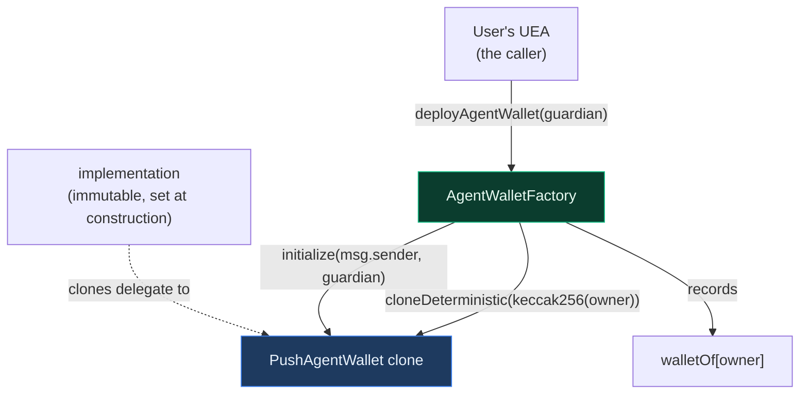
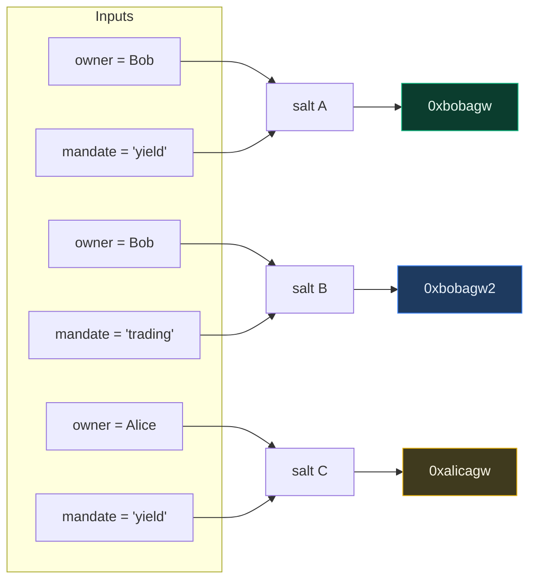
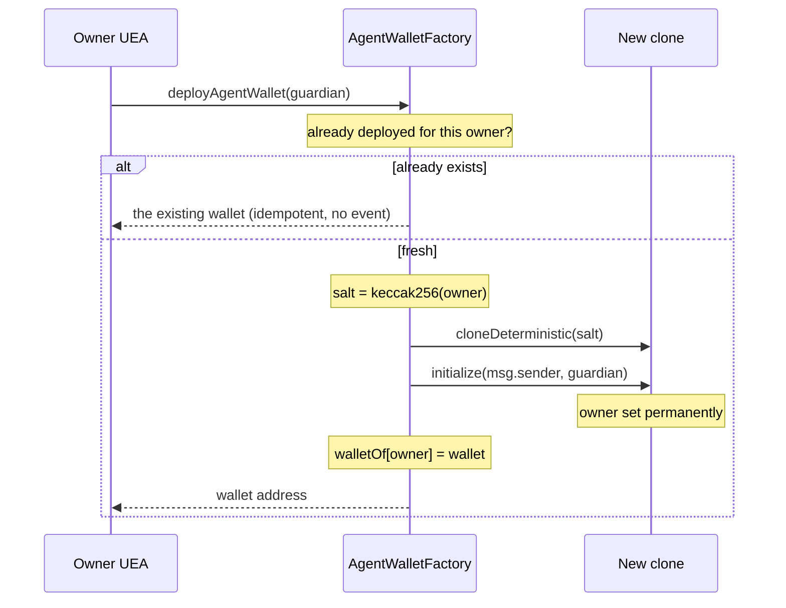
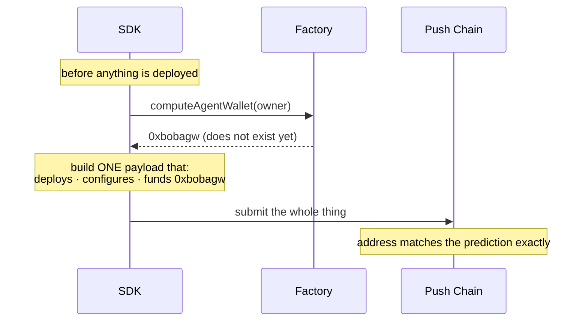

# AgentWalletFactory

`src/AgentWalletFactory.sol` · deterministic deployer

---

## 1. What this contract does

`AgentWalletFactory` creates `PushAgentWallet` accounts. That is its entire job.

It holds no funds, has no admin, and exposes no configuration. The wallet implementation
address is fixed at construction and can never change. Beyond deployment it keeps one
piece of state: a registry mapping each `owner` to the one wallet created for them.

It is the smallest contract in the system, and that is deliberate — a factory with admin
powers would be a permanent lever over every wallet it ever created.

## 2. Why it matters

Three properties that the rest of the system depends on.

**The caller is always the owner.** `deployAgentWallet` takes the owner from `msg.sender`
and never as a parameter. There is no `deployFor(address owner, ...)` variant and one must
never be added — it would let an attacker deploy a wallet on a user's behalf, potentially
pointing at an implementation the user never chose.

**Addresses are known before deployment.** Because deployment is `CREATE2` with a salt
derived from `owner` alone, the address can be computed in advance. This is what makes the
whole inbound flow work as a single signed payload: the SDK computes where the wallet *will*
be, then builds one transaction that deploys it, configures it, and funds it.

**One wallet per owner, for life.** The salt is `keccak256(abi.encode(owner))` with no
mandate input, so a user's wallet address — and therefore their CEA on every external chain —
is fixed permanently. Mandates are sessions inside that one wallet.

**Deployment is idempotent.** A repeat call returns the existing wallet instead of reverting.
A duplicate deploy can damage nothing, whereas a revert inside the atomic setup multicall
would fail an otherwise benign grant.

**The guardian is not in the salt.** It is passed to `deployAgentWallet` and stored, so the
owner can rotate it later without moving the wallet address.

## 3. Role in the system



## 4. Address derivation

```
salt    = keccak256(abi.encode(owner))
address = CREATE2(factory, salt, EIP-1167 proxy bytecode for implementation)
```

The owner is the only input. Two different owners get two different addresses; the same
owner always resolves to the same one:



The same mandate id under two different owners yields two unrelated wallets, so mandate
ids need not be globally unique — only unique per user.

## 5. Deployment flow



Creation and initialization happen in the **same transaction**. This is what makes the
wallet's unguarded `initialize` safe: the address holds no code until `cloneDeterministic`
returns, and by the time the transaction ends the owner is already set. There is no window
for anyone to claim it.

## 6. Why counterfactual addresses matter

The user signs **once**, on their origin chain. Everything on Push Chain has to be
composed in advance from that single signature, which is only possible if the wallet's
address is known before it exists.



Without this, funding would need a second transaction after deployment, and the user would
have to sign twice.

## 7. The registry

```solidity
mapping(address owner => address wallet) public walletOf;
```

Two purposes. It makes deployment **idempotent**: a repeat call reads this map, returns the
existing wallet and stops, rather than failing opaquely at the `CREATE2` level. And it gives
off-chain consumers a direct lookup without replaying the address derivation.

`isDeployed` is the convenience predicate over the same map.

## 8. Function reference

| Function | Access | Purpose |
|---|---|---|
| `deployAgentWallet(address guardian)` | anyone; caller **is** the owner | Deploy and initialize a wallet, or return the existing one |
| `computeAgentWallet(address owner)` | view | Predict the address before deployment |
| `isDeployed(address owner)` | view | Whether that owner has a wallet |
| `walletOf(address owner)` | view | The wallet address, or zero |
| `WALLET_IMPLEMENTATION()` | view | The immutable implementation |

### Events and errors

| Name | Meaning |
|---|---|
| `AgentWalletDeployed(wallet, owner)` | A wallet was created. Emitted once ever, per owner |
| `ZeroAddress` | Construction was attempted with a zero implementation |

## 9. Operational notes

**The implementation must be sealed.** After deploying the implementation contract, it
should immediately be initialized to a burn address. Otherwise the logic contract sits
uninitialized and anyone could claim ownership of it directly. Clones are unaffected by
the implementation's own storage, so sealing costs nothing functionally. The deployment
script does this and asserts a second initialization attempt reverts.

**The factory is not upgradeable and holds no privileges.** Once deployed it can only ever
mint clones of the one implementation it was constructed with. Pointing at a new
implementation means deploying a new factory; existing wallets are untouched by that, which
is the intended property — nobody can change the logic under funds that already exist.

## 10. Related documents

- [architecture.md](./architecture.md) — how the whole system fits together
- [agent-wallet.md](./agent-wallet.md) — the contract this factory deploys
- [modules.md](./modules.md) — what gets installed into a wallet after deployment
