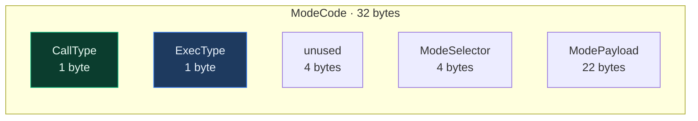
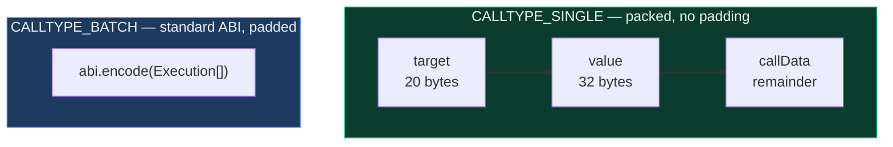
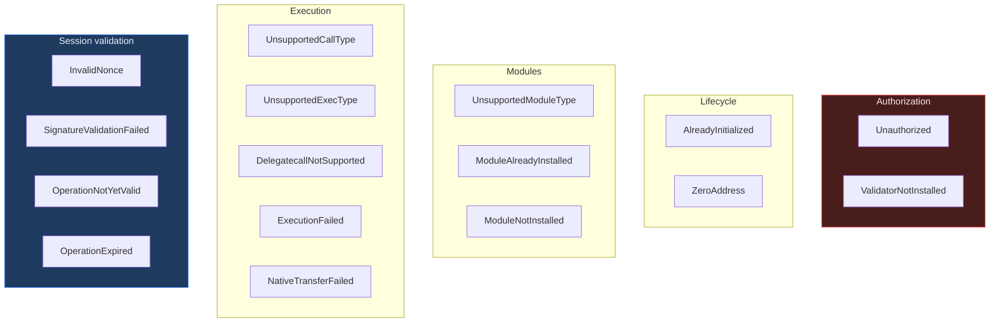
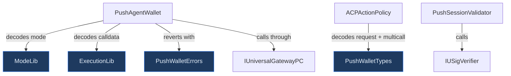

# Libraries, Types, and Interfaces

The supporting code: encoding libraries, mirrored structs, shared errors, and the local
interface declarations.

```
src/libraries/     ModeLib · ExecutionLib · PushWalletTypes · PushWalletErrors
src/interfaces/    IERC7579Account · IERC7579Module · IPushAgentWallet
                   IAgentWalletFactory · IUniversalGatewayPC · IUSigVerifier
```

None of these hold state or make decisions. They are the vocabulary the rest of the system
speaks — but two of them encode conventions that cause real bugs when misunderstood, so
they are worth reading properly.

---

## 1. `ModeLib` — execution mode encoding

ERC-7579 packs how a call should be executed into a single `bytes32`.



### Call types

| Value | Name | Supported here |
|---|---|---|
| `0x00` | Single | ✅ |
| `0x01` | Batch | ✅ |
| `0xFE` | Static | ❌ |
| `0xFF` | Delegatecall | ❌ — the target would own the account's storage |

### Exec types

| Value | Name | Supported here |
|---|---|---|
| `0x00` | Default — revert on failure | ✅ |
| `0x01` | Try — continue on failure | ❌ — silent partial failure is wrong for value movement |

The library provides `decode`, `encode`, the `encodeSimpleSingle` / `encodeSimpleBatch`
convenience helpers, and `getCallType`. It is ported verbatim from the reference ERC-7579
implementation.

The mode is one of the eight fields bound into the operation hash, which is what prevents
a signed single call from being resubmitted as a batch.

---

## 2. `ExecutionLib` — execution calldata encoding

This library carries the single most important convention in the codebase: **the two call
types use different encodings, and they are not interchangeable.**



Single is `abi.encodePacked(target, value, callData)` — **not** `abi.encode`. Batch is a
standard `abi.encode(Execution[])`.

An `Execution` is simply:

```solidity
struct Execution {
    address target;
    uint256 value;
    bytes   callData;
}
```

The reason this matters: the two encodings are structurally different. `decodeBatch`
therefore validates before it trusts anything — the offset word must land inside the blob,
there must be room for the length word, and the decoded length's entries must fit in what
remains. A mismatched encoding reverts rather than decoding into a plausible-looking empty
batch. Always pair the encoder with the matching mode — `encodeSingle` with a single mode,
`encodeBatch` with a batch mode.

---

## 3. `PushWalletTypes` — mirrored Push Chain structs

These structs are **copies** of types defined in the Push Chain gateway and core
repositories. They are declared locally rather than imported, to avoid a cross-repo build
dependency.

### `UniversalOutboundTxRequest`

The request the wallet sends to `UniversalGatewayPC`. Mirrors the gateway's `TypesUGPC.sol`
field-for-field and in order.

| Field | Meaning |
|---|---|
| `recipient` | Raw destination address, as bytes for SVM compatibility |
| `token` | PRC20 token on Push Chain |
| `amount` | Amount to burn on Push and unlock at origin |
| `gasLimit` | Gas limit for the fee quote |
| `gasPrice` | Gas price override; zero uses the chain default |
| `maxPCForGas` | Cap on native PC forwarded to the gas swap |
| `payload` | Calldata to execute on the destination chain |
| `revertRecipient` | Who receives funds if the transaction reverts |

`ACPActionPolicy` decodes this struct to apply rules R4, R5, R6, and R10.

### `Multicall`

One entry inside `payload`, mirroring the core repo's `Types.sol`:

```solidity
struct Multicall {
    address to;
    uint256 value;
    bytes   data;
}
```

### `MULTICALL_SELECTOR`

```solidity
bytes4 constant MULTICALL_SELECTOR = bytes4(keccak256("UEA_MULTICALL"));
```

The magic prefix marking a payload as a batch. The destination-chain CEA checks for this
prefix to decide between the multicall and single-call branches.

> **Ordering is load-bearing.** These structs are decoded by ABI position, not by name. If
> the upstream definitions change field order, these mirrors must be updated in lockstep —
> a mismatch would decode silently into wrong values rather than failing loudly.

---

## 4. `PushWalletErrors` — shared custom errors

All revert reasons in one library, so failures are typed and cheap rather than string
comparisons.



Most carry the offending values as parameters — `InvalidNonce(key, expected, provided)`
tells you immediately what went wrong, which matters for an agent that must decide whether
to retry.

---

## 5. Interfaces

### Locally declared external interfaces

These describe contracts we **call but do not deploy**. Only the signatures actually used
are declared.

| Interface | Describes | Why local |
|---|---|---|
| `IUniversalGatewayPC` | Push Chain's outbound gateway | Avoids a cross-repo build dependency |
| `IUSigVerifier` | The USV precompile at `0xEC00...0001` | Same |

### ERC-7579 interfaces

| Interface | Purpose |
|---|---|
| `IERC7579Module` | Base module lifecycle — `onInstall`, `onUninstall`, `isModuleType`, `isInitialized` |
| `IERC7579Validator` | Adds `validateUserOp` and `isValidSignatureWithSender` |
| `IERC7579Hook` | Adds `preCheck` and `postCheck` |
| `IERC7579Account` | The account surface we implement |

`IERC7579Account` notably **omits `executeFromExecutor`**, because executor modules are
unsupported. The omission is the specification: there is no executor entry point on the
account at all.

### Our own contract interfaces

`IPushAgentWallet` and `IAgentWalletFactory` describe our contracts for external
consumers — SDKs, indexers, and integrators — without requiring them to import the full
implementations.

---

## 6. How these fit together



## 7. Related documents

- [architecture.md](./architecture.md) — how the whole system fits together
- [agent-wallet.md](./agent-wallet.md) — the main consumer of `ModeLib` and `ExecutionLib`
- [modules.md](./modules.md) — the main consumer of `PushWalletTypes`
- [factory.md](./factory.md) — deterministic deployment
