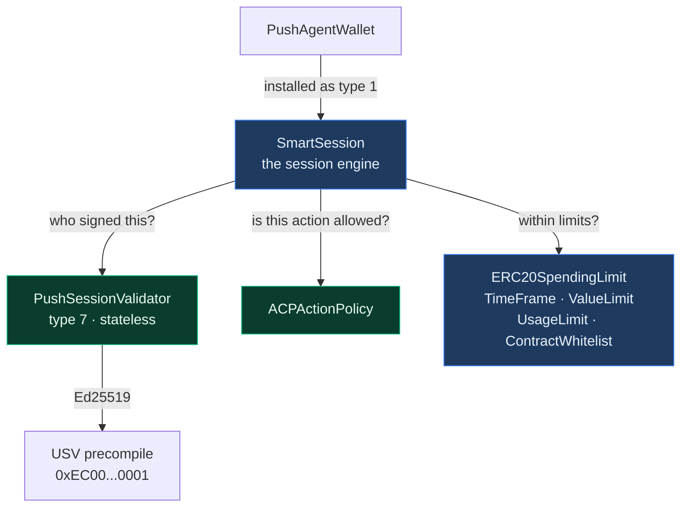
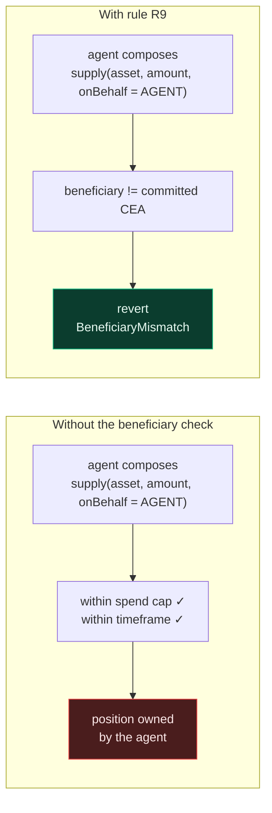
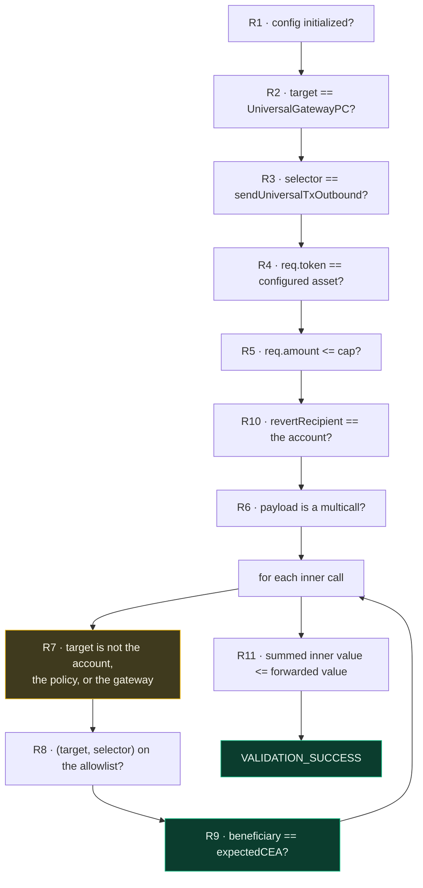
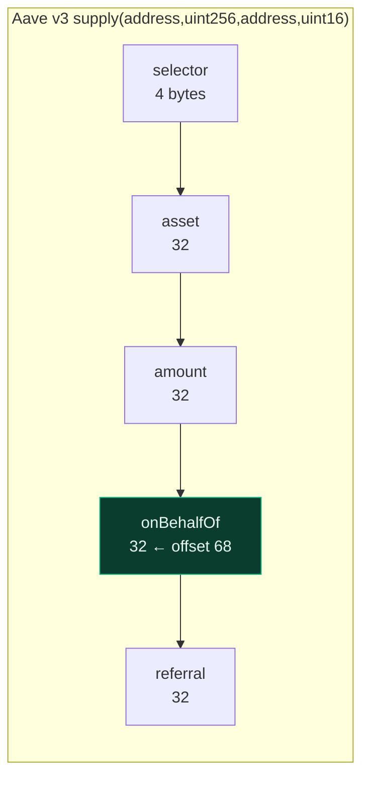
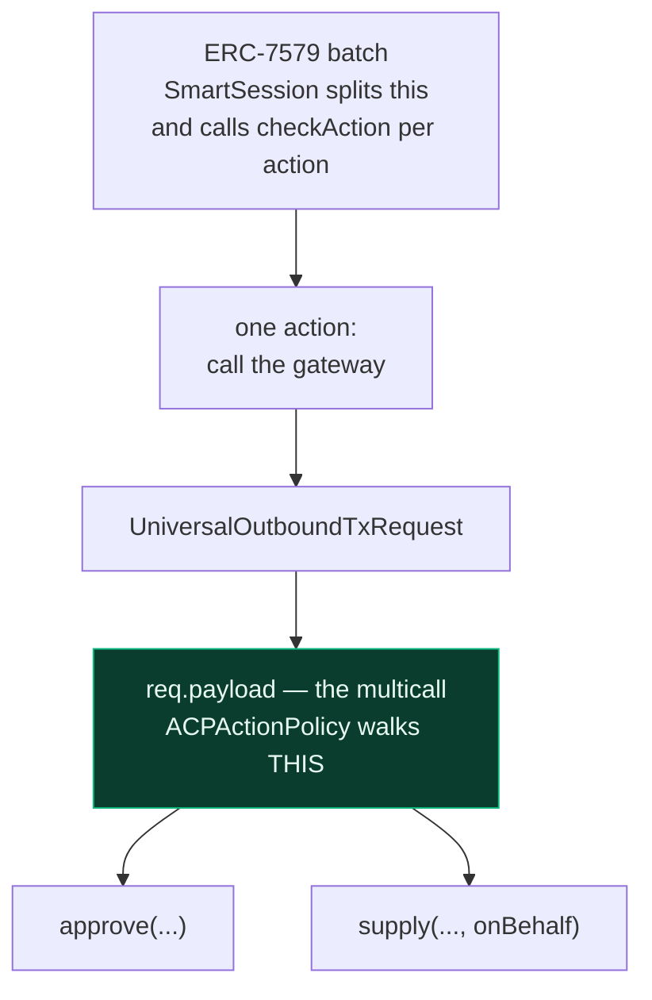
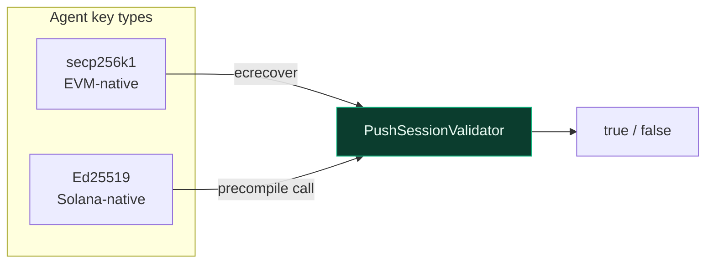
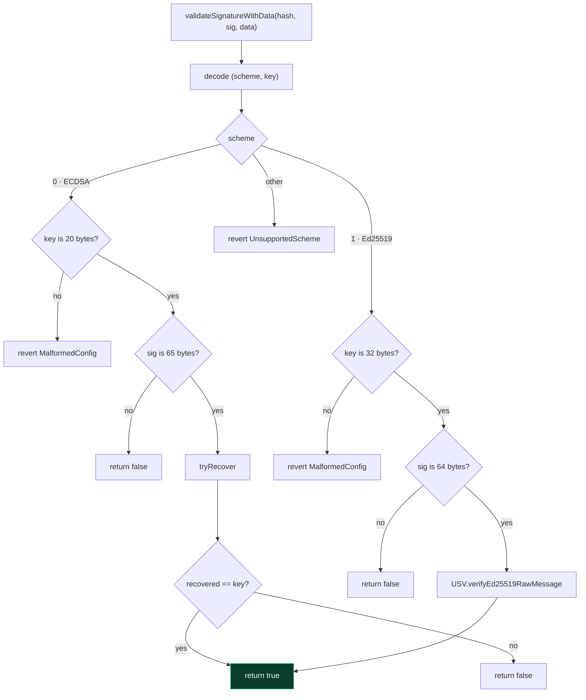
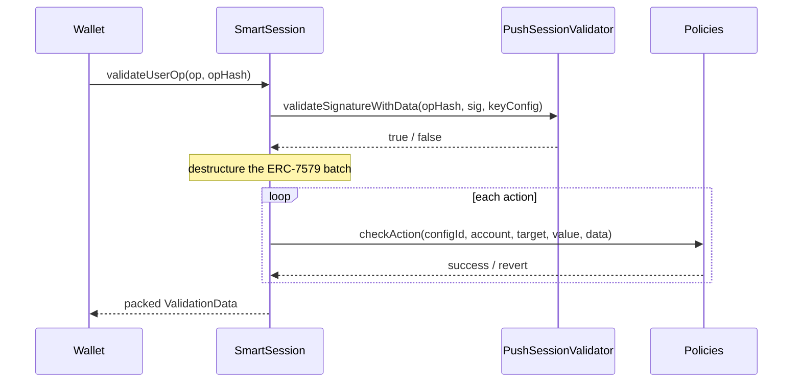
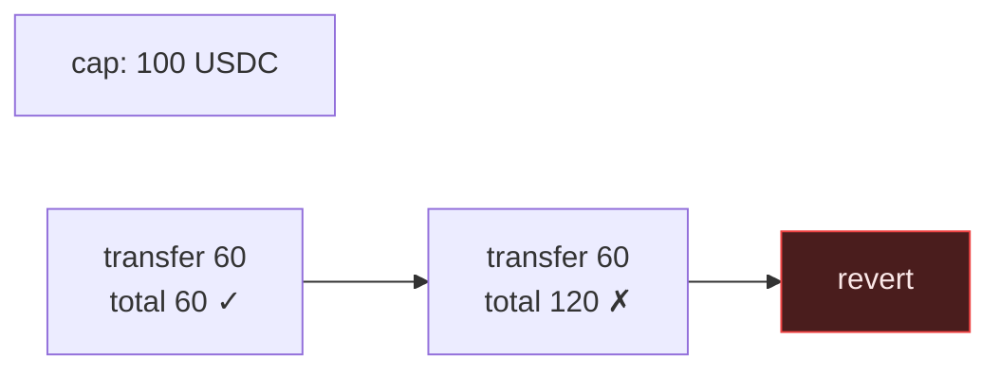
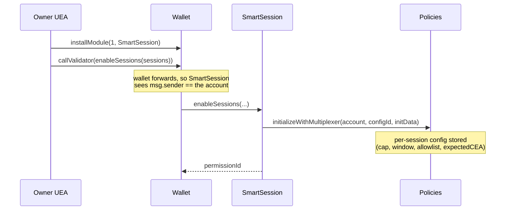

# Modules

The validator, the policies, and the session engine — everything that decides whether a
delegated action is allowed.

- `src/policies/ACPActionPolicy.sol` — built by us
- `src/validators/PushSessionValidator.sol` — built by us
- `SmartSession` and five limit policies — adopted unmodified

---

## 1. The module landscape

The wallet itself deliberately knows nothing about sessions, spend caps, or expiry. All of
that lives in modules, so the account stays small and the enforcement layer can evolve
without touching the contract that holds the money.

| Module | Origin | Question it answers |
|---|---|---|
| `SmartSession` | adopted | Is there a valid session, and does every check pass? |
| `PushSessionValidator` | **ours** | Did the session key actually sign this hash? |
| `ACPActionPolicy` | **ours** | Is this specific cross-chain action permitted? |
| `ERC20SpendingLimitPolicy` | adopted | Has the cumulative spend cap been exhausted? |
| `TimeFramePolicy` | adopted | Are we inside the session's validity window? |
| `ValueLimitPolicy` | adopted | Is the native value within bounds? |
| `UsageLimitPolicy` | adopted | Has the session been used too many times? |
| `ContractWhitelistPolicy` | adopted | Is the target on the allowlist? |

Adopted contracts are deployed **unmodified** and pinned to an exact upstream commit. They
are audited upstream; forking them would discard that.

---

# Part I — `ACPActionPolicy`

## 2. What it does

`ACPActionPolicy` authorises exactly one kind of action: the wallet calling
`UniversalGatewayPC.sendUniversalTxOutbound`.

It decodes the outbound request, walks the multicall payload that will run on the
destination chain, and enforces that every inner call is on the allowlist and that the
beneficiary of any deposit is **the wallet's own CEA**.

## 3. Why it matters

This is the contract that makes provider custody structurally impossible.

Every other policy limits *how much* or *how often*. This one limits *where the value ends
up*. Without it, an agent operating entirely within its spend cap and time window could
still deposit the user's funds into a position owned by the agent.

## 4. Configuration

Each `(configId, multiplexer, account)` triple gets its own config, set when the owner
grants the session:

| Field | Meaning |
|---|---|
| `destChainHash` | Destination chain identifier, e.g. `keccak256("eip155:1")` |
| `expectedCEA` | The wallet's CEA on that chain — **the required beneficiary** |
| `asset` | The only PRC20 token this session may move |
| `maxAmountPerCall` | Ceiling on a single call's amount |
| `allowedCalls[]` | Exhaustive allowlist of permitted inner calls |

Each `allowedCalls` entry is a `(target, selector, beneficiaryOffset, hasBeneficiary)`
tuple: which contract, which function, where the beneficiary sits in the calldata, and
whether it has one at all (`approve`, for instance, does not).

## 5. The eleven rules

`checkAction` applies these in order, cheapest first.

Three of these carry most of the security weight.

**R9 — the beneficiary check.** Reads the beneficiary out of the inner calldata and
requires it to equal the committed CEA. This is what stops redirection.

**R7 — forbidden inner targets.** An inner call may not target the account itself, the
policy, or the gateway. The account is the important one: the wallet permits calls from
itself, so without R7 an agent could route a call back into the wallet and reach
`installModule`, taking control of the whole account.

**R10 — revert recipient.** If the cross-chain transaction fails, funds return to the
account, never to a third party.

## 6. Reading the beneficiary

The policy extracts the beneficiary by reading a 32-byte word at a configured byte offset
and taking its low 20 bytes.

| Protocol | Signature | Beneficiary | Offset | Derivation |
|---|---|---|---|---|
| Aave v3 / Spark | `supply(address,uint256,address,uint16)` | `onBehalfOf` | **68** | `4 + 32 + 32` |
| Morpho Blue | `supply(MarketParams,uint256,uint256,address,bytes)` | `onBehalf` | **228** | `4 + 160 + 32 + 32` |
| ERC-20 | `approve(address,uint256)` | none | — | `hasBeneficiary = false` |

Morpho's `MarketParams` is five static fields encoded inline, hence 160 bytes.

Two things follow from this design. The offset is read before the word, so it is
bounds-checked — reading past the end of a short blob would return adjacent memory. And
because offsets are **configuration**, every protocol added to an allowlist needs a test
asserting its offset extracts the right address from a real encoded call. A wrong offset
reads the wrong word and would pass silently.

## 7. Where the policy sits in the nesting

The policy never iterates the outer batch — SmartSession has already destructured it. Its
own loop is over the inner multicall, the instructions destined for the other chain.

---

# Part II — `PushSessionValidator`

## 8. What it does

A stateless validator answering one question: **did this key sign this hash?**

It supports two signature schemes:

- **secp256k1 (ECDSA)** — standard EVM signing, verified with `ecrecover`
- **Ed25519** — Solana-style keys, verified through the USV precompile

## 9. Why it matters

This is what makes a Solana-keyed agent a first-class operator on an EVM account. An agent
holding only an Ed25519 keypair can drive a Push Chain smart account without ever
possessing an EVM key — no bridging of identity, no wrapper key, no custody of a secondary
secret.

## 10. How it is configured

The session config carries `abi.encode(uint8 scheme, bytes key)`:

| Scheme | Value | Key format |
|---|---|---|
| ECDSA | `0` | 20-byte signer address |
| Ed25519 | `1` | 32-byte raw public key |

Signature lengths are enforced: 65 bytes for ECDSA, 64 for Ed25519.

## 11. Verification flow

Three details worth knowing.

**It is completely stateless.** Every parameter arrives as calldata and the contract holds
no storage, so a single deployment serves every account on the chain.

**Recovery failures return `false` rather than reverting.** A revert inside validation is
indistinguishable from a policy rejection, which makes debugging much harder.

**It uses the raw-message Ed25519 variant.** The precompile offers two methods; the other
verifies over the ASCII of a hex string, which is oriented toward wallet display. A
headless agent signing with a standard library produces a raw-bytes signature, so the raw
variant is the correct one.

## 12. USV precompile notes

Fixed at `0xEC00000000000000000000000000000000000001`, chain-level.

- Public keys must be **raw 32 bytes** — the precompile casts directly, so base58 fails
- Signatures must be 64 bytes
- Each verification costs 4,000 gas

---

# Part III — Adopted modules

## 13. SmartSession

The session engine, adopted unmodified from `erc7579/smartsessions` at a pinned commit.

It is installed into the wallet as a type-1 validator and owns the entire session
lifecycle: enabling sessions, storing which policies apply to which actions, and running
them when a session-signed operation arrives.

Only **USE mode** is exercised: sessions are always granted by the owner in advance, never
enabled inline by the agent as part of its own transaction. The agent can therefore never
widen its own permissions.

## 14. The limit policies

Five adopted policies, each enforcing an orthogonal constraint. They compose — a session
typically installs several.

| Policy | Constrains | Typical use |
|---|---|---|
| `ERC20SpendingLimitPolicy` | Cumulative ERC-20 spend | "at most 500 USDC in total" |
| `TimeFramePolicy` | Validity window | "expires in 30 days" |
| `ValueLimitPolicy` | Native value per use | Caps gas forwarded per action |
| `UsageLimitPolicy` | Number of uses | "at most 10 operations" |
| `ContractWhitelistPolicy` | Target address | Restricts which contracts are reachable |

The spend limit is worth highlighting because it is **cumulative**, not per-call: it tracks
what has already been spent, so an agent cannot make repeated small transfers that
individually pass but collectively exceed the mandate.

Two upstream policies, `UniActionPolicy` and `ArgPolicy`, are deliberately **not** adopted:
both require a newer compiler than this project pins, and `ACPActionPolicy` supersedes
their functionality for our use case.

## 15. How a session is granted

Sessions are always established by the owner, in advance.

The `permissionId` returned identifies the session; the agent includes it in every
signature it produces.

Revocation is the reverse and equally available to the owner at any time — either by
removing the individual session, or by `emergencyRevokeAll` on the wallet, which detaches
the whole engine at once.

## 16. Related documents

- [architecture.md](./architecture.md) — how the whole system fits together
- [agent-wallet.md](./agent-wallet.md) — the account these modules are installed into
- [factory.md](./factory.md) — how accounts are created
- [libraries-and-types.md](./libraries-and-types.md) — the structs these modules decode
