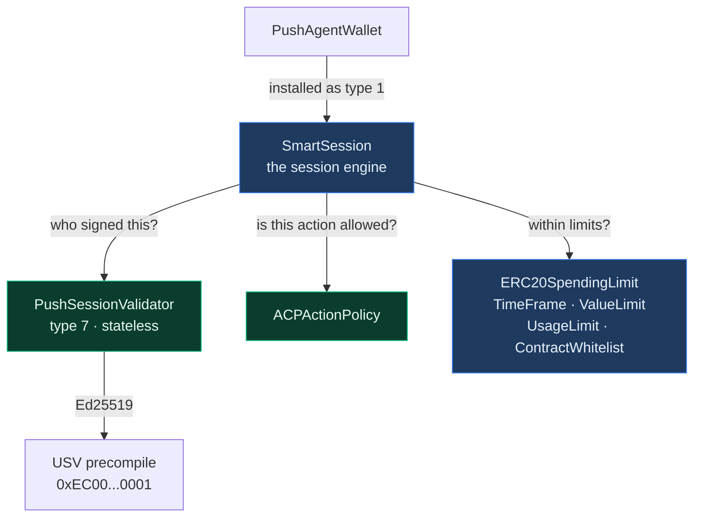
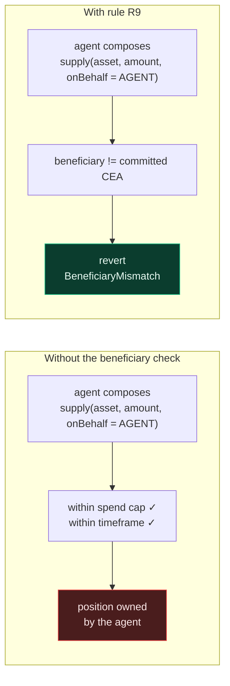
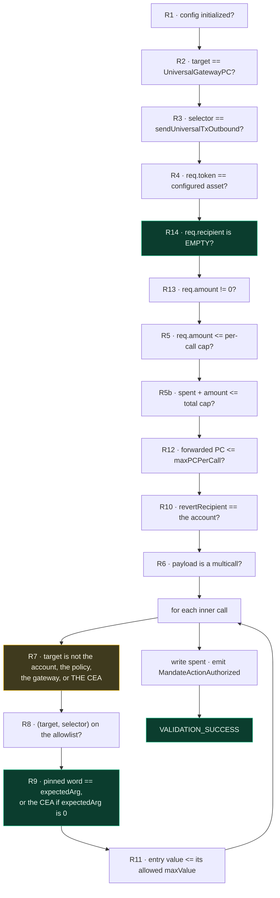
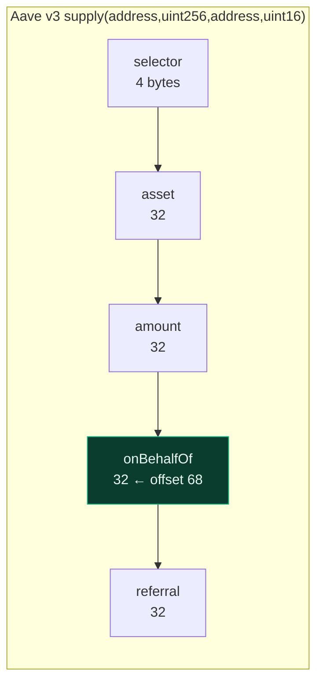
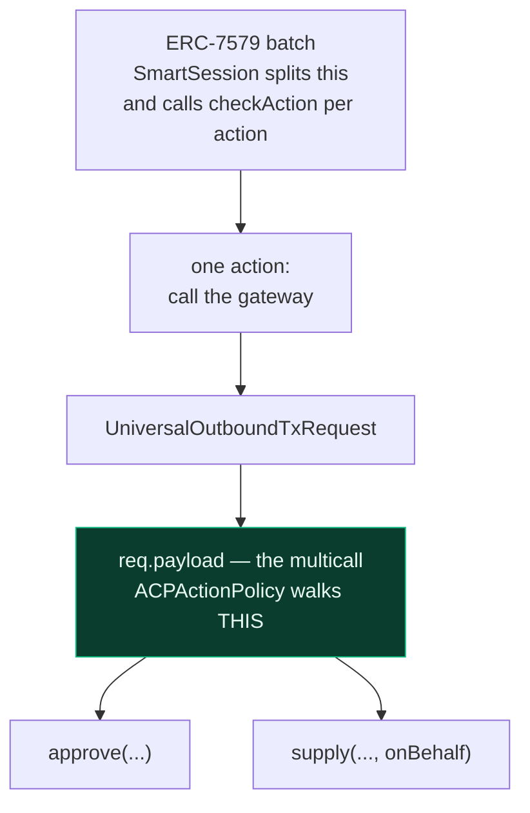
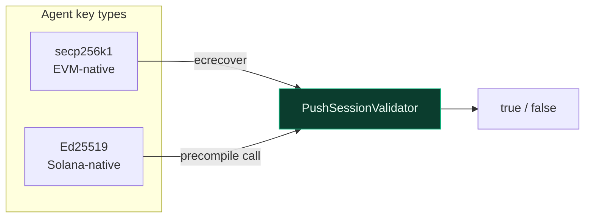
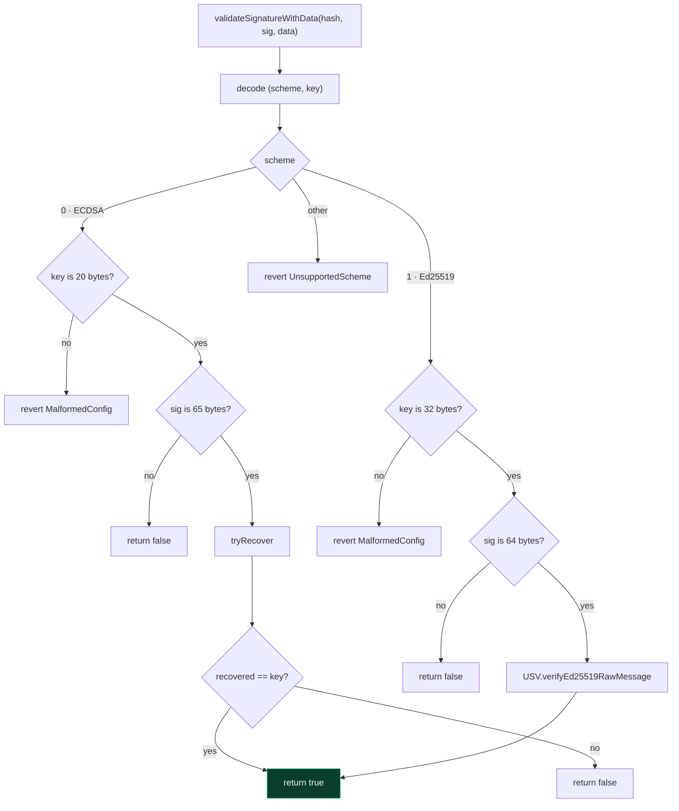
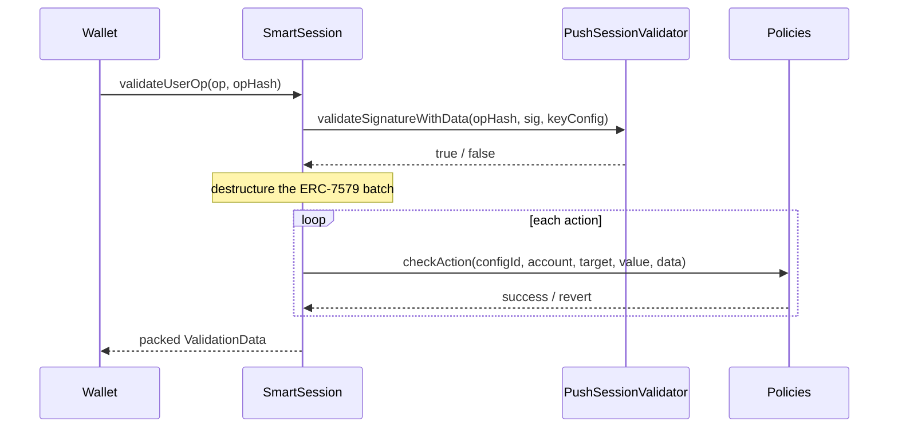
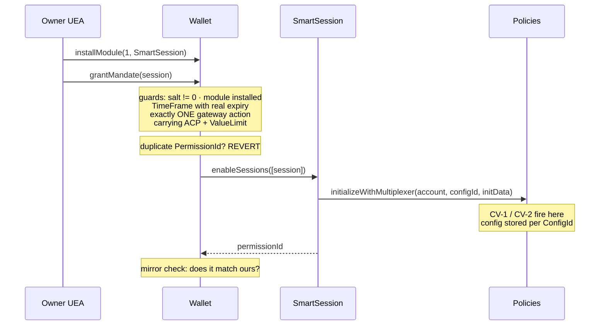

# Modules

The validator, the policies, and the session engine — everything that decides whether a
delegated action is allowed.

- `src/policies/ACPActionPolicy.sol` — built by us
- `src/validators/PushSessionValidator.sol` — built by us
- `SmartSession` and five limit policies — adopted unmodified

---

## 1. The module landscape

The wallet itself deliberately knows nothing about sessions, spend caps, or expiry. All of
that lives in modules, so the account stays small and the enforcement layer can evolve
without touching the contract that holds the money.

| Module | Origin | Status | Question it answers |
|---|---|---|---|
| `SmartSession` | adopted | required | Is there a valid session, and does every check pass? |
| `PushSessionValidator` | **ours** | required | Did the session key actually sign this hash? |
| `ACPActionPolicy` | **ours** | **mandatory** | Is this specific cross-chain action permitted? |
| `TimeFramePolicy` | adopted | **mandatory** | Are we inside the session's validity window? |
| `ValueLimitPolicy` | adopted | **mandatory** | Is the pooled PC gas budget exhausted? |
| `UsageLimitPolicy` | adopted | optional | Has the session been used too many times? |
| `ContractWhitelistPolicy` | adopted | optional | Is the target on the allowlist? |
| `ERC20SpendingLimitPolicy` | adopted | **not used** | — the asset cap lives in `ACPActionPolicy` |
| `SimpleGasPolicy` | adopted | ⛔ **never attach** | See the warning in §14 |

The three **mandatory** policies are enforced on-chain at grant time: `grantMandate` refuses
any session missing `TimeFramePolicy` with a real expiry, or missing either
`ACPActionPolicy` or `ValueLimitPolicy` on its single gateway action. They are guarantees,
not conventions.

Adopted contracts are deployed **unmodified** and pinned to an exact upstream commit. They
are audited upstream; forking them would discard that.

---

# Part I — `ACPActionPolicy`

## 2. What it does

`ACPActionPolicy` authorises exactly one kind of action: the wallet calling
`UniversalGatewayPC.sendUniversalTxOutbound`.

It decodes the outbound request, walks the multicall payload that will run on the
destination chain, and enforces that every inner call is on the allowlist and that the
beneficiary of any deposit is **the wallet's own CEA**.

## 3. Why it matters

This is the contract that makes provider custody structurally impossible.

Every other policy limits *how much* or *how often*. This one limits *where the value ends
up*. Without it, an agent operating entirely within its spend cap and time window could
still deposit the user's funds into a position owned by the agent.

## 4. Configuration

Each `(configId, multiplexer, account)` triple gets its own config, set when the owner
grants the session:

| Field | Meaning |
|---|---|
| `destChainHash` | Destination chain identifier, e.g. `keccak256("eip155:1")` |
| `expectedCEA` | The wallet's CEA on that chain — **the required beneficiary** |
| `asset` | The only PRC20 token this session may move |
| `maxAmountPerCall` | Ceiling on a **single call's** amount |
| `maxAmountTotal` | **Cumulative** ceiling across the session's lifetime |
| `maxPCPerCall` | Ceiling on **Push Chain** native value forwarded to the gateway per call |
| `spent` | Running total authorised so far; reset on re-grant |
| `allowedCalls[]` | Exhaustive allowlist of permitted inner calls |

Each `allowedCalls` entry is a `(target, selector, beneficiaryOffset, hasBeneficiary,
maxValue, expectedArg)` tuple: which contract, which function, where the pinned address sits
in the calldata, whether there is one at all, how much destination-chain native value that
call may carry (`0` for every current target, since all are non-payable), and **which
address that word must equal**.

`expectedArg` is what makes the allowlist safe for approvals:

| `expectedArg` | Meaning |
|---|---|
| `address(0)` | Sentinel: "the wallet's own CEA". Correct for every deposit-style entry (`supply`, `repay`) |
| any other address | Pin the argument to exactly that address. Required for an ERC-20 `approve`, whose spender must be the **protocol**, never the CEA |

The two amount ceilings are deliberately redundant and bound different things:

| Field | Bounds | Failure it contains |
|---|---|---|
| `maxAmountPerCall` | single-transaction blast radius | a compromised key draining the mandate in **one** transaction, before monitoring can react |
| `maxAmountTotal` | lifetime mandate exposure | the same key draining it across **N** transactions |

Without the per-call ceiling a 1,000 USDC mandate empties in a single call. With it, an
attacker needs N transactions — each an observable on-chain event the owner can revoke
against mid-sequence.

## 5. The rules

`checkAction` applies these in order, cheapest first.

Rule numbers are **not sequential** and are never renumbered — existing tests and audit
notes reference them by number, so new rules are appended rather than inserted.

Three of these carry most of the security weight.

**R9 — the beneficiary check.** Reads the beneficiary out of the inner calldata and
requires it to equal the committed CEA. This is what stops redirection.

**R7 — forbidden inner targets.** An inner call may not target the account itself, the
policy, the gateway, **or the wallet's own CEA**.

The first three are defence-in-depth against reaching `installModule` through a call routed
back into the wallet — SmartSession rejects self-calls upstream and the wallet's own
authorization rejects them too, and all three layers are kept deliberately.

The fourth is load-bearing on its own. An inner call targeting the CEA executes with
`msg.sender == CEA`, which **satisfies** the CEA's own self-call check, and the frozen CEA
explicitly permits value-0 self-calls. That makes the inner CEA self-call a working **exit
path**: a compromised key could bridge value out with an agent-chosen revert recipient.
Sessions are entry-only — they open positions and never close them — so the target is
refused structurally rather than left to the allowlist. An allowlist omission is one SDK bug
away; a structural rule is not.

**R9 — the pinned argument.** Reads the configured word out of the inner calldata and
requires it to equal `expectedArg`, or the committed CEA when `expectedArg` is the zero
sentinel. This is what stops both deposit redirection *and* an approval handing the CEA's
balance to an attacker.

**R10 — revert recipient.** If the cross-chain transaction fails, funds return to the
account, never to a third party.

**R14 — the destination recipient must be empty.** An empty `recipient` is the gateway's own
documented "park the funds in the caller's CEA" convention, so this is the canonical
encoding rather than a restriction. It is also a **fail-closed backstop for R6**: if the
multicall prefix check were ever bypassed, the frozen CEA would receive a zero recipient
with a non-empty payload and revert `InvalidRecipient()` — instead of executing that payload
as a raw call, which would be direct theft.

R14 is **session-path only**. The owner path deliberately permits a non-empty recipient,
because withdrawals to an external address depend on it.

**R5b — the cumulative cap.** `spent` accumulates across the session's lifetime, so an
agent cannot make repeated individually-legal calls until the wallet is empty. The
accumulation happens during validation and reverts with the transaction if execution
later fails. It is written **after every other check passes**, so a failure later in the
rule set leaves no partial state.

**R12 / R13 — bounding the gas budget.** These close a path the amount caps cannot see.
The gateway infers the transaction type from the request: with `req.amount == 0` it skips
the token burn entirely, so `spent` never grows — yet it still takes a protocol fee from
the Push Chain native value attached to the call. A session key could therefore drain the
wallet's PC balance through repeated zero-amount calls while every amount cap read as
untouched.

R13 rejects zero-amount outbounds outright, closing the class. R12 caps the per-call PC
outflow for the shapes that remain. The two together mean the PC gas budget is bounded in
both shape and size.

## 6. Config-time validation

Two checks run when the config is stored, not when an action is checked. They cost nothing
on the hot path and make a dangerous configuration **unrepresentable** rather than merely
inadvisable.

**CV-1 — approval entries must pin their spender.** Any `allowedCalls` entry whose selector
is `approve` or `increaseAllowance` must carry `hasBeneficiary = true`, `beneficiaryOffset =
4`, and a non-zero `expectedArg`. Otherwise the config reverts at grant time.

Without it, the mandatory destination-chain `approve` would ship with a completely unchecked
spender. A compromised key could then bridge one wei — satisfying every amount rule — with
an inner `approve(attacker, type(uint256).max)`, and drain the CEA directly on the
destination chain via `transferFrom`.

**CV-2 — the committed CEA cannot be zero.** Because `expectedArg == address(0)` is the
sentinel for "the wallet's own CEA", a zero `expectedCEA` would collapse that sentinel: R9
would compare the extracted beneficiary against the zero address, and a `supply(onBehalf =
0)` would pass.

Both follow the same principle: anything the SDK could silently get wrong is validated
on-chain. And because they live in the **policy** rather than the wallet, they fire on every
path that stores a config — `grantMandate`, `reconfigureMandate`, and the owner's
`callValidator` escape hatch alike. There is no route that builds a mis-pinned config.

A general rule is not possible here: the policy cannot know which argument of an arbitrary
selector grants authority, since `permit`, `setApprovalForAll` and protocol-specific
authorizations all differ. Those remain an SDK obligation.

## 7. Reading the beneficiary

The policy extracts the beneficiary by reading a 32-byte word at a configured byte offset
and taking its low 20 bytes.

| Protocol | Signature | Beneficiary | Offset | Derivation |
|---|---|---|---|---|
| Aave v3 / Spark | `supply(address,uint256,address,uint16)` | `onBehalfOf` | **68** | `4 + 32 + 32` |
| Morpho Blue | `supply(MarketParams,uint256,uint256,address,bytes)` | `onBehalf` | **228** | `4 + 160 + 32 + 32` |
| ERC-20 | `approve(address,uint256)` | `spender` | **4** | first argument — **required** by CV-1 |

Morpho's `MarketParams` is five static fields encoded inline, hence 160 bytes.

Two things follow from this design. The offset is read before the word, so it is
bounds-checked — reading past the end of a short blob would return adjacent memory. And
because offsets are **configuration**, every protocol added to an allowlist needs a test
asserting its offset extracts the right address from a real encoded call. A wrong offset
reads the wrong word and would pass silently.

## 8. Where the policy sits in the nesting

The policy never iterates the outer batch — SmartSession has already destructured it. Its
own loop is over the inner multicall, the instructions destined for the other chain.

---

# Part II — `PushSessionValidator`

## 9. What it does

A stateless validator answering one question: **did this key sign this hash?**

It supports two signature schemes:

- **secp256k1 (ECDSA)** — standard EVM signing, verified with `ecrecover`
- **Ed25519** — Solana-style keys, verified through the USV precompile

## 10. Why it matters

This is what makes a Solana-keyed agent a first-class operator on an EVM account. An agent
holding only an Ed25519 keypair can drive a Push Chain smart account without ever
possessing an EVM key — no bridging of identity, no wrapper key, no custody of a secondary
secret.

## 11. How it is configured

The session config carries `abi.encode(uint8 scheme, bytes key)`:

| Scheme | Value | Key format |
|---|---|---|
| ECDSA | `0` | 20-byte signer address |
| Ed25519 | `1` | 32-byte raw public key |

Signature lengths are enforced: 65 bytes for ECDSA, 64 for Ed25519.

## 12. Verification flow

Three details worth knowing.

**It is completely stateless.** Every parameter arrives as calldata and the contract holds
no storage, so a single deployment serves every account on the chain.

**Recovery failures return `false` rather than reverting.** A revert inside validation is
indistinguishable from a policy rejection, which makes debugging much harder.

**It uses the raw-message Ed25519 variant.** The precompile offers two methods; the other
verifies over the ASCII of a hex string, which is oriented toward wallet display. A
headless agent signing with a standard library produces a raw-bytes signature, so the raw
variant is the correct one.

## 13. USV precompile notes

Fixed at `0xEC00000000000000000000000000000000000001`, chain-level.

- Public keys must be **raw 32 bytes** — the precompile casts directly, so base58 fails
- Signatures must be 64 bytes
- Each verification costs 4,000 gas

---

# Part III — Adopted modules

## 14. SmartSession

The session engine, adopted unmodified from `erc7579/smartsessions` at a pinned commit.

It is installed into the wallet as a type-1 validator and owns the entire session
lifecycle: enabling sessions, storing which policies apply to which actions, and running
them when a session-signed operation arrives.

Only **USE mode** is exercised: sessions are always granted by the owner in advance, never
enabled inline by the agent as part of its own transaction. The agent can therefore never
widen its own permissions.

## 15. The limit policies

Five adopted policies, each enforcing an orthogonal constraint. They compose — a session
typically installs several.

| Policy | Constrains | Status | Typical use |
|---|---|---|---|
| `TimeFramePolicy` | Validity window | **mandatory** | "expires in 30 days" |
| `ValueLimitPolicy` | Cumulative native value | **mandatory** | The mandate's lifetime PC gas budget |
| `UsageLimitPolicy` | Number of uses | optional | "at most 10 operations" |
| `ContractWhitelistPolicy` | Target address | optional | Restricts which contracts are reachable |
| `ERC20SpendingLimitPolicy` | Cumulative ERC-20 spend | **not used** | Superseded by `ACPActionPolicy.maxAmountTotal` |

`ValueLimitPolicy` is the mandate's **gas budget**, and it matters more under one shared
wallet than it would under many: native PC is pooled across every mandate, so without a
lifetime cap a compromised key could drain the pool through repeated in-cap calls. It
accumulates the action-level value directly, which makes the bound a single readable number
rather than the product of two parameters.

`ERC20SpendingLimitPolicy` is deliberately unused. The cumulative asset cap lives in
`ACPActionPolicy.maxAmountTotal` instead, because the real flow is
`(gateway, sendUniversalTxOutbound)` rather than `(token, transfer)` — and the spend policy
does not check the *spender*, which would make a session-path `approve` an exfiltration
vector.

Two upstream policies, `UniActionPolicy` and `ArgPolicy`, are deliberately **not** adopted:
both require a newer compiler than this project pins, and `ACPActionPolicy` supersedes
their functionality for our use case.

> ### ⛔ Never attach `SimpleGasPolicy` on Push Chain
>
> It reads gas fields out of the `PackedUserOperation`. Because Push Chain has no EntryPoint,
> the wallet builds that struct in memory with **every gas field zero** — so the policy
> computes a zero cost, passes everything forever, and still satisfies SmartSession's
> "at least one policy" floor while *appearing* in the session as a gas control.
>
> A policy that enforces nothing but looks like it does is worse than no policy. Use
> `ValueLimitPolicy` for gas budgeting. This is a natural mistake when porting a standard
> ERC-4337 session template, which is why it is called out here rather than left implicit.

## 16. How a session is granted

Sessions are always established by the owner, in advance.

The `permissionId` returned identifies the mandate; the agent includes it in every signature
it produces. The wallet asserts that SmartSession's derivation matches its own — if the two
ever diverged, every guard above would have been validating a different session than the one
actually enabled.

**`ConfigId` is what keeps mandates independent.** It is derived from the account, the
`PermissionId` and the action, so two mandates on the same wallet resolve to different
configs and hold separate `spent` and `limitUsed` counters. Under one-wallet-per-user this
keying *is* the isolation guarantee.

Revocation is available to the owner at any time — `revokeMandate` for one, or
`emergencyRevokeAll` to detach the whole engine — and to the guardian through
`guardianRevoke` / `guardianRevokeAll`. See
[agent-wallet.md](./agent-wallet.md#12-the-mandate-lifecycle) for the full lifecycle,
including recovery from the `onInstall` brick.

## 17. Related documents

- [architecture.md](./architecture.md) — how the whole system fits together
- [agent-wallet.md](./agent-wallet.md) — the account these modules are installed into
- [factory.md](./factory.md) — how accounts are created
- [libraries-and-types.md](./libraries-and-types.md) — the structs these modules decode
