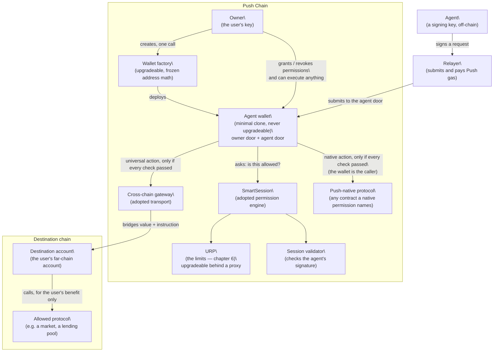
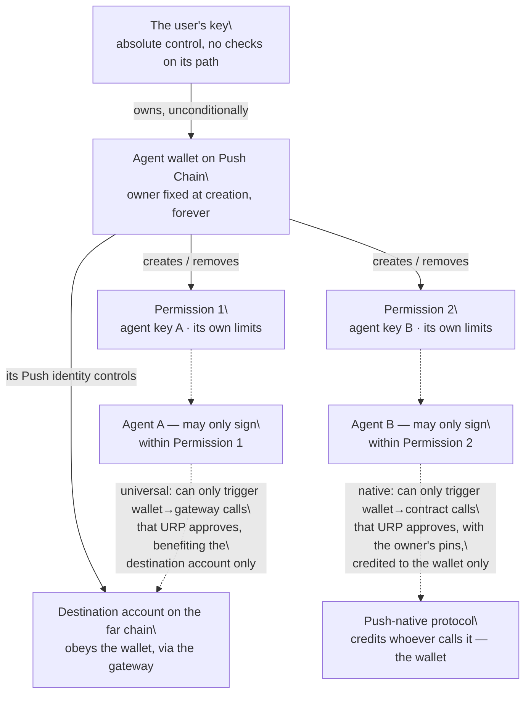
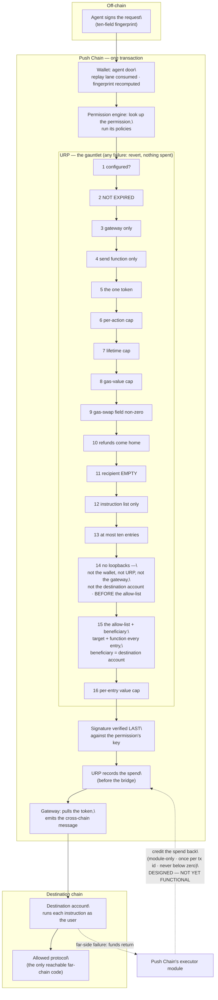
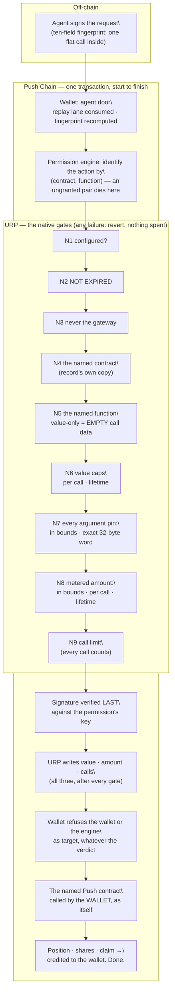
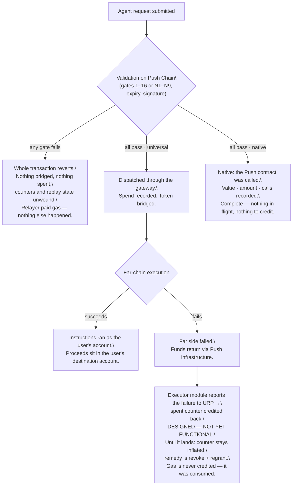

# Push Agentic Wallet — v3 Architecture
**This document describes what the system is.** It is written for a reader who has not followed the design process. Every term is explained the first time it is used. The reasoning behind each choice lives in the phase planning document; the checkable list of every ruling lives in the decision register. This document is the one a builder reads.
*Status of claims: where this document describes code that already exists (Push Chain's contracts, or the SmartSession permission engine), the claim carries a file and line reference. Where it describes something designed for v3 but not yet built, it says so in the text. Nothing here is presented as existing when it does not.*
---
# 1 · What this is
## The problem
- A user wants to let an automated agent trade or move funds for them, with the user's money — on another blockchain, or on Push Chain itself — without handing over their account.
- The user needs three things at once:
\t- The agent can act **without asking the user each time**.
\t- The agent can never spend **more than the user allowed**, on anything the user did not allow, for longer than the user allowed.
\t- The user can **shut it off instantly**, and take their money out at any time, no matter what state anything else is in.
- All of this runs on Push Chain, which reaches other blockchains through its own cross-chain gateway. Push Chain has no shared "transaction entry point" contract of the kind other chains use for smart accounts — so our wallet must do that job itself.
## The shape of the answer
- The user gets a **dedicated agent wallet** — a small, cheap contract created just for one purpose. It is not the user's main account. It only ever holds the money the user chooses to put at risk.
- The user grants the wallet a **permission**: a fixed bundle of limits binding one agent key. A permission is one of **two kinds**, declared at grant and never changed. A **universal** permission bounds cross-chain actions: which token, which destination protocol and functions, how much per action, how much in total, and until when. A **native** permission bounds actions on Push Chain itself: which Push contracts and functions, which arguments are pinned to which values, how much native value, how many calls, and until when.
- Every action the agent takes is checked against that permission **by contracts, at execution time**. The agent's honesty is never assumed and never needed.
- The single most important contract in the system is **URP — the Universal Rules Policy**. It carries two rulebooks, one per kind of permission. For a universal permission, every agent action, whatever it claims to be, is one and the same kind of call on Push Chain — the wallet calling the cross-chain gateway — and only URP looks inside that call to check what the agent is *really* doing on the far chain. For a native permission the target and function are already visible to the engine, and URP checks the three things the engine cannot see: the arguments, the value, and the count. Chapter 6 is devoted to it.
## What we build, and what we adopt
| Piece | Build or adopt | What it is |
|---|---|---|
| **Wallet factory** (AGWFactory) | Build | Creates agent wallets at predictable addresses |
| **Agent wallet** (PushAgentWallet) | Build | The account itself: holds funds, verifies agent requests, executes |
| **URP** | **Build — the only genuinely novel contract** | The policy that inspects and limits every agent action — cross-chain through its universal rulebook, Push-native through its native rulebook |
| **Session validator** (PushSessionValidator) | Carry forward and verify | Checks the agent's signature (two schemes: standard ECDSA, and Ed25519) |
| **SmartSession** | Adopt, unmodified | An existing open-source permission engine that stores permissions and runs policies |
| **Cross-chain gateway** | Adopt (Push Chain's) | The contract that carries value and instructions to other chains |
| **Destination account** | Adopt (Push Chain's) | The user's account on the far chain, controlled from Push Chain. Universal permissions only |
| **Push-native protocol** | Adopt (whatever the owner names) | Any contract on Push Chain a native permission allows the agent to call — a staking pool, a vault, a token. Nothing is built or trusted; the wallet simply calls it |
## What this system deliberately does not have
Read this list before reading anything else. None of these is an oversight.
- **No editing of a granted permission.** A permission is frozen at grant. Any change means revoking it and granting a new one — in one combined step.
- **No upgrade of a deployed wallet.** A wallet's code is fixed forever at creation. A new wallet version means creating a fresh wallet.
- **No guardian, no recovery contact, and no pause on any wallet.** Nobody but the owner can act on a wallet, and nobody at all can freeze one. *(The **factory** has an operational pause that can stop **new wallets being created**. It cannot touch a wallet that exists, its funds, or its mandates — see chapter 9, item 22.)*
- **No paymaster and no gas sponsorship.** The agent's service relays its own requests and pays its own gas.
- **No deny-list.** The permission names what is allowed; everything else is refused. There is no list of specially forbidden functions.
- **No limit on how far in the future a permission or request may expire.** The user's choice of expiry is respected as given.
- **No mixed permission.** A permission is universal or native, never both. An owner who wants an agent to do both grants two permissions on the same wallet — they coexist, meter independently, and are revoked independently.
## Glossary
| Term | Meaning |
|---|---|
| **Owner** | The user's own key. Created the wallet, controls it absolutely. |
| **Agent** | An automated service holding an ordinary signing key. It signs requests; it never holds funds. |
| **Agent wallet** | The contract this document is about. Holds the budgeted funds on Push Chain. |
| **Permission** | One frozen bundle of limits binding one agent key, of one **kind** — universal or native. A wallet can hold several, of either kind. |
| **Universal permission** | A permission whose every action travels through the gateway to a far chain. One token, one destination chain, an allow-list of far-chain calls, one destination account. |
| **Native permission** | A permission whose actions are calls to contracts on Push Chain itself. One to eight (contract, function) pairs, each with its own pins, caps and call limit. Nothing leaves Push Chain. |
| **Action** | One (contract, function) pair the engine recognises as a unit. A universal permission has exactly one — the gateway's send. A native permission has one to eight. |
| **Argument pin** | A native limit: a 32-byte word at a fixed position in a call's data that must equal a value frozen at grant. This is how a beneficiary, a spender or a pool id is locked. |
| **Policy** | A contract that checks one aspect of a request. URP is the main one. |
| **SmartSession** | The adopted engine that stores permissions and calls each policy in turn. |
| **Gateway** | Push Chain's cross-chain transport. The only thing a **universal** action is ever allowed to call — and the one thing a **native** action never may. |
| **Destination account** | The user's contract account on the far chain. Push Chain computes its address in advance. |
| **Relayer** | Whoever submits the agent's signed request to Push Chain and pays that gas. |
| **PC** | Push Chain's native token, used for gas. |
---
# 2 · The pieces
Six things make up the system. This chapter says what each one is, what it stores, and where it runs. How they interact comes in chapters 3 to 6.
## 2.1 The wallet factory
- A single contract on Push Chain that creates agent wallets.
- Whoever calls it becomes the owner of the wallet it creates. There is no way to create a wallet owned by someone else — the factory does not accept an owner as input; it uses the caller's address, full stop.
- Wallet addresses are **predictable before creation**. The factory uses deterministic deployment (CREATE2): the address is computed from the owner's address plus a per-owner counter. Creating two wallets in a row gives two different, but individually predictable, addresses.
- The factory itself sits behind an upgradeable proxy, so its logic can be improved — **but the address computation must never change**. If it changed, any address a user had computed in advance (and possibly already sent funds to) would become unreachable. A permanent regression test pins this.
- The factory stores: the wallet implementation address, and each owner's wallet counter.
## 2.2 The agent wallet
- A **minimal clone**: a tiny contract that delegates all logic to one fixed implementation. Cheap to create, and **not upgradeable — ever**. The owner's address is baked into the clone's own bytecode at creation and can never be reassigned.
- It is a modular smart account following an existing standard (ERC-7579), reduced to the minimum: it supports exactly **one kind of module — a validator** (a contract that checks signatures and permissions). Attempts to install any other module kind (executors, hooks, fallbacks) are refused by the wallet itself.
- It has two doors:
\t- **The owner door.** The owner can make the wallet do anything, send anything anywhere, with no checks at all. This is deliberate and is covered in chapter 3.
\t- **The agent door** — a function called `executeWithSession`. Anyone may knock on this door with a signed agent request; the request only passes if every check in chapters 5 and 6 passes.
- What the wallet stores: a replay-protection table (chapter 5), and a grant counter used to make every permission unique (chapter 4).
- What it holds: the budgeted funds — the tokens the owner has decided to put under agent management, plus a little PC for gas on cross-chain calls.
## 2.3 The permission
- A permission is **not a single record in one place**. It is written across three storage locations in one grant transaction:
\t- **SmartSession's storage** holds: that the permission exists, which agent key may sign for it, and the list of policy contracts to run.
\t- **URP's storage** holds everything about what the agent may actually do, in one of two shapes chosen by the permission's kind. For a universal permission: the allowed protocol functions on the far chain, the token, the caps, the counters, and the destination account address. For a native permission, one record **per action**: the Push contract and function, the argument pins, the value and amount caps, the call limit, and the counters. Chapter 6 lists every field of both.
\t- **URP also records the kind itself**, in a small mode record written in the same transaction. On every later request URP consults that record — not the shape of the data — to choose which rulebook runs.
\t- *(There is no separate time-window policy in v3: the expiry lives inside URP, so URP is the sole action policy — see chapter 6.1.)*
- A permission is identified by a unique id computed from its contents plus a salt the wallet supplies from its own grant counter. Granting the same terms twice therefore produces two distinct permissions — they never collide, and revoking one never touches the other.
- A permission is **immutable**. Nothing in the system can modify one after grant. The only operations that exist are: create one, and remove one.
## 2.4 The agent
- An agent is an ordinary externally-owned account — a plain signing key. Smart-contract agents (multisigs and the like) are not supported in v3.
- Two signature schemes are accepted: standard ECDSA, and Ed25519 (verified through a precompiled contract on Push Chain at a settled, canonical address; what remains before testnet is one fork test of the live call path).
- **An agent key is attached to one permission, not to the wallet.** A wallet with three permissions can have three different agent keys, each locked to its own limits. There is no wallet-level "the agent" and no way to swap the key inside an existing permission — a new key means a new permission.
- The agent holds no funds of the user's and has no standing power. Its only ability is to produce signatures that the wallet may or may not accept.
## 2.5 URP — introduced
- URP is the contract where the user's real intent is enforced: *this protocol, these functions, this token, this much, for me, until then*.
- It exists because of a structural blind spot in the adopted engine, explained fully in chapter 6: from Push Chain's point of view, every agent action looks identical — a call to the gateway. URP is the contract that opens that call up and inspects what is inside.
- For a native permission it does the complementary job: the engine already sees the target and function, so URP checks how the function is called — which arguments are pinned, how much value rides along, how much of a metered amount, and how many times.
- It is the one contract in the system that is **upgradeable** — it sits behind a proxy at a permanent address, so its rules can be corrected or extended without moving any wallet or reissuing any permission. That is a deliberate trade, and it is what limit 27 in chapter 9 is about: the address is fixed forever, the logic behind it is not.
- One paragraph is all it gets here. **Chapter 6 is its chapter.**
## 2.6 The destination account
- *(Universal permissions only. A native permission has no destination account: its actions never leave Push Chain, and whatever they produce is credited to the wallet itself.)*
- The user's account on the far chain (Ethereum, or any chain Push supports). Push Chain's existing infrastructure creates it and controls it; we adopt it as-is.
- Its address is **computable in advance** on Push Chain, before the account even exists on the far chain (`getCEAForPushAccount` forward, `ceaToPushAccount` reverse).
- At grant time, the tooling computes this address and freezes it into the permission. From then on, URP requires that everything the agent does on the far chain benefits **that address and no other**. The agent can trade with the user's money; everything it buys lands in the user's own far-chain account.
## 2.7 The Push-native protocol
- Any contract on Push Chain that a native permission names: a staking pool, a vault, a token, a registry. Nothing is built, adopted or trusted — it is whatever the owner chose to allow.
- The wallet calls it **directly, as itself**. The protocol sees the wallet as the caller, so whatever the call produces — a staked position, shares, a claim — is the wallet's, never the agent's. This is the native counterpart of the destination account's "for the user only" rule, one hop shorter.
- To the engine it is an (address, function) pair and nothing more. To URP it is that pair plus the pins, caps and counters the owner attached. Neither contract knows what the function *means*; both only know what the owner allowed.
## Diagram — the system map

---
# 3 · Who controls what
## The single chain of authority
There is exactly one chain of control in this system, and it starts and ends with the user.
- **The user's key owns the wallet.** Ownership is fixed at creation, inside the wallet's own bytecode. It cannot be transferred, stolen by code, or reassigned by any function — no function to do so exists.
- **The wallet owns its permissions.** Only the owner, through the wallet, can create or remove a permission. An agent cannot grant itself anything, extend anything, or remove anything.
- **A permission bounds one agent key.** The key can sign requests inside the permission's limits. That is the entirety of its power.
- **The wallet's Push-side identity owns the destination account.** The far-chain account obeys instructions that arrive through Push Chain's gateway from the wallet. The agent never controls the destination account; it can only cause the wallet to send it instructions that URP has already approved.
- **For a native permission the same rule holds one hop shorter.** The wallet calls the Push contract as itself, so the position, the shares, the claim — whatever the call produces — is credited to the wallet. The agent never controls the target contract; it can only cause the wallet to call it in exactly the way URP has already approved, with the arguments the owner pinned.
## The owner door has no checks — on purpose
- The owner can execute anything from the wallet at any time: withdraw every token, send to any address, call any contract, on Push or (via the gateway) beyond.
- **No policy, no cap, no expiry, no destination rule applies to the owner.** All of chapter 6 applies to the agent door only.
- Why: every safety mechanism on the owner's own exit is also a way for the owner to be locked out of their own money. The design refuses that trade. The wallet must remain drainable *by its owner* in every degraded state the rest of the system could ever reach — engine misconfigured, policy bricked, permission wedged, bridge down. A standing test executes an owner withdrawal in each of these states and must always pass.
- The cost of this choice is stated plainly: **a stolen owner key drains the wallet completely.** There is no guardian and no delay to stop it. Defence against key theft belongs to the layer that holds keys — the user's identity and key-management setup — not to this wallet. This is the first entry in chapter 9's list of accepted limits.
## What an agent's signature is — and is not
- A signed agent request is a **bearer instruction**: whoever holds it may submit it to the wallet. The wallet checks *the signature and the limits*, not *who delivered it*. (A possible future tightening — binding requests to a named submitter — is recorded in chapter 11.)
- A signature grants nothing durable. Each request spends from the permission's remaining budget exactly once (the replay protection in chapter 5 guarantees the "once").
- The agent key never touches custody. At no point in any flow do funds sit in an account the agent controls. Universally, they move from the wallet, through the gateway, to the user's own destination account, and anything bought lands in that same account. Natively, they move from the wallet straight into a Push contract as the wallet's own position, and come back to the wallet.
## Diagram — the chain of ownership

---
# 4 · The life of a permission
## 4.1 Birth — the grant
- The owner (or the tooling acting for the owner, with the owner signing) composes the terms. **The first term is the kind**, and it decides the shape of everything after it. Common to both kinds:
\t- the agent's public key and its signature scheme;
\t- the expiry — one value, held inside URP.
- **For a universal permission:**
\t- the far-chain protocol: each allowed contract address and function, and — for each function — where in its arguments the *beneficiary* sits, so URP can later check that the beneficiary is the user's destination account. These argument positions are **generated from the protocol's interface by tooling, never typed by hand** (a promise the contracts cannot check — chapter 10);
\t- one token, and with it one destination chain — a permission never spans tokens or chains;
\t- the caps: a per-action maximum, a lifetime maximum, and a maximum of native PC per action;
\t- the destination account's computed address.
- **For a native permission:**
\t- one to **eight** actions — eight is a fixed wallet constant, a sanity bound rather than a gas bound — each a Push contract and one function on it. A function may be *value-only*: a bare transfer of native PC with empty call data;
\t- per action, the **argument pins**: up to eight positions in the call data, each frozen to the exact 32-byte word that must appear there. This is how a beneficiary is locked to the wallet, a spender to one contract, a pool to one id. **Positions are generated from the contract's interface by tooling, never typed by hand** (chapter 10) — a wrong position fails closed, but a *missing* pin guards nothing;
\t- per action, the native-value caps: a per-call maximum and a lifetime maximum;
\t- per action, optionally, a **metered amount**: one argument position read as a number, with its own per-call and lifetime maximum — the native counterpart of the bridged-amount cap;
\t- per action, a **call limit**: how many times the action may run, where zero means unlimited;
\t- and nothing else. There is no token, no destination chain, and no destination account: a native permission has no far side.
- The owner sends one transaction through the wallet. The wallet supplies a salt from its internal grant counter — this is what makes every permission unique — and calls the engine's standard enable function. In the same transaction, URP's configuration — including the permission's expiry — is written: one record for a universal permission, one record **per action** for a native one, and beside them the record of which kind this is.
- **Before anything reaches the engine, the wallet asserts the declared kind against the actions.** A universal permission must name exactly one action, and it must be the gateway's outbound send. A native permission may name anything on Push Chain **except** the gateway — and except seven addresses that would turn the agent into the owner: the zero address, the engine's wildcard marker, the wallet itself, the engine, URP, the validator, and the factory. It may not name the engine's two wildcard function markers, and it may not name the same (contract, function) pair twice. Every one of these refusals carries its own named error, and the two that matter most — the wallet and the engine as targets — are pinned by permanent tests.
- The wallet exposes exactly **two** permission operations to the owner: *enable* and *remove*. The engine underneath offers more; the wallet deliberately does not surface them. *Enable* takes the kind as an explicit argument and records it in the grant event, so an indexer can tell a native permission from a universal one without opening the session.
- A failed grant does not undo a wallet. A wallet with zero permissions is a valid, safe object: with no permission there is no agent authority of any kind, and every agent request fails before any policy even runs.
## 4.2 Life — what the counters mean
- **The lifetime cap counts what is bridged, not what is deployed.** When the agent moves 40 of an allowed 100 to the far chain, the counter reads 40. If it then trades those 40 into 80 and back again on the far chain, the counter still reads 40 — redeployment at the destination is not new spending from the wallet. The cap bounds the user's exposure *from the wallet*; the expiry bounds how long the agent can keep working with what is already across.
- **An unlimited cap is allowed and is expressed as the largest representable number.** There is no special "unlimited" flag; the comparison simply never trips. The product must display this honestly — "unlimited", never a huge number (chapter 10). The one exception is a native action's **call limit, where zero means unlimited** — a call limit of zero calls would be a permission that authorises nothing.
- **A native action keeps three counters, not one:** native value sent, the metered amount (if the action has one), and calls made. **Every successful call counts as a call, even one that sends no value and meters no amount.** A call limit that zero-value calls could slip past would be advisory, so the counter always moves — this is the one place the native rulebook deliberately differs from the universal one, whose counter does not move on a zero-amount request.
- *(Universal only.)* **If a cross-chain action fails on the far side, the spent amount is credited back** — the wallet's funds return and the counter should not stay inflated. This credit is issued by Push Chain's own executor module calling URP. It is **designed but not yet functional**: it needs a change on the Push core side that has not landed. Until it lands, a failed far-side action leaves the counter inflated, and the remedy is to revoke and regrant. Both halves of this are stated again in chapters 9 and 11.
## 4.3 Change — there is no change
- **A permission is never edited. Every "change" is: revoke the old one, grant a new one, in one atomic owner transaction.** If any part fails, the whole transaction fails, and the old permission remains exactly as it was. There is no window where the wallet is half-configured.
- One race is guarded explicitly. Between the owner composing the change and the transaction landing, the agent may spend. The owner's change transaction therefore begins with an **assertion of the expected spent amount**: "I am replacing this permission believing it has consumed X." If the agent moved money in the gap, the assertion fails, the whole change reverts, and the owner re-reads and retries with current numbers. Stale beliefs never silently become new budgets. For a native action the assertion names **all three counters** — value, amount, calls — and every one must match exactly; and it refuses to run against a permission of the other kind, or against one that does not exist, so a stale belief can never pass by reading zeros from the wrong place.
- **Counters restart from zero on the new permission.** This is a real, accepted sharp edge: replacing a 100-cap permission that had 80 spent with a "tighter" 50-cap permission yields 50 of *fresh* authority — more than the 20 that remained. The contracts do not compensate for prior spend, and the product is obliged to show the owner what the old permission had consumed before the new cap is chosen (chapter 10).
- Because no permission can ever be widened in place, an entire class of problems disappears structurally: there is no "widening inside the expiry window" to delay, timelock, or guard. The mechanism that would have needed guarding does not exist.
## 4.4 Death — revocation and expiry
- **Revocation is one owner call, effective immediately on Push Chain.** The permission's storage is removed; the very next agent request against it fails. Nothing the agent does can delay or contest this. Removal performs pure storage deletion — it calls out to nothing, so no external contract can make revocation fail (`SmartSessionBase.sol:329-355`, `ConfigLib.sol:274-284`).
- **One honest limit:** revocation stops new instructions. An instruction that already left through the gateway — already in flight across the bridge — still completes on the far chain. The window is bridge latency. The revoke screen must say this (chapter 10).
- **Expiry needs no transaction.** Past the expiry, URP's expiry gate — the second gate of either rulebook — fails every request. The permission's storage still exists until removed, but it is inert.
- Removing a permission also removes the standing power of anything signed under it: a request the agent signed but never submitted — a *banked* signature — dies with the permission, because the permission's id is bound into what was signed (chapter 5) and that id no longer exists. A regrant produces a new id, and the banked request fails against it. A permanent test pins this.
## Diagram — the permission lifecycle
```mermaid
stateDiagram-v2
  [*] --> Composed: owner + tooling assemble terms
  Composed --> Active: one grant transaction\
(engine + URP + expiry written together)
  Active --> Active: agent request passes\
counters advance
  Active --> Active: far-side failure\
credit back (designed — not yet functional)
  Active --> Expired: expiry passes\
no transaction needed
  Active --> Removed: owner revokes\
immediate, unconditional
  Active --> Replaced: CHANGE = revoke + regrant\
one atomic transaction,\
gated by the spent-amount assertion
  Replaced --> [*]: old id dead — banked signatures die with it\
new permission starts at zero
  Expired --> Removed: cleanup, optional
  Removed --> [*]
```
---
# 5 · One action, end to end
This chapter walks a single agent action from signature to funds moving. It is the spine of the whole system; chapter 6 then zooms into the deepest step.
## 5.1 Why the wallet does so much itself
- On chains that follow the account-abstraction standard, a shared system contract (the "EntryPoint") receives signed account operations, checks replay protection, and dispatches them. **Push Chain has no such contract.** So our wallet performs those jobs itself, inside one function — the agent door, `executeWithSession`.
- The wallet keeps the standard's *packaging* (the operation format), because the adopted permission engine speaks it. But the packaging is just a shape; there is no shared dispatcher behind it. The wallet is its own dispatcher and never leaves the call stack — which has one important consequence used later: **when the wallet finally calls the gateway, the gateway sees the wallet itself as the caller**, not a relayer, not the agent.
## 5.2 The request the agent signs
What the agent signs depends on the permission's kind — but only in the innermost part. The wallet operation around it, and the fingerprint over it, are identical for both.
**A universal request has nested layers.** The agent's service composes the action innermost first:
- **Innermost — the far-chain call.** The actual thing the user wanted: for example, *buy these shares, for this much of the token, with the user's destination account as beneficiary*.
- **Around it — the instruction list.** The far-chain calls are packed as an instruction list for the destination account, between one and **ten** entries — ten is a fixed contract constant. Each entry is: a target address, a native-value amount, and call data.
- **Around that — the gateway request.** The message to Push Chain's gateway: which token and how much to bridge, the instruction list as payload, and two routing fields URP will pin (chapter 6): the bridged-funds recipient field, and the refund destination.
- **Outermost — the wallet operation.** The whole thing packaged as an operation on the wallet, plus the replay-protection pair described next.
**A native request has one layer.** There is no far-chain call, no instruction list and no gateway request. The agent names a Push contract, a native-value amount, and the call data — and that flat call *is* the execution payload. Around it sits the same wallet operation and the same replay-protection pair. Three nested envelopes become one call; nothing else changes.
Then the agent computes the operation's **fingerprint** — a hash the wallet will independently recompute — and signs it.
## 5.3 The fingerprint — what the signature actually covers
The wallet computes the fingerprint itself, from what actually arrived — never trusting a hash supplied from outside. It binds **ten fields**:
1. a fixed domain label (so the signature cannot mean anything in any other protocol);
2. the chain id (no replay on another chain);
3. the wallet's own address (no replay on another wallet);
4. the validator's address;
5. **the permission's id** — this is why one agent key serving several permissions can never have a request meant for one budget charged to another, and why a banked signature dies when its permission is replaced;
6. the execution mode;
7. the hash of the full execution payload — every nested layer above, down to the last argument;
8. the replay lane (next section);
9. the position in that lane;
10. **the request's expiry** — a per-request deadline, so a relayer cannot extend or trim a request's lifetime. **A stamp of zero means no expiry**, matching the account-abstraction convention; the SDK's default sets a real, short one.
**Honesty note for the builder: fields 5 and 10 are designed, not yet shipped.** The existing v2 code binds eight fields (`opHash` in the shipped wallet). Adding the permission id and the request expiry is a v3 requirement, not an error in this document. Do not "correct" the ten back to eight.
## 5.4 Replay protection — independent lanes
- The wallet keeps a table of counters, not a single counter. A request names a **lane** (any 192-bit key the agent picks) and a **position** in that lane. Each lane advances independently: position n in a lane can only be used once, and only after n-1.
- Why lanes instead of one counter: an agent running several strategies can proceed in parallel. A stalled or abandoned request in one lane never blocks another lane.
- The consumed position is written **before** validation runs, so a request can never run twice, even re-entrantly. And if execution later reverts, the whole transaction unwinds — counter, position, everything — leaving no half-spent state. A failed action costs the relayer gas and changes nothing else.
- Two honest notes: a request that can never succeed wedges *its own lane* permanently — the agent just abandons that lane; and if two relayers race the same signed request, one wins and the other wastes its own gas. Both are accepted, both are agent-side problems only.
## 5.5 The walk, in order
What happens when the relayer submits, step by step. Every step is on Push Chain, inside one transaction, until the bridge.
1. **Anyone submits** the signed operation to the wallet's agent door. **The wallet's first act is to check the request's own expiry stamp**, before anything else costs gas. The door is permissionless by design — the agent's service is expected to relay its own requests and pay Push gas from its own PC balance (an operational duty, chapter 10), but the wallet does not check who submits.
2. **The wallet consumes the replay position** — lane and position, checked and advanced first.
3. **The wallet computes the ten-field fingerprint** from the arrived payload.
4. **The wallet asks the permission engine to validate.** SmartSession looks up the permission by its id: does it exist on this wallet? Which policies are attached?
5. **The engine runs every attached policy, in order, on the raw request.** First it identifies the action by the call's target and function; a native request naming any pair the permission did not grant dies here, at the engine, before any policy runs. Then, for this system, exactly one policy: **URP — the whole of chapter 6**, which reads the permission's kind and runs the matching rulebook, and which carries the expiry check itself. Every policy must pass; any failure ends everything with nothing spent. Two engine facts matter here:
\t- **Action policies have a minimum count of one, but the engine's other policy class (checks on the outer operation) has a minimum of zero** (`SmartSession.sol:237-247, 285-299`). Rule for this system: **no mandatory guarantee may live only in that zero-minimum class**, because a configuration with none of them is legal. Everything mandatory lives in URP.
\t- **Policies run before the signature is checked** — an engine ordering we adopt, not choose (`SmartSession.sol:340-352`). Consequence: every policy must be safe to run on arbitrary, not-yet-authenticated calldata from anyone. URP holds no state that validation mutates, so a forged request can waste gas and nothing else.
6. **The signature is verified last.** The session validator recovers the signer from the fingerprint — ECDSA directly, or Ed25519 through the precompile — and compares it to the key stored in the permission. Wrong key, no execution.
7. **The wallet enforces the verdict explicitly.** Because there is no EntryPoint to do it, the wallet itself unpacks the engine's answer and enforces both the pass/fail result and the validity window it returns. *(The request's own expiry was already checked at step 1. The wallet rejects **expired** requests but places no ceiling on how far ahead an expiry may sit — and a stamp of **zero means no expiry at all**.)*
8. **The wallet refuses two targets whatever the engine said.** After validation and before dispatch, if the approved call targets the wallet itself or the engine, the wallet reverts. Neither can ever be granted (chapter 4.1), so on a permission the wallet created this never fires — it exists for a permission the owner enabled on the engine *directly*, bypassing the wallet's grant check, which the owner door permits. It is the last of four independent refusals of a self-call, it runs deliberately **after** validation and not before (chapter 11), and two permanent tests pin it — one of them reaching the engine as a target through the engine's own wildcard.
9. **The wallet makes the approved call, with the exact validated bytes.** For a universal permission that is **the gateway**: it sees the wallet as the caller, pulls the bridged token amount from the wallet's balance, takes the PC provided for far-side gas, and emits the cross-chain message. For a native permission it is **the named Push contract**, called by the wallet as itself, carrying the approved value and call data: the contract sees the wallet as the caller, and whatever the call produces is the wallet's. **A native action is complete here** — one Push transaction, no bridge, nothing in flight. The two steps below are universal only.
10. **On the far chain**, the destination account receives the message and runs the instruction list, entry by entry, each call made *by the user's own account* — which is why anything bought lands as the user's.
11. **If the far side fails**, the funds return through Push Chain's infrastructure, and the credit path of chapter 4.2 applies (designed — not yet functional). Gas is never refunded: it was genuinely consumed. **A refund credit must not move any gas counter** — a permanent rule.
## Diagram — one agent action
```mermaid
sequenceDiagram
  participant AG as Agent (off-chain key)
  participant RL as Relayer
  participant W as Agent wallet
  participant SS as SmartSession (engine)
  participant U as URP
  participant V as Session validator
  participant GW as Gateway
  participant DA as Destination account (far chain)
  participant NP as Push-native protocol

  AG->>AG: universal: build nested layers:<br/>far-chain call → instruction list (≤10) → gateway request → operation<br/>native: one flat call (contract, value, data) → operation
  AG->>AG: sign the ten-field fingerprint
  AG->>RL: hand over the signed operation
  RL->>W: submit at the agent door (permissionless)
  W->>W: 1. consume replay lane + position
  W->>W: 2. recompute the fingerprint from what arrived
  W->>SS: 3. validate against the named permission
  SS->>SS: identify the action by (target, function);<br/>an ungranted pair dies here
  SS->>U: the whole of chapter 6 —<br/>read the kind, run its rulebook, check every limit
  U-->>SS: pass / fail (nothing spent on fail)
  SS->>V: 4. LAST: does the signature match the permission's key?
  V-->>SS: signer confirmed / rejected
  SS-->>W: verdict
  W->>W: 5. enforce verdict + request expiry itself
  W->>W: 5b. refuse the wallet or the engine as target, whatever the verdict
  alt universal permission
    W->>GW: 6. call with the exact approved payload<br/>(gateway sees the WALLET as caller)
    GW->>DA: bridge token + instruction list
    DA->>DA: run each instruction as the user's own account
    Note over U,DA: far-side failure → funds return, spend credited back<br/>(designed — not yet functional) · gas never refunded
  else native permission
    W->>NP: 6. call the named Push contract with the exact approved bytes<br/>(the WALLET is the caller)
    NP-->>W: whatever the call produced is the wallet's — done, one transaction
  end
```
---
# 6 · URP — where the limits live
*URP — the Universal Rules Policy. One contract, two rulebooks: the **universal** rulebook (6.2–6.4) descends from a v2 contract that has since been removed from the repository; the line references in those sections point into that removed file and are kept only as provenance for the reviewed logic URP reproduces. The **native** rulebook (6.2b, 6.4b) is referenced by function name into `src/policies/URP.sol`. **The authoritative specification is the contract itself, `src/policies/URP.sol`, together with its test suite.** Every v3 extension to the universal rulebook is marked below.*
## 6.1 Why this contract exists
- The adopted permission engine identifies "what action is this?" by hashing **the target contract and the function being called on Push Chain**.
- But every agent action in this system is the *same* Push-side call: the wallet calling the gateway's send function. A market trade, a lending deposit, a transfer to a thief's address — **identical**, from the engine's point of view.
- The things the user actually cares about — which protocol, which function, whose benefit, how much — live *inside the call's data*, nested two layers deep, where the engine never looks.
- **URP is the contract that looks.** It is registered as the action policy for the one action that exists, and it unwraps the call data and checks everything inside. Remove URP and the user's real limits are not enforced anywhere. That is why the engine's own floor — **at least one action policy per action** (`SmartSession.sol:285-299`) — combined with URP being that one policy, means the system fails closed: strip URP from a permission and the permission validates nothing at all, so every request dies.
- **For a native permission the blind spot is different, and smaller.** Here the engine's identity — the Push contract and the function — is exactly what the user cares about, so the engine itself already refuses a call to any contract or function the permission did not name. What the engine still cannot see is *how* the function is called: the arguments, the value attached, and how many times. URP's native rulebook checks those three. It is registered as the action policy on **each** of the permission's one to eight actions, and the fail-closed property is identical and per action: strip URP from any action and that action validates nothing.
- **URP decides which rulebook to run from a record it wrote at grant, not from the request.** Chapter 6.7 explains how that record is set, and why a request can never reach the wrong rulebook.
- Two wiring rules protect the fail-closed property. **Both are enforced in code, by the wallet's grant-shape check — a grant violating either one reverts:**
\t- **Never configure a fallback action policy** on an agent wallet. The engine supports a wildcard policy that catches unmatched actions; installing one would absorb requests that should die. For a universal permission this follows from the one-action shape; for a native permission the wallet refuses the engine's wildcard target and its two wildcard function markers **by name**, because the engine itself does not refuse the wildcard target at grant time (chapter 7.1).
\t- **Never rely on the engine's other policy class** (checks on the outer operation) for anything mandatory — that class is allowed to be empty (`SmartSession.sol:237-247`). Everything mandatory lives in URP.
## 6.2 What URP stores — a universal permission's configuration
Frozen at grant, per permission, written at initialisation:
| Field | Meaning |
|---|---|
| the token | The one asset this permission may bridge. Also pins the destination chain — see 6.5 |
| per-action cap | The most that one request may bridge |
| lifetime cap | The most that all requests together may bridge. The largest representable number means unlimited |
| PC-per-action cap | The most native gas value one request may carry |
| the spent counter | Running total of bridged amount. Starts at zero |
| the expiry | The permission's end. Held **inside URP** so this one contract carries the complete mandatory set — no other policy needs to exist for the user to be safe |
| the destination account address | Computed and committed at grant. Everything must benefit this address |
| the allowed-calls list | Per entry: a far-chain contract address, a function on it, where that function's beneficiary argument sits, whether it has one, and a per-entry native-value cap. One to thirty-two entries |
## 6.2b What URP stores — a native permission's configuration, per action
A native permission holds one of these records **per action** — a permission with eight actions holds eight, each under its own action id. Frozen at grant, written at initialisation:
| Field | Meaning |
|---|---|
| the target | A defensive copy of the action's Push contract. The engine already routes by it; URP asserts it again at N4 so a mis-wired engine entry cannot pair one contract's rules with another's call |
| the function | A defensive copy of the action's function selector, asserted at N5. The value `0xFFFFFFFF` means **value-only**: a bare transfer of PC with **empty** call data — a function that merely takes no arguments is a normal four-byte selector, not value-only |
| the argument pins | Zero to eight. Each is a byte position in the call data — counted from byte zero, selector included, so 4 is the first argument — and the exact 32-byte word that must sit there. **Full-word equality**, so an address argument with anything in its upper twelve bytes is a mismatch, deliberately: the pin proves the padding is clean as well as the value |
| per-call value cap | The most native PC one call may carry |
| lifetime value cap | The most all calls together may carry. Largest number means unlimited |
| the value-spent counter | Running total of native PC sent. Starts at zero |
| the metered amount | Optional: on/off, a position in the call data read as a number, a per-call cap and a lifetime cap. Off is a flag, not "position zero" — position zero is a legal position, inside the selector |
| the amount-spent counter | Running total of the metered amount. Starts at zero |
| the call limit | How many successful calls the action permits. **Zero means unlimited** — the one cap in the system where zero is not "nothing" |
| the calls-used counter | Successful calls so far. **Moves on every successful call**, including one that sends no value and meters nothing |
| the expiry | The permission's end, held inside URP for the same reason as in the universal rulebook |
Two refusals happen at grant, not at validation: a native record may never name the gateway as its target, and a value-only record may carry neither pins nor a metered amount — such a record could never authorise anything, so it is a misconfiguration the owner believes they granted, not a valid strict one.
**And, beside either configuration, the mode record**: whether this permission's URP record exists at all, and which kind it is. Chapter 6.7.
## 6.3 What URP opens
Each validation performs a **two-level unwrap**:
- **Level one — the gateway request.** URP decodes the wallet's call to the gateway: the token, the amount, the native value, the routing fields, and the payload.
- **Level two — the instruction list.** Inside the payload sits the destination account's instruction list: up to **ten** entries of *(target, value, data)*. URP walks **every** entry. One bad entry — even the last — kills the whole request.
- **A native validation opens nothing.** The call is already flat. URP reads 32-byte words out of the call data at the positions the permission froze, and never decodes it as a structure — it does not know, and does not need to know, what the function's arguments mean. Every read is bounds-checked in 256-bit arithmetic, so a crafted position can neither wrap nor read past the end.
## 6.4 The universal gauntlet — every gate, in order
Each gate: what it demands, and what it stops. Any failure reverts the whole request with nothing spent.
| # | Gate | Demands | Stops |
|---|---|---|---|
| 1 | **Configured** | This permission's configuration exists and is initialised (`:141`) | Requests against ghosts — ids never granted on this wallet |
| 2 | **Not expired** | The permission's own end date has not passed — **the expiry lives here, in URP** | Everything, after the deadline the user set. This is why URP alone is the complete mandatory set |
| 3 | **Gateway only** | The Push-side call target is the gateway, nothing else (`:143`) | The agent calling any Push contract directly — a token, the wallet, anything. The entire far-chain rulebook below is only sound because *everything* must pass through the gateway |
| 4 | **Send function only** | The gateway function is the outbound send, nothing else (`:145-147`) | Reaching any other gateway capability |
| 5 | **The one token** | The bridged token equals the configured token (`:151`) | Spending any asset the user did not budget |
| 6 | **Per-action cap** | Amount within the per-action cap (`:163`) | One oversized request |
| 7 | **Lifetime cap** | Amount plus everything already spent within the lifetime cap | Death by a thousand cuts — many small requests summing past the budget |
| 8 | **Gas-value cap** | Native PC attached within its cap (`:177`) | Draining the wallet's gas balance through the value field |
| 9 | **No uncapped gas swap** | The request's own gas-swap ceiling is non-zero *(v3 addition)* | An agent authoring the field's "no cap" value. The **owner** may set unlimited caps in the mandate; an **agent** may not author an unlimited request field |
| 10 | **Refunds come home** | The refund destination is the wallet itself (`:178-180`) | A "failed" transfer whose refund lands at the agent's address — failure as an exfiltration route |
| 11 | **No side recipient** | The bridged-funds recipient field is empty — funds may only travel with the instruction payload *(v3 addition)* | Any use of the gateway's direct-transfer mode. Defence in depth: the current far-side code ignores this field on the payload path, but URP does not lean on that staying true |
| 12 | **Instruction list only** | The payload is exactly a destination-account instruction list | Smuggling any other payload shape past the gates below |
| 13 | **At most ten** | Between one and ten instructions *(v3 constant)* | Unbounded lists that could exhaust validation gas |
| 14 | **No loopbacks** | No instruction may target the wallet, URP itself, the gateway — **or the destination account** (`:253-255`; the last is a v3 addition). **Checked before gate 15** | Self-calls and re-entry tricks; and — the v3 addition — the agent instructing the user's own account directly, which would hand it arbitrary control of everything that account holds. **This gate wins even if the owner allow-listed that address** — a permanent test pins exactly that |
| 15 | **The allow-list, and for the user only** | Every instruction's far-chain target *and* function appear in the allowed-calls list; and where the matched rule names a beneficiary argument, that argument equals the destination account (`:264-265`) | Everything. This is the only place in the entire system that checks the far-chain destination — and the beneficiary pin is what stops the agent trading honestly but making *itself* the beneficiary |
| 16 | **Per-entry value cap** | Each instruction's native value within its own cap | Value-draining through individual entries |

> **There is no zero-amount gate.** v2 rejected a bridged amount of zero; v3 permits it, because that is the *redeployment* path — instructions travelling to capital already at the destination, with nothing new bridged. The counter correctly does not move. Without it an agent could buy but never sell.

After every gate passes, URP **records the spend before the bridge is called** — effects first, so no ordering trick can spend twice against a stale counter.
## 6.4b The native gates — every gate, in order
Run only for a native permission (`_checkNative`). The same discipline as the universal gauntlet, for the same reason: this runs before the signature is verified, on unauthenticated call data from any caller. No external calls; every counter written last; any failure reverts the whole request with nothing spent.
| # | Gate | Demands | Stops |
|---|---|---|---|
| N1 | **Configured** | This action's native record exists and is initialised | Requests against ghosts — action ids never granted on this wallet |
| N2 | **Not expired** | The permission's end date has not passed — the expiry lives here, as in the universal rulebook | Everything, after the deadline the user set |
| N3 | **Never the gateway** | The call's target is not the gateway | The mirror of gate 3. A native permission cannot be written against the gateway (6.2b), so on a permission the wallet created this cannot fire — it is defence in depth against a mis-wired grant, and a named test manufactures the state the wallet forbids to prove the gate is live |
| N4 | **The named contract** | The call's target equals the record's own copy of the target | A record reached through any action id but its own |
| N5 | **The named function** | The call's function equals the record's copy. Call data under four bytes counts as value-only — matching how the engine itself buckets short calls — and **a value-only call must carry empty call data, not one to three stray bytes** | Reaching any function but the one granted; and smuggling bytes under a value-only action |
| N6 | **Value caps** | Native PC attached within the per-call cap; attached plus everything already sent within the lifetime cap | Draining the wallet's PC through one large or many small calls |
| N7 | **The argument pins** | For every pin: the call data is long enough to hold the word at that position, and the word there equals the frozen value exactly | A beneficiary that is not the wallet; a spender that is not the intended contract; a pool id the owner did not choose; a correct address with dirty padding. **This is the only place a native call's arguments are checked**, and a missing pin is an unchecked argument (chapter 9) |
| N8 | **The metered amount** | If the action meters an amount: the call data reaches it, the amount is within the per-call cap, and amount plus everything already metered is within the lifetime cap | Staking, approving, transferring or depositing more than the user allowed, per call or over the permission's life |
| N9 | **The call limit** | If the action has a limit: calls used so far are below it | The (n+1)th call — including a zero-value one, because every successful call counts |
After every gate passes, URP writes all three counters — value, amount, calls — **and only then**, so a request that fails at N9 has moved nothing at N6 or N8. It emits a metering event on every success, even when both value and amount are zero, because the call counter still moved.
**Every native error puts the value you debug with first.** The engine truncates a policy's revert data to 32 bytes — a selector plus 28 bytes of the first argument (chapter 7.1). A native error therefore leads with the offending value (the word that did not match, the amount that was too large) rather than an index or a length, which would surface as zeros and tell nobody anything. The universal rulebook's errors predate this ordering and keep their reviewed shape; wallet errors are not truncated at all and do not follow it.
## 6.5 What URP counts
- **The spent counter** advances by the bridged amount, before dispatch, and only counts bridging — chapter 4.2's "bridged, not deployed" rule lives here.
- **The credit-back** *(v3 addition — designed, not yet functional)*: when a far-side execution fails and Push Chain's executor module reports it, URP reduces the spent counter by the failed amount. Three properties bound this path:
\t- **module-only** — a single fixed caller, Push Chain's own executor module, may invoke it; the agent cannot fabricate a failure;
\t- **idempotent** — each failed cross-chain transaction id credits at most once; a second credit for the same id reverts (a named test);
\t- **saturating** — the counter never goes below zero.
\t- One honest limit: URP cannot verify the *amount* the module hands it; it trusts Push core. Idempotency and saturation bound the damage of a wrong amount. This is an accepted limit (chapter 9).
- **Gas is never credited.** A failed action's gas was genuinely consumed. **A refund credit must not move any gas counter** — a permanent rule with its own test.
- **A native action counts three things**, all written after every gate passes: native value sent, the metered amount if the action has one, and calls. There is no credit-back and nothing to credit: a native call either succeeds or reverts inside one Push transaction, and a revert unwinds every counter with it. The credit-back path refuses to run against a native record.
## 6.6 What URP deliberately does not do
- **No expiry-distance ceiling.** It rejects the expired; it never rejects the distant-future. The user's chosen horizon is respected as given.
- **No deny-list.** Nothing rejects a function by name. If an owner allow-lists a token-approval function, that is permitted — and hands the agent spending power outside every cap. The product must warn; the contract will not refuse. (An open question records whether this should change — chapter 11.)
- **No direct destination-chain check.** The configured chain is stored but not compared at validation. The chain is pinned *transitively*: the one allowed token is a Push-side mirror specific to one origin chain, so fixing the token fixes the chain. A builder who notices the stored-but-unchecked field has found a known fact, not a bug.
- **No opinion about the owner.** URP runs only on the agent door. The owner's door never meets it.
- **No understanding of native calls.** The native rulebook compares words at positions; it does not know what a function does. A pinned argument is locked; an unpinned one is the agent's to choose. So allow-listing a token approval without pinning its spender hands the agent that approval — the native form of the no-deny-list rule. The SDK refuses to emit an unpinned approval (chapter 10); the contract will not.
## 6.7 Which rulebook — how the kind is fixed, and locked three ways
- **The kind travels inside URP's initialisation data.** The engine passes each policy an opaque blob at grant; URP's blob is a one-byte kind followed by the configuration body — a universal body or a native one. URP decodes the kind as a plain number and range-checks it, so an out-of-range value produces a named error rather than a compiler panic; a blob in any other shape reverts rather than mis-decoding.
- **URP writes a mode record beside the configuration** — initialised, and which kind — and consults that record on every validation. It does not infer the kind from the data's shape, and it does not trust the request. Universal is the record's zero value, so an *empty* record cannot be told from a universal one by its kind field alone; the initialised flag is what is authoritative, and the mode field is meaningless without it.
- **A permission initialised as one kind can never be re-initialised as the other, or as itself.** The re-initialisation refusal reads the mode record and, beneath it, the universal configuration — so a universal configuration written before its mode record existed is still recognised, and is still protected. URP is upgradeable behind a proxy and its storage is append-only: the universal configuration, the credit-back set, the mode record and the native configuration each hold their own slot, and a later implementation may add state only after them.
- **The kind is locked three ways, and a mismatch can never open anything.** The wallet asserts the declared kind against the actions' targets at grant (chapter 4.1). Gate 3 requires a universal request to target the gateway. Gate N3 refuses a native request that does. Between them there is no shape in which a gateway call reaches a native record, and none in which a native call reaches a universal one. What the wallet does *not* do is decode URP's blob — it never inspects URP's contents — so the kind the wallet asserted and the kind URP recorded can, in principle, disagree. When they do, the result is a **dead permission**, never an open one: native targets with a universal body die at gate 3 on every request; a gateway target with a native body is refused at initialisation, and any other native body dies at N3. The only thing not covered is the grant event, which carries the kind the wallet was told (chapter 9).
- **The mode is readable.** A getter returns the mode record and never reverts; it is the documented first call for anything that does not already know a permission's kind. The universal and native getters each revert, with the actual kind named, when asked about a record of the other kind — a wrong-kind read is a caller bug — and each returns an all-zero record for an empty slot, which is a state, not an error.
## Diagram — the full agentic flow, Push Chain to the far chain, every gate

## Diagram — the native flow, every gate

## Diagram — when things fail

---
# 7 · What we adopted, and what that costs
Four external systems are load-bearing. For each: what we rely on it for, and the exact exposure that reliance creates. Nothing here is hidden as a footnote.
## 7.1 The permission engine (SmartSession)
- **Relied on for:** storing permissions, deriving their ids, running every policy, and verifying the agent's signature — the whole of chapter 5, steps 4–6.
- **What we get for free:** battle-tested storage and lifecycle code; removal that is pure storage deletion and cannot be blocked by any external call (`SmartSessionBase.sol:329-355`, `ConfigLib.sol:274-284`).
- **The costs, each one carried knowingly:**
\t- **Policies run before authentication** (`SmartSession.sol:340-352`). Every policy we ever attach must be safe on arbitrary calldata from anyone. This is a standing constraint on all future policy work, not just on URP.
\t- **One policy class may legally be empty** (`SmartSession.sol:237-247`) — hence the wiring rule that nothing mandatory lives there.
\t- **The engine ships an owner-only function that resets a policy's counters in place.** v3 tooling never calls it, and the agent structurally cannot (it is owner-path only) — a named test proves the agent cannot reach it. But it survives upstream, and a future tool that called it would silently refill a budget.
\t- **At grant, the engine refuses only two targets: the zero address and itself** (`ConfigLib.sol:139-143`). It does **not** refuse its own wildcard marker at grant — only at validation. The wallet is therefore the only grant-time layer keeping that marker, and the two wildcard function markers, out of a native permission. The wallet refuses all three by name; a constant-mirror test pins each value against the vendored engine so a fork bump cannot silently move them.
\t- **The engine identifies an action by (contract, function) alone**, so two entries naming the same pair collapse to one configuration, and the second initialisation would be refused by URP with an error naming an opaque id. The wallet refuses duplicates first, naming the pair.
\t- **The engine truncates a policy's revert data to 32 bytes** before re-wrapping it — a selector and 28 bytes of the first argument. Every native-rulebook error is therefore ordered with its diagnostic value first (chapter 6.4b). Wallet errors do not pass through the engine and are not truncated.
## 7.2 The cross-chain gateway
- **Relied on for:** carrying value and instructions to the far chain, and being the *only* thing a universal agent action can touch (gate 3) — and the one thing a native action never may (gate N3, and the wallet's grant check).
- **The costs:**
\t- We inherit the gateway's availability and its bridge latency — the revocation window of chapter 4.4 is exactly this latency.
\t- The gateway's refund behaviour for our outbound direction is documented for the *inbound* direction only (`Revert_Handling.md:14` covers inbound; outbound is handled by Push core's own modules). Our exposure analysis of refund edge-cases is complete except for this one gap, recorded as an open question (chapter 11). It blocks nothing we build.
## 7.3 The destination-account system
- **Relied on for:** the user's far-chain account — its creation, its address computation in both directions, and its obedience to gateway messages.
- **The costs, inherited not owned:**
\t- **Its factory is upgradeable by Push governance,** and the account templates can be rotated. Our guarantee that "the committed destination address is the user's account" is therefore inherited from Push's own governance discipline. We accept this on admin trust — Push's governance is our platform, not our adversary. One operational duty watches it (chapter 10): monitoring compares each permission's committed destination address against the current prediction, so a rotation that changes derivations is *detected* even though nothing on-chain prevents it.
\t- **A paused destination-account factory blocks a first outbound to a chain where the user's account does not yet exist.** Availability only; no funds at risk.
\t- **The account's own instruction loop is unbounded** in Push's code — our ten-entry bound (gate 13) is enforced on our side, and a note is open with Push core about theirs (chapter 11).
## 7.4 Push Chain's executor module
- **Relied on for:** the credit-back path — it is the one caller URP will believe about far-side failure.
- **The costs:**
\t- The whole credit-back feature is **gated on Push core work that has not landed** — the module does not yet call URP on failure. Until it does, the feature is inert and the counter-inflation limit of chapter 9 applies.
\t- Its on-chain address is written in Push's platform code (`UniversalCore.sol:50`) but **unconfirmed against a live deployment** — one of the two facts that must be confirmed before URP hardcodes anything (chapter 11).
\t- URP cannot verify the amounts it reports — trusted, with damage bounded by once-per-id and never-below-zero.
---
# 8 · Guarantees
Every promise the system makes, with the mechanism behind it and the test that proves it. A promise with no mechanism is marketing; each of these names its enforcement.
| The promise | The mechanism | Proven by |
|---|---|---|
| Nobody but you can ever own your wallet | Owner = creator, baked into the clone's bytecode; no function to change it | No code path accepts another owner — deployment attempts prove it |
| The agent can never spend a token you did not name | Gate 5: the one-token pin | A request naming any other token reverts |
| …never more per action than you set | Gate 6 | An over-cap request reverts |
| …never more in total than you set | Gate 7 + spend recorded before dispatch | Requests summing past the cap revert at the crossing point |
| …never for anyone's benefit but yours | Gate 15's beneficiary pin | A request naming any other beneficiary reverts |
| …never touching any protocol you did not allow | Gate 15: the allow-list — the only far-chain check in the system | A request to an unlisted target or function reverts |
| …never after the end date | Gate 2 — the expiry inside URP — plus the wallet's own per-request expiry check | A request after expiry reverts with no state change |
| …never instructing your far-chain account directly | Gate 14, including the destination account, checked before the allow-list | **Must revert even when that address is in the allow-list** — permanent test |
| A "failed" action can never deliver funds to the agent | Gate 10 (refunds come home) + gate 11 (no side recipient) | A request with either field wrong reverts |
| No request runs twice | Replay lanes consumed before validation | Resubmission of a used position reverts |
| A signed request dies with its permission | The permission id is fingerprint field 5 | **A banked request fails after revoke-and-regrant** — permanent test |
| One permission's request can never be charged to another | Same field 5 | Cross-permission replay reverts |
| Revocation is immediate and unblockable | One owner call; removal is pure storage deletion, no external calls | Revocation succeeds with a hostile policy installed; next request fails |
| A change never mixes old and new states | Atomic revoke + regrant; spent-amount assertion gates it | The change reverts when the agent spent in the composition window |
| A failed action costs gas and nothing else | Whole-transaction revert unwinds every counter | Counters and replay state identical before and after a failed action |
| You can always withdraw everything | The owner door has no checks | Owner withdrawal succeeds in every degraded state we can construct |
| A module can never block its own removal | The uninstall callback runs defensively with a fixed 100,000-gas stipend; on revert or burn-out an event is emitted and removal proceeds anyway | A callback that reverts and one that burns all its gas are both still removed |
| The agent can never refill its own budget | The engine's reset is owner-path only; v3 tooling never invokes it | **The agent-cannot-reset negative test** — permanent |
| Your wallet address, once computed, stays valid | Address math frozen across factory upgrades | **The address-stability regression test** — permanent |
| *Native:* the agent can never call a Push contract or function you did not name | The engine's action identity, plus gates N4 and N5 asserting URP's own copies | A request to an ungranted pair dies at the engine; a mismatched copy reverts at URP |
| *Native:* …never with a pinned argument set to anything else | Gate N7 — full 32-byte equality at the frozen position | A request with any pinned word different reverts, including a correct address with dirty padding |
| *Native:* …never more native value, per call or in total | Gate N6 | An over-cap call reverts; calls summing past the lifetime cap revert at the crossing point |
| *Native:* …never more of a metered amount, per call or in total | Gate N8 | The same, on the metered argument |
| *Native:* …never more calls than you allowed | Gate N9, with every successful call counted | The (n+1)th call reverts; a zero-value call still consumes one |
| The agent can never make your wallet call itself or its engine | Refused at grant — never grantable — and refused again at dispatch, after validation, whatever the engine said | **Two permanent tests**, one of which reaches the engine as a target through the engine's own wildcard, enabled through the owner door |
| A native permission can never reach the gateway; a universal one can never reach anything else | The kind is asserted against every target at grant; gate 3 and gate N3 mirror it at validation | A gateway target declared native, and a non-gateway target declared universal, both revert at grant — **permanent tests** |
| Two permissions of different kinds on one wallet never touch each other's counters | Separate storage per kind, keyed by action id | A native call moves no universal counter — asserted on the raw storage slot, not through a getter |
## The permanent tests
Eighteen tests across the build documents are marked permanent — **never to be deleted or weakened**. The four below are the ones this table's universal promises rest on directly. The other fourteen pin promises made elsewhere in this document: the owner path surviving every degraded state; the two routing pins; the Ed25519 fails-closed probe; the enable-mode-is-dead test; the request-body length constant; the seven native-permission tests (the wallet and the engine refused as targets at grant, the wallet and the engine refused at dispatch, a gateway target refused as native, a non-gateway target refused as universal, the wildcard markers refused, and gate N3 proven live); URP's exact external-function set; and the refusal to re-initialise a universal configuration that has no mode record. Each is the only thing pinning a promise that some future refactor will be tempted to break:
1. **Address stability** — the factory's address math never changes. Breaking it strands counterfactually funded addresses, with no migration remedy in existence.
2. **The forbidden destination-account rule beats the allow-list** — remove this and one owner mistake (allow-listing their own far-chain account) hands the agent everything that account holds.
3. **A banked request fails after regrant** — remove this and every revoke-and-regrant silently leaves old signed requests alive against the new budget.
4. **The agent cannot reset counters** — remove this and the lifetime cap is advisory.
---
# 9 · What this system does not protect against
Twenty-seven accepted limits. Each is a deliberate choice, stated without softening. A builder who "fixes" one of these is reverting a decision, not fixing a bug. Where an open question could change one, it is named in plain words.
## Keys and people
1. **A stolen owner key drains the wallet completely.** Deliberate: any brake on the owner is also a lock-out of the owner. Defence belongs to the user's key-management and identity layer — and what that layer actually guarantees is itself still an open question (chapter 11).
2. **Nobody can act while the owner is unreachable.** No guardian, no emergency contact. Deliberate. The open question "should an emergency contact return?" would change this.
3. **Whoever holds a signed request may submit it.** The wallet checks the signature, not the messenger. Deliberate. The open question "should requests name their submitter?" would close it.
## Timing
4. **Revocation cannot recall an instruction already in flight.** The window is bridge latency. Deliberate — physics of bridging. The revoke screen must disclose it.
5. **There is no ceiling on how far ahead anything may expire, so the agent can bank signed requests for later.** With the per-request expiry bound into the signature, the residual is *mistiming* of an authorised action — never theft, never an amount or target the user did not allow. Deliberate, and pinned by an acceptance test that a distant-future expiry is **accepted** — so a future "fix" fails a test.
## Budgets
6. **Replacing a permission starts its counters at zero — tightening a cap can increase remaining authority.** Deliberate: silent compensation was judged worse than an honest reset. The product must show prior consumption before a new cap is set.
7. **The lifetime cap bounds bridging, not redeployment.** Money already across can be redeployed endlessly until expiry. Deliberate — the cap is exposure-from-the-wallet; the expiry is the time bound.
8. **The adopted engine contains an owner-only counter reset that survives upstream.** Our tooling never calls it; the agent structurally cannot. Deliberate adoption cost, held by a permanent test.
9. **There is no deny-list, so an owner may allow-list a token-approval function** — which hands the agent spending power outside every cap. Deliberate: the model is allow-list-only, and the owner's list is the owner's responsibility. The open question "should the contract refuse approval-granting functions?" would change this.
10. **Until Push core's failure-reporting lands, a failed far-side action leaves the spent counter inflated.** Deliberate and *temporary*. Remedy meanwhile: revoke and regrant.
11. **A refund credit's amount cannot be verified by URP.** Trusted from Push core; damage bounded by once-per-id and never-below-zero.
12. **Gas is never credited back on failure.** The gas was genuinely consumed. Deliberate, with a rule that no credit path may ever touch a gas counter.
## Mechanics
13. **A request that can never succeed wedges its own replay lane forever.** Every cause is agent-side; the agent abandons the lane. No unwedge mechanism exists, deliberately.
14. **Two relayers racing the same request: the loser wastes its gas.** Accepted.
15. **Policies run on calldata that has not yet been authenticated** — an adopted-engine ordering. Standing constraint: every policy, forever, must be safe on arbitrary calldata from any caller.
## Platform inheritance
16. **The destination-account templates can be rotated by Push governance.** Accepted on admin trust; monitoring detects derivation changes; nothing on-chain prevents them.
17. **The destination-account factory is upgradeable — our address-verifiability guarantee is inherited, not owned.** Accepted: Push governance is our platform.
18. **A paused destination-account factory blocks a first outbound to a new chain.** Availability only; funds are never at risk.
## Permanence
19. **If the wallet's creation bytecode ever drifted, every pre-computed and pre-funded address would be stranded, with no remedy.** That is why the address-stability test is permanent and the address math is frozen forever.
20. **Deployed v3 wallets can never be migrated.** No upgrade path exists by construction. The open question "when does that stop being acceptable?" records the revisit trigger — nothing more.
21. **Adding any wallet-wide guard later means every user moves to a fresh wallet.** The direct consequence of shipping a validator-only wallet. The product obligation to walk users through far-chain balances exists for exactly this future.

## Operations

22. **The factory can be paused, which temporarily blocks new wallet creation.** A user who computed and funded a wallet address in advance cannot deploy it while the pause is on, so those funds are unreachable until it is lifted. **Availability only** — nothing is lost, no existing wallet is affected, and no deployed wallet can be frozen by anyone. Deliberate: it is the system's only incident lever, and its blast radius is limited to signups.

23. **A misbehaving agent can burn the wallet's native gas balance in fees, within its caps.** Every action costs the wallet native gas up to the per-action ceiling, and a redeploy-only mandate lets an agent act repeatedly without ever moving the spend counter. Bounded by exactly two things: **the gas balance the owner funded, and the expiry.** Deliberate — the alternative is a second counter on a second asset, and the wallet's own funding is already the honest limit. Obligation 15 makes the number visible before the user commits.

## The limits contract itself

27. **URP is upgradeable, so whoever holds its proxy admin can rewrite every limit in this document.** This is the most powerful role in the system, and it is stated here rather than left to be discovered. What that role *can* do: replace URP's logic, and with it every gate, cap and pin described in chapter 6. What it *cannot* do: reach into a permission's stored configuration or its counters directly, or touch a wallet's funds — an existing permission keeps its caps until new logic says otherwise, and the owner door never consults URP at all. The trust anchors URP was initialised with (the gateway, the credit-back caller, the engine) have no setter; the only route to changing them is a full implementation swap. **Deliberate, and a genuine trade:** URP previously held those anchors in bytecode and needed no admin trust at all, but a policy that cannot be corrected is a policy whose first mistake is permanent — and its storage layout is frozen and append-only precisely so that a correction cannot silently reinterpret permissions already granted. The mitigation is procedural, not structural: the admin should be a multisig behind a timelock, so a change is visible before it lands. Until it is, this item reads exactly as written.

## Native permissions

24. **An unpinned argument guards nothing.** The native rulebook locks the words the owner pinned and nothing else; an argument the owner did not pin is the agent's to choose. Allow-listing a token approval without pinning the spender hands the agent that approval — the native form of the no-deny-list rule (item 9). Deliberate: the contract compares words, it does not understand functions. Obligation 16 makes the SDK refuse to emit the unpinned form.
25. **The kind the wallet was told and the kind URP recorded can disagree, and the wallet does not check.** The wallet never decodes URP's initialisation data (chapter 6.7). A mismatch yields a permission that can never execute — every request dies at gate 3 or gate N3 — never one that opens anything; but the grant event then carries a kind URP does not hold, and an indexer trusting the event over URP's own mode getter is wrong about a dead permission. Deliberate: the alternative is the wallet validating URP's contents, which no other part of the design does. Obligation 17 derives both from one value.
26. **A native call limit counts calls, not effects.** An action with a call limit of ten lets the agent spend those ten on calls that move nothing. Deliberate — the alternative, not counting a zero-value call, makes the limit bypassable by exactly such calls. Obligation 18 says so on the grant screen.
---
# 10 · What the product must do that the contracts cannot
Eighteen obligations. The contracts cannot check any of them; each names what goes wrong if it is skipped. **Sixteen of the eighteen currently have no test anywhere — this is the largest untested surface in the design, and it is the surface users actually experience.**
## The grant and change screens
1. **Argument positions for beneficiary checks are generated from each protocol's interface by tooling — never typed by hand.** A wrong position makes gate 15's beneficiary pin check the wrong bytes: the beneficiary pin silently guards nothing.
2. **Every newly supported protocol ships a rejection test** — a wrong beneficiary and an oversized amount must be shown to revert before that protocol is offered to users. This obligation is itself the test for the previous one.
3. **The destination account address is derived by tooling, never pasted, and the grant screen shows it — and whether it is deployed yet.** A pasted address puts the beneficiary pin under a typo's control.
4. **The grant screen gives the expiry the same prominence as the cap.** Users who see "100" but not "90 days" are authorising more time than they know.
5. **The grant screen shows the destination account's current idle balance.** The agent's instructions can use whatever sits there — the user should see the real exposure, not just the new budget.
6. **An unlimited cap is displayed unmistakably as unlimited — never as a huge number.** A number that means "no limit" printed as digits is a deception.
7. **On a change, show what the old permission consumed before the owner picks the new cap.** Without it, the counters-reset edge (chapter 9, item 6) catches owners silently. The change flow's stale-state assertion forces the tooling to read the old value anyway — showing it costs nothing.
8. **The change flow must never silently shrink the owner's chosen new cap to compensate for prior spend.** The reset is honest; a hidden adjustment would be a lie in the other direction.
9. **The revoke screen states that an already-dispatched instruction still completes.** Otherwise revocation reads as a guarantee it is not (chapter 9, item 4).
## Partners and operations
10. **Launch partners are told, before integration, that rotating an agent signing key means revoking and regranting every permission on that key — counters resetting with it.** A partner who rotates keys casually will burn its users' budgets.
11. **The agent service holds and maintains its own PC balance for relaying** — separate from any wallet balance. If it runs dry, every user's agent stops at once: an outage, not a security event, but an outage the product owns.
12. **A user moving to a new wallet version is told their far-chain balances do not move automatically, and is walked through each one.** No tooling for this exists yet; until it does, this is a support-ticket generator (and chapter 9, item 21, is why it will happen).
13. **Monitoring compares each permission's committed destination address against the current derivation.** This is the detection half of the admin-trust acceptances (chapter 9, items 16–17): drift is caught by operations, or not at all.

## Wallet creation

14. **At wallet creation, the interface shows the destination-chain account address this wallet will have on each supported chain.** Every new wallet the user creates means a new account on every chain they may reach. If that cost is not shown before they commit, they discover it later — usually when they find balances stranded on a wallet they stopped using.

## Gas funding

15. **The grant screen states how much native gas token the wallet holds, and how many actions that funds at the chosen per-action gas ceiling.** The wallet spends its own gas balance on every cross-chain action — **including actions that bridge nothing**, which is the redeployment path. So the gas balance is a second, independent budget that no cap in the mandate bounds. A user who funds a wallet generously with gas and grants a long expiry has authorised more agent activity than the token caps alone suggest.

## Native permissions

16. **Argument pins are generated from the Push contract's interface by tooling — never typed by hand — and an approval-granting function is refused unless its spender argument is pinned.** A wrong pin position fails closed: the word will not match and every call reverts. A *missing* pin fails open: the argument is unchecked (chapter 9, item 24). The SDK is the layer that knows what a function means; the contract only knows what was pinned.
17. **The permission's kind and every action's URP configuration are derived from one value.** The wallet asserts the kind against the targets and URP records the kind from its own initialisation data, and nothing checks that the two agree (chapter 9, item 25). Tooling that builds the session and the policy blobs from a single kind variable cannot produce the mismatch; tooling that carries two can.
18. **The native grant screen shows, per action, the contract, the function, every pinned argument in human terms, the value and amount caps, and the call limit — and states that a call limit is consumed by any successful call, including one that moves nothing.** Eight actions with eight pins each is the ceiling on what a user may be asked to approve at once; the ceiling exists so that this screen stays readable, not for gas.
---
# 11 · Open questions, and what must not be "fixed"
## 11.1 The two items that gate implementation
These are facts to confirm, not decisions to make. Nothing else in this chapter blocks code — and with the precompile address settled, only the executor module's address still gates implementation.
- **RESOLVED — the Ed25519 precompile's address is settled** (the canonical V2 registration; the competing value was a legacy V1 with a different method set). What remains is a fork test of the live call path against a known-good signature vector from the node team — it gates testnet, not implementation.
- **The executor module's address.** Written in Push's platform code but unconfirmed against a live deployment. Confirm before URP hardcodes its one trusted caller.
## 11.2 Design questions for the team — none blocks v3
- **Should the contract refuse approval-granting functions outright?** Would close chapter 9, items 9 and 24 — for a native permission, the unpinned-spender form. Today: allow-list-only, owner's responsibility, with the SDK refusing the unpinned form (obligation 16).
- **Should an emergency contact return to the design?** Would close chapter 9, item 2.
- **Should requests bind their submitter?** Would close chapter 9, item 3. Today: bearer requests.
- **Should the destination and refund locks also exist at the gateway layer?** Our layer locks both regardless; a second lock would be belt-and-braces.
- **When does "no wallet migration, ever" stop being acceptable?** The recorded revisit trigger for chapter 9, item 20.
## 11.3 With Push core
- **The executor module must call URP on outbound failure.** The one piece of Push-core work the credit-back feature waits on. Not agentic-wallet work.
- **The destination account's own instruction loop is unbounded** in Push's code. Ours is bounded at ten; theirs should be bounded too.
- **The gateway's refund behaviour for the outbound direction** is undocumented in the public revert-handling notes (inbound only). Completeness of our exposure analysis, nothing more.
## 11.4 Conventions and text
- **The SDK's default per-request expiry: 15 minutes recommended.** A convention, not a contract rule — the contracts accept any unexpired request.
- **The identity layer's recovery guarantees are not yet enumerated.** They are the only defence against chapter 9, item 1. Not this system's work, but this system's users' exposure.
- **One sentence in the internal rules document still overclaims** that no counter reset exists anywhere; it must be narrowed to "no agent-reachable reset" (chapter 7.1 has the truth).
## 11.5 Do not "fix" these
Twelve things in this design look like mistakes to a fresh reader. Each is a decision. Every implementation task touching one of these must carry this list.
1. **The fingerprint binds ten fields; the shipped v2 code binds eight.** Ten is the design. Do not regress to eight for compatibility.
2. **Gas is never credited back on a failed action** — and no refund path may touch a gas counter. The asymmetry is correct: the gas was consumed.
3. **There is no paymaster and none is planned.** Agents relay their own requests and pay their own gas. Do not add sponsorship.
4. **The empty-recipient pin (gate 11) guards a path the current far-side code does not even read.** It is defence in depth against that code changing. Do not remove it as "dead".
5. **The forbidden-target rule compares against the destination account, and it beats the allow-list.** Not a bug that it overrides the owner's own list — the permanent test demands exactly that.
6. **Widening and narrowing a permission share one path: revoke and regrant.** There is no separate, "safer" narrow-only edit. Do not add one.
7. **The configured destination chain is stored but never compared at validation.** The chain is pinned transitively by the token. The unused field is known and documented (chapter 6.6), not forgotten.
8. **The wallet's refusal of itself and the engine as dispatch targets runs after validation, not before.** Placed earlier it would pre-empt the engine's own refusals and change which error surfaces, and the engine-as-target case is only reachable at all through the engine's wildcard, which validation has to resolve first. Two permanent tests pin its position; do not move it.
9. **A native call limit is consumed by a call that sends no value and meters nothing.** Not a metering bug. The universal counter ignores a zero-amount request because it counts bridging; the native call counter counts calls, and a limit zero-value calls could slip past would be advisory.
10. **A value-only native action accepts empty call data and nothing else.** The engine buckets one to three bytes under the same action id; URP refuses them by name. That is what value-only means, not overreach.
11. **URP's kind-specific getters revert on a record of the other kind, and return zeros on an empty slot.** Both halves are deliberate: an empty slot is a state, a wrong-kind read is a caller bug. The mode getter never reverts and is the first call for anything that does not already know the kind.
12. **Eight actions, eight pins, thirty-two allow-list entries are sanity bounds, not gas bounds.** They cap what a human is asked to approve and audit at once. Raising any of them is a design change, not a tuning.
---
*End of the architecture document. The decision register holds the checkable form of every ruling above; the phase planning document holds the reasoning. Changes to this document follow the same rule as the system it describes: nothing is edited silently — a change names the ruling it implements.*
